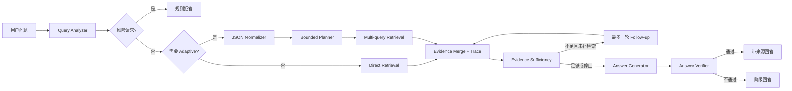

# Legal RAG Agent | 现行中国法律检索增强生成系统

一个面向中国现行法律文本的可复现 RAG 工程项目。它不是把大模型接到向量库后的演示，而是围绕法律场景中的三个核心问题展开：**如何稳定召回正确法条、如何证明一次优化真的有效、如何在证据不足时安全停止生成**。

项目已经完成从数据画像、分块实验、混合检索、受控查询理解，到证据充分性检查、引用校验和分层评测的完整闭环。默认链路保持保守：清晰问题直接检索，复杂问题才进入有边界的 adaptive lane；任何检索或生成增强都必须通过固定评测集、trace 和失败归因证明价值。

> 本项目仅用于检索与工程研究，不提供个案法律意见。完整法律语料不随仓库分发，数据来源及复现边界见下文。

## 项目产出

| 维度 | 已完成产出 |
| --- | --- |
| 数据与索引 | 203 部法律、19,050 个条文级 chunk 的历史实验快照；4 种 chunk 策略；废止法律标记与精确重复条文去重 |
| 检索能力 | 自研中文 BM25、dense、RRF、LlamaIndex BM25/dense 对照；法律名和条号 metadata boost；完整 ranking trace |
| 受控 Agent 能力 | 规则 Query Analyzer、严格 JSON normalizer、有限 multi-query planner、证据合并、最多一轮补检索 |
| 生成安全 | 高风险请求预拒答、证据充分性检查、引用有效性校验、资料不足降级模板、免责声明校验 |
| 评测体系 | 120 条分层评测集、30 条固定生成子集、9 类检索题型 + 拒答、bootstrap 95% CI、失败标签、LLM-as-judge |
| 工程质量 | 57 个离线单元测试；CLI、配置、manifest、JSONL trace、Markdown/CSV 报告；外部 API 失败可显式归因 |

历史实验中，`Qwen3-Embedding-4B` dense 的 Hit@5 达到 **0.981 [0.954, 1.000]**，无外部 API 的自研 BM25 baseline 为 **0.704 [0.611, 0.787]**。这些数字来自 2026-06 的固定本地语料快照和当时模型版本，不是跨语料、跨时间的效果承诺。完整实验条件见 [结果摘要](reports/RESULTS_SUMMARY.md)。

## 为什么值得做

法律 RAG 的难点不只是“回答像不像”，而是每个环节都可能制造一个看似合理但无法核验的结果：

- 法律文本有天然条文边界，盲目按固定 token 切分会破坏引用粒度。
- 用户常用场景化、情绪化或多意图表达，关键词可能被噪声稀释。
- BM25、dense 和框架默认组件的适用边界不同，融合不一定比单路更强。
- 命中相关法律不等于命中正确条号，生成正确文字也不等于引用真实存在。
- 法律场景不能依赖无限 Agent loop，在证据不足或请求越界时必须可预测地停止。

因此，本项目把 **评测、失败归因和证据边界** 作为主线，而不是把组件数量当作完成度。

## 系统架构



### 1. 数据驱动的分块

数据集本身是一行一条法律条文，因此 `article` 被选作可解释 baseline，而不是直接套用 256/512 token。项目同时保留 `neighbor`、`long_split` 和 `fixed_chars` 作为受控实验变量，并输出 chunk 长度、条号跨度、异常样例和索引规模诊断。

### 2. 可解释的多路检索

- 自研 BM25 使用中文单字、bigram、法律名和条号特征，弥补默认英文式 tokenizer 对中文法律文本的不适配。
- Dense 检索支持本地 sentence-transformers 和 OpenAI-compatible embedding API，并将 query instruction、metadata 拼接作为显式配置。
- RRF 只基于排名融合不同分值空间，同时保存 BM25/dense 子排名，便于解释每个结果从哪里来。
- 废止法律默认降权；用户明确查询旧法时不降权，保留历史法律研究能力。

### 3. 受控 Adaptive RAG

Adaptive lane 不是自由 Agent loop。只有规则分析器识别到模糊、多意图、矛盾、情绪化、过长、候选法律过多或低置信输入时才触发。LLM normalizer 必须返回严格 JSON，失败时回退到确定性规则；planner 限制 query 数量，补检索最多执行一轮。

### 4. 生成前后双重校验

生成前检查法律名、条号和问题覆盖是否充分。生成后校验 `[Sx]` 引用是否存在、关键结论是否被证据支持、免责声明是否保留。高风险请求在检索前直接拒答，证据不足或引用无效时返回统一降级模板。

### 5. 评测优先

评测报告同时记录 Hit@k、MRR、bootstrap 置信区间、延迟、引用有效性、verifier、judge 和失败标签。Retrieval-only 与生成指标严格分离，外部 judge 的超时、格式错误和服务异常不会被伪装成模型质量失败。

## 关键实验结果

以下是 v3 固定评测集上的历史结果节选。检索指标只统计 108 条有 gold 的样例，12 条拒答样例单独处理。

| 配置 | Hit@5 | MRR | 结论 |
| --- | ---: | ---: | --- |
| 自研 BM25 | 0.704 | 0.608 | 无模型下载、无 API 的可复现 baseline |
| BGE dense | 0.676 | 0.538 | 纯 chunk 文本时没有超过 BM25 |
| BGE dense + metadata + query instruction | 0.769 | 0.577 | 文本工程带来 9.3 个百分点增益 |
| Qwen3-Embedding-4B dense | **0.981** | **0.884** | 当前快照上的质量优先配置 |
| BM25 + BGE RRF | 0.796 | 0.609 | 两路质量接近时融合有效 |
| BM25 + Qwen3 RRF | 0.944 | 0.783 | 弱检索器会拖累强 dense |
| LlamaIndex 默认 BM25 | 0.111 | 0.090 | 默认 tokenizer 不适合该中文语料 |
| LlamaIndex BGE dense | 0.870 | 0.709 | 暴露 metadata 文本拼接这一隐藏变量 |

生成实验固定使用 30 条子集和同一 BM25 检索结果，对 4 个 backend 形成 120 条 model-case 记录。整体 judge faithfulness 为 0.970，citation validity 为 0.925。由于 judge 使用 DeepSeek-V3，对同模型存在 self-preference 风险，因此规则 verifier 与人工失败样例仍是更重要的旁证。

## 真正有价值的踩坑与修复

| 问题 | 根因 | 修复与价值 |
| --- | --- | --- |
| Adaptive 开启后整体效果下降 | 规则改写丢失语义词，强 retriever 已不需要额外改写 | 用同一 120 cases 做 A/B，BM25 Hit@5 从 0.704 降至 0.667；因此默认关闭，只保留可测的受控入口 |
| 同一 BGE 模型在 LlamaIndex 中明显更强 | 框架默认把法律名、条号等 metadata 拼入 embedding 文本 | 做 metadata 与 query instruction 消融，自研 dense 从 0.676 提升到 0.769，并把文本构造变成显式配置 |
| 框架默认 BM25 几乎失效 | 默认 tokenizer 没有针对中文法律名、条号和连续汉字设计 | 实现中文单字 + bigram + metadata boost，Hit@5 从对照的 0.111 提升到 0.704 |
| Retrieval-only 报告出现“拒答正确率” | 旧逻辑把拼接的检索文本送入回答 verifier，指标语义错误 | 无生成时回答类指标统一标为 `N/A`，避免用无意义数字包装效果 |
| 多 case 生成评测可能相互污染 | 聊天后端保留短期记忆，后一条 case 会看到前一条上下文 | 每个 case 开始前重置 memory，保证多模型横向比较公平 |
| Judge 服务异常被混入模型质量 | API/JSON 错误和低分没有分开统计，且模型返回的 `passed` 可与分数矛盾 | 严格解析单个 JSON 对象、校验分数范围、按阈值重算 pass；judge error 单独计数并排除质量均值 |
| 新旧法律和重复法条争夺排名 | 原始语料包含已废止法律及同法同条号完全重复文本 | 增加废止标记与可配置 penalty，只做保守精确去重，避免误删修订内容 |

这组结论里最重要的不是“组件越多越好”，而是保留负结果：RRF、Adaptive 和领域 embedding 都曾在合理假设下失败，项目据此调整默认策略，而不是隐藏实验。

## 快速开始

### 环境

- Python 3.10+
- [uv](https://docs.astral.sh/uv/)
- 可选：Ollama，用于本地生成
- 可选：SiliconFlow API Key，用于 Qwen3 embedding、API 模型和 LLM-as-judge

```powershell
git clone https://github.com/1040942669/legal-rag-agent.git
Set-Location legal-rag-agent
uv sync
```

### 准备语料

基础语料来自 Hugging Face 的 [Kuugo/Chinese_Law](https://huggingface.co/datasets/Kuugo/Chinese_Law)，其数据卡标注为 Apache-2.0，内容截止到 2025-01-01。下载后目录应满足：

```text
Chinese-Laws/
├── README.md
└── Chinese-Laws/
    ├── 中华人民共和国民法典.txt
    └── ...
```

仓库不提交完整法律文本、embedding cache 或生成报告。历史结果使用 203 部法律的本地增强快照，精确复跑历史数字需要相同语料；使用公开数据的当前版本时，应把新结果视为一次新的实验。

### 10 分钟离线链路

以下命令不调用 LLM，也不需要 API Key：

```powershell
uv run python -m legal_rag.cli profile-data
uv run python -m legal_rag.cli build-index --chunk-strategy article
uv run python -m legal_rag.cli evaluate `
  --chunk-strategy article `
  --retriever bm25 `
  --cases eval_cases/legal_eval_cases_v3.jsonl `
  --prefix v3_article_bm25
```

启动只检索、不生成的交互模式：

```powershell
uv run python -m legal_rag.cli chat --chunk-strategy article --retriever bm25 --no-generate
```

### Dense 与生成实验

复制环境变量模板并填写需要的 Key：

```powershell
Copy-Item .env.example .env
```

```text
SILICONFLOW_API_KEY=your_key
```

构建 Qwen3 embedding 并运行 dense 评测：

```powershell
uv run python -m legal_rag.cli build-embeddings `
  --chunk-strategy article `
  --embedding qwen3_embedding_4b `
  --batch-size 8

uv run python -m legal_rag.cli evaluate `
  --chunk-strategy article `
  --retriever dense `
  --embedding qwen3_embedding_4b `
  --cases eval_cases/legal_eval_cases_v3.jsonl
```

固定检索条件，对比多个生成 backend 并启用 judge：

```powershell
uv run python -m legal_rag.cli evaluate `
  --chunk-strategy article `
  --retriever bm25 `
  --cases eval_cases/legal_eval_cases_v3_gen_subset.jsonl `
  --generate `
  --models qwen2.5:7b,siliconflow:deepseek-ai/DeepSeek-V3 `
  --judge `
  --prefix v3gen_models_bm25
```

## 测试与复现边界

```powershell
uv run pytest -q
```

当前本地验收结果为 `57 passed`。单元测试不依赖真实 LLM 或大型 embedding 下载，覆盖数据解析、chunk、检索、adaptive contract、证据校验、judge 异常处理和 v3 case 完整性。

需要明确区分三类可复现性：

1. 代码与离线逻辑：由锁文件、配置、57 个测试和 BM25 CLI 保证。
2. 历史检索数字：依赖 2026-06 的 203 部法律快照及对应 embedding cache。
3. API 生成分数：还依赖外部模型版本、服务状态和 judge 偏差，不能视为永久固定值。

## 仓库结构

```text
legal_rag/                         核心实现
├── query.py                       规则查询分析与风险标记
├── query_understanding.py         JSON normalizer 与 fallback
├── planning.py                    有界 multi-query 计划
├── retrieval.py                   BM25、dense、RRF 与 trace
├── evidence.py                    证据充分性检查
├── verifier.py                    引用与回答校验
├── judge.py                       严格 LLM-as-judge 适配器
└── evaluation.py                  指标、置信区间与报告
configs/default.yaml               可审计的默认参数
eval_cases/                        固定评测集
tests/                             离线回归测试
reports/RESULTS_SUMMARY.md         历史实验总表
docs/                              评测方法与开发计划
ARCHITECTURE_DECISION_LOG.md       关键架构决策和反例
```

生成的索引、embedding cache、CSV/JSON 报告和 trace 默认位于 `artifacts/`、`reports/`，均不进入 Git。

## 当前状态与下一步

- Phase 0：可复现 baseline、manifest、run metadata，已完成。
- Phase 1：检索可靠性、诊断、失败归因和 trace，已完成。
- Phase 2：受控查询理解与 multi-query planning，已完成。
- Phase 3：证据充分性、最多一轮补检索和 answer verifier，已完成。
- Phase 4A：v3 评测集、置信区间、judge 和手工实验矩阵，已完成。
- Phase 4B：reranker protocol、embedding cache health check、自动 matrix runner、统一成本和 p50/p95 延迟聚合，待开发。

当前不会继续堆叠自由 Agent 能力。下一阶段优先把已经验证过的实验过程自动化，再决定 reranker 是否值得成为默认链路。

## 文档导航

- [文档索引](docs/README.md)：公开文档的职责和阅读顺序。
- [历史实验结果](reports/RESULTS_SUMMARY.md)：完整数字、环境和解释边界。
- [评测方案](docs/EVALUATION_PLAN.md)：case 设计、指标定义和报告原则。
- [执行计划](docs/LEGAL_RAG_EXECUTION_PLAN.md)：Phase 0-5 状态、依赖和验收标准。
- [架构决策记录](ARCHITECTURE_DECISION_LOG.md)：为什么这样设计、哪些假设被实验推翻。

## 数据与责任说明

外部法律数据遵循其来源页面声明的许可证，本仓库不重新分发完整语料。法律法规会更新，任何实验结果都受语料截止日期影响。系统输出只适合作为信息检索线索，不能替代执业律师意见或官方法律数据库。
