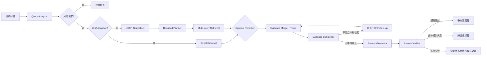

# Legal RAG Agent | 中国法律文本快照检索增强生成系统

一个面向指定中国法律文本快照的可复现 RAG 工程项目。它不是把大模型接到向量库后的演示，而是围绕法律场景中的三个核心问题展开：**如何稳定召回正确法条、如何证明一次优化真的有效、如何在证据不足时安全停止生成**。

仓库已经实现旧 Phase 路线中的规则型工程链路，包括数据画像、分块实验、混合检索、受控查询理解、证据覆盖启发式、引用编号检查、缓存契约和自动实验矩阵。默认链路保持保守：清晰问题直接检索，复杂问题才进入有边界的 adaptive lane；reranker 默认关闭，任何检索或生成增强都必须通过固定评测集、trace、质量与成本指标证明价值。M1 已把结构检查、行为检查和未知语义状态拆开，并修正回答、拒答和 Judge 的分母；当前已发布版本为 [v0.2.0](https://github.com/1040942669/legal-rag-agent/releases/tag/v0.2.0)。

> 本项目仅用于检索与工程研究，不提供个案法律意见。仓库不随附完整法律语料，历史快照的内容截止日期为 2025-01-01；因此本文不声称覆盖全部当前有效法律。数据来源及复现边界见下文。

## 项目产出

| 维度 | 已完成产出 |
| --- | --- |
| 数据与索引 | 203 部法律、19,050 个条文级 chunk 的历史实验快照；4 种 chunk 策略；废止法律标记与精确重复条文去重 |
| 检索能力 | 自研中文 BM25、dense、RRF、LlamaIndex 对照；可选 BGE cross-encoder reranker；法律名和条号 metadata boost；完整 ranking trace |
| 受控 Agent 能力 | 规则 Query Analyzer、严格 JSON normalizer、有限 multi-query planner、证据合并、最多一轮补检索 |
| 生成边界 | 高风险请求预拒答、证据充分性检查、结构化回答兼容层、引用/范围/行为检查、资料不足或澄清模板、最终交付前复核 |
| 评测体系 | 120 条分层评测集、30 条固定生成子集、bootstrap 95% CI、显式行为分母、answer/retrieval/Judge N/A、自动五维实验矩阵 |
| 工程质量 | M1 `v0.2.0` 为 186 个离线测试、148 个子测试；embedding cache v2 契约；17 项累计 JSON 质量门禁与精确 PR/master CI；CLI、manifest、JSONL trace、CSV/JSON/Markdown 报告 |

历史实验中，`Qwen3-Embedding-4B` dense 的 Hit@5 达到 **0.981 [0.954, 1.000]**，无外部 API 的自研 BM25 baseline 为 **0.704 [0.611, 0.787]**。这些数字来自 2026-06 的固定本地语料快照和当时模型版本，不是跨语料、跨时间的效果承诺。完整实验条件见 [结果摘要](reports/RESULTS_SUMMARY.md)。

## 为什么值得做

法律 RAG 的难点不只是“回答像不像”，而是每个环节都可能制造一个看似合理但无法核验的结果：

- 法律文本有天然条文边界，盲目按固定 token 切分会破坏引用粒度。
- 用户常用场景化、情绪化或多意图表达，关键词可能被噪声稀释。
- BM25、dense 和框架默认组件的适用边界不同，融合不一定比单路更强。
- 命中相关法律不等于命中正确条号，生成正确文字也不等于引用真实存在。
- 法律场景不能依赖无限 Agent loop，在证据不足或请求越界时必须可预测地停止。

因此，本项目把 **评测、失败归因和证据边界** 作为主线，而不是把组件数量当作完成度。

## 系统架构



这是调用链的简化图。M1 `v0.2.0` 将生成结果适配为结构化回答，分开检查 schema、引用 ID、可见证据范围、回答模式、免责声明和语义状态。词面启发式最多给出 `uncertain` 或 `not_checked`，仍不证明引用语义支持或法律结论正确。

### 1. 数据驱动的分块

数据集本身是一行一条法律条文，因此 `article` 被选作可解释 baseline，而不是直接套用 256/512 token。项目同时保留 `neighbor`、`long_split` 和 `fixed_chars` 作为受控实验变量，并输出 chunk 长度、条号跨度、异常样例和索引规模诊断。

### 2. 可解释的多路检索

- 自研 BM25 使用中文单字、bigram、法律名和条号特征，弥补默认英文式 tokenizer 对中文法律文本的不适配。
- Dense 检索支持本地 sentence-transformers 和 OpenAI-compatible embedding API，并将 query instruction、metadata 拼接作为显式配置。
- RRF 只基于排名融合不同分值空间，同时保存 BM25/dense 子排名，便于解释每个结果从哪里来。
- 可选 cross-encoder 对 base retriever 的 top-N 候选做精排，保留原 rank/score，并单独记录候选数和重排耗时。
- 废止法律默认降权；用户明确查询旧法时不降权，保留历史法律研究能力。

### 3. 受控 Adaptive RAG

Adaptive lane 不是自由 Agent loop。只有规则分析器识别到模糊、多意图、矛盾、情绪化、过长、候选法律过多或低置信输入时才触发。LLM normalizer 必须返回严格 JSON，失败时回退到确定性规则；planner 限制 query 数量，补检索最多执行一轮。

### 4. 生成前后双重校验

生成前检查法律名、条号和问题覆盖是否充分。只有可信调用方显式注入 `VerificationContext` 时，证据才会在进入生成提示和返回 sources 前按 snapshot/scope 过滤，verifier 也会检查该范围；当前 CLI 没有认证身份、租户隔离或默认 active snapshot。生成后分别检查结构、引用 ID、claim 与可见引用对齐、可选范围、回答模式和免责声明。伪造引用或无效模式会进入有界的受限响应，最终交付响应再次验证；被拒绝草稿的正文与内容型诊断不会写入普通 Trace，只保留稳定状态和计数。

当前 verifier 仍是规则与启发式防线，不是语义支持或法律正确性证明。`source_ids_exist` 只说明编号属于本次结果目录；`citation_ids_valid` 还组合了当前可见引用/claim 对齐要求，快照与权限范围则由独立的 `evidence_scope_valid` 表示。没有启用经过校准的语义评审时，支持状态保持 `uncertain` 或 `not_checked`。免责声明不再等同拒答，普通法律文本中的“不得”“不能”也不会单独触发拒答。详细口径见[评测指标字典](docs/METRICS.md)。

### 5. 评测优先

评测报告同时记录 Hit@k、MRR、bootstrap 置信区间、平均/P50/P95 延迟、引用有效性、verifier、judge 和失败标签。Experiment matrix 可展开 chunk、retriever、embedding、adaptive、reranker 五个维度；LLM 和 reranker 的调用次数、token、耗时及可选成本估算统一聚合。Retrieval-only 与生成指标严格分离，外部 judge 的超时、格式错误和服务异常不会被伪装成模型质量失败。

## 关键实验结果

以下是 v3 固定评测集上的历史结果节选。检索指标只统计 108 条有 gold 的样例，12 条拒答样例单独处理。

| 配置 | Hit@5 | MRR | 结论 |
| --- | ---: | ---: | --- |
| 自研 BM25 | 0.704 | 0.608 | 无模型下载、无 API 的可复现 baseline |
| BGE dense | 0.676 | 0.538 | 纯 chunk 文本时没有超过 BM25 |
| BGE dense + metadata + query instruction | 0.769 | 0.577 | 文本工程带来 9.3 个百分点增益 |
| Qwen3-Embedding-4B dense | **0.981** | **0.884** | 当前快照上的质量优先配置 |
| BM25 + BGE RRF | 0.796 | 0.609 | 两路质量接近时融合有效 |
| BM25 + Qwen3 RRF | 0.944 | 0.783 | 弱检索器会拖累强 dense |
| LlamaIndex 默认 BM25 | 0.111 | 0.090 | 默认 tokenizer 不适合该中文语料 |
| LlamaIndex BGE dense | 0.870 | 0.709 | 暴露 metadata 文本拼接这一隐藏变量 |

Phase 4B 自动矩阵在同一 v3 集合上复跑了 BM25 direct/adaptive。质量与历史结论一致，但新增尾延迟揭示了更清楚的成本差异：

| 配置 | Hit@5 | MRR | 平均延迟 | P50 | P95 |
| --- | ---: | ---: | ---: | ---: | ---: |
| BM25 direct | **0.704** | **0.608** | 243.5 ms | 201.0 ms | 316.1 ms |
| BM25 + rules adaptive | 0.667 | 0.578 | 437.5 ms | 288.0 ms | 1189.3 ms |

这次复跑同时验证了 matrix runner；它不是新的跨机器性能基准。延迟只应在同一次运行、同一机器内横向比较。

生成实验固定使用 30 条子集和同一 BM25 检索结果，对 4 个 backend 形成 120 条 model-case 记录。历史报告中的 judge faithfulness 为 0.970，citation validity 为 0.925。由于 judge 使用 DeepSeek-V3，对同模型存在 self-preference 风险，规则 verifier 又只有启发式边界，这些数字只能作为当时配置下的信号，不能证明语义支持或法律正确性。

## 真正有价值的踩坑与修复

| 问题 | 根因 | 修复与价值 |
| --- | --- | --- |
| Adaptive 开启后整体效果下降 | 规则改写丢失语义词，强 retriever 已不需要额外改写 | 用同一 120 cases 做 A/B，BM25 Hit@5 从 0.704 降至 0.667；因此默认关闭，只保留可测的受控入口 |
| 同一 BGE 模型在 LlamaIndex 中明显更强 | 框架默认把法律名、条号等 metadata 拼入 embedding 文本 | 做 metadata 与 query instruction 消融，自研 dense 从 0.676 提升到 0.769，并把文本构造变成显式配置 |
| 框架默认 BM25 几乎失效 | 默认 tokenizer 没有针对中文法律名、条号和连续汉字设计 | 实现中文单字 + bigram + metadata boost，Hit@5 从对照的 0.111 提升到 0.704 |
| Retrieval-only 报告出现“拒答正确率” | 旧逻辑把拼接的检索文本送入回答 verifier，指标语义错误 | 无生成时回答类指标统一标为 `N/A`，避免用无意义数字包装效果 |
| 多 case 生成评测可能相互污染 | 聊天后端保留短期记忆，后一条 case 会看到前一条上下文 | 每个 case 开始前重置 memory，保证多模型横向比较公平 |
| Judge 服务异常被混入模型质量 | API/JSON 错误和低分没有分开统计，且模型返回的 `passed` 可与分数矛盾 | 严格解析单个 JSON 对象、校验分数范围、按阈值重算 pass；judge error 单独计数并排除质量均值 |
| 新旧法律和重复法条争夺排名 | 原始语料包含已废止法律及同法同条号完全重复文本 | 增加废止标记与可配置 penalty，只做保守精确去重，避免误删修订内容 |
| 旧 embedding cache 能加载但身份不完整 | 旧 metadata 没记录 query/document prefix、metadata embedding 开关和语料内容指纹，同目录可能静默复用错误向量 | 引入 cache schema v2、模型契约与 corpus SHA-256；dense 运行时 fail-closed，并提供 `cache-health` 迁移诊断 |
| 手工实验难复跑且只看平均延迟 | 多条 CLI 命令容易漏参数，单格失败会中断结果，平均值掩盖尾延迟 | 增加 experiment matrix harness，逐格记录状态并输出 CSV/JSON/Markdown、P50/P95、内存、调用/token/成本字段 |

这组结论里最重要的不是“组件越多越好”，而是保留负结果：RRF、Adaptive 和领域 embedding 都曾在合理假设下失败，项目据此调整默认策略，而不是隐藏实验。

## 快速开始

### 环境

- Python 3.10+
- [uv](https://docs.astral.sh/uv/)
- 可选：Ollama，用于本地生成
- 可选：SiliconFlow API Key，用于 Qwen3 embedding、API 模型和 LLM-as-judge

```powershell
git clone https://github.com/1040942669/legal-rag-agent.git
Set-Location legal-rag-agent
uv sync --locked
```

### 准备语料

基础语料来自 Hugging Face 的 [Kuugo/Chinese_Law](https://huggingface.co/datasets/Kuugo/Chinese_Law)，其数据卡标注为 Apache-2.0，内容截止到 2025-01-01。下载后目录应满足：

```text
Chinese-Laws/
├── README.md
└── Chinese-Laws/
    ├── 中华人民共和国民法典.txt
    └── ...
```

仓库不提交完整法律文本、embedding cache 或生成报告。历史结果使用 203 部法律的本地增强快照，精确复跑历史数字需要相同语料；使用公开数据的当前版本时，应把新结果视为一次新的实验。

### 10 分钟本地语料链路

以下命令不调用 LLM，也不需要 API Key，但需要先准备上节说明的本地法律语料：

```powershell
uv run python -m legal_rag.cli profile-data
uv run python -m legal_rag.cli build-index --chunk-strategy article
uv run python -m legal_rag.cli evaluate `
  --chunk-strategy article `
  --retriever bm25 `
  --cases eval_cases/legal_eval_cases_v3.jsonl `
  --prefix v3_article_bm25
```

启动只检索、不生成的交互模式：

```powershell
uv run python -m legal_rag.cli chat --chunk-strategy article --retriever bm25 --no-generate
```

### Dense 与生成实验

复制环境变量模板并填写需要的 Key：

```powershell
Copy-Item .env.example .env
```

```text
SILICONFLOW_API_KEY=your_key
```

构建 Qwen3 embedding 并运行 dense 评测：

```powershell
uv run python -m legal_rag.cli build-embeddings `
  --chunk-strategy article `
  --embedding qwen3_embedding_4b `
  --batch-size 8

uv run python -m legal_rag.cli evaluate `
  --chunk-strategy article `
  --retriever dense `
  --embedding qwen3_embedding_4b `
  --cases eval_cases/legal_eval_cases_v3.jsonl
```

固定检索条件，对比多个生成 backend 并启用 judge：

```powershell
uv run python -m legal_rag.cli evaluate `
  --chunk-strategy article `
  --retriever bm25 `
  --cases eval_cases/legal_eval_cases_v3_gen_subset.jsonl `
  --generate `
  --models qwen2.5:7b,siliconflow:deepseek-ai/DeepSeek-V3 `
  --judge `
  --prefix v3gen_models_bm25
```

### Cache、矩阵与 Reranker

构建 embedding 后先验证缓存和当前 chunk/config 是否完全匹配：

```powershell
uv run python -m legal_rag.cli cache-health `
  --chunk-strategy article `
  --embedding bge_large_zh
```

一条命令复跑 direct/adaptive 矩阵：

```powershell
uv run python -m legal_rag.cli experiment-matrix `
  --chunk-strategies article `
  --retrievers bm25 `
  --adaptive-modes direct,adaptive `
  --rerankers none `
  --cases eval_cases/legal_eval_cases_v3.jsonl
```

可选 BGE reranker 默认不加载；显式启用时才下载模型并将 top-20 重排为 top-5：

```powershell
uv run python -m legal_rag.cli evaluate `
  --chunk-strategy article `
  --retriever bm25 `
  --reranker bge_v2_m3 `
  --rerank-top-n 20 `
  --cases eval_cases/legal_eval_cases_v3.jsonl
```

首次运行 `bge_v2_m3` 需要下载/加载约 2.29 GB 模型。它目前是实验能力，不是默认链路；只有完整 A/B 同时提升质量且 P95 可接受时才会晋升为默认。

### M2 实验生命周期（开发中）

草稿 PR #9 已提供 `plan / run / resume / aggregate / replay` 五个显式入口。当前可执行后端是 provider-free BM25；`offline` 使用 2 条完全虚构的合成 case，`retrieval` 必须显式给出本地语料路径。`smoke-generation` 与 `full-regression` 可以生成计划，但在没有预算闸门和显式 provider 配置时会失败关闭，不会读取 `.env` 或尝试模型请求。

这些命令要求在 Git 源码工作区运行，因为 manifest 会记录真实 HEAD、dirty 状态、未跟踪文件摘要和分阶段实现指纹。默认原始工件、精确阶段缓存和聚合报告均写入被 Git 忽略的 `artifacts/experiments/`。

```powershell
# 只校验并打印 manifest，不创建实验目录
uv run python -m legal_rag.cli experiment plan `
  --experiment-id offline-demo `
  --mode offline

# 新建并执行；已有同名实验会被拒绝，必须显式 resume
uv run python -m legal_rag.cli experiment run `
  --experiment-id offline-demo `
  --mode offline

uv run python -m legal_rag.cli experiment resume `
  --experiment-id offline-demo

# 只读取持久工件，发布内容寻址的 JSON、JSONL、CSV 和 Markdown
uv run python -m legal_rag.cli experiment aggregate `
  --experiment-id offline-demo

# 创建新的 experiment_id，只允许精确缓存命中，任何 miss 都失败关闭
uv run python -m legal_rag.cli experiment replay `
  --source-experiment-id offline-demo `
  --experiment-id offline-demo-replay
```

回放不会退化为 fresh，也不会复用源实验目录。新实验的 attempt 会保留 `replay` 来源、原始 source call provenance、实际外部调用 0 和独立计时；聚合器不会调用 retriever、assistant 或 provider，也不会把损坏 case 补成成功。

## 测试与复现边界

```powershell
uv run --offline --frozen --no-sync python scripts/quality_gate.py --milestone M1 --mode offline
```

该 M1 门禁不需要完整语料或模型 Key，会累积运行 M0 工程基线与 `M1-T01` 至 `M1-T10`：全量测试、明确禁止 socket 访问的合成 BM25 smoke、包版本导入、CLI help、Markdown 相对链接、STATE/manifest JSON、候选文件凭证风险检查，以及 M1 的结构/行为/指标边界。离线子进程会禁用 dotenv 加载并在项目 provider 边界拒绝真实模型调用；mandatory pytest 出现零测试、skip、xfail 或无效 JUnit 也不会假绿。冻结软件候选 `647c0238674abe603fdf33e80191c19eb6de3dd9` 的精确 Linux PR-head CI 为 `186 passed, 148 subtests passed`、JUnit 334/0/0/0，累计 17/17 必需检查通过；这仍不是 OS 级 air-gap，也不代表真实法律质量已经验证。

需要明确区分三类可复现性：

1. 代码与离线逻辑：M0 发布时由 89 个测试提供基线；M1 `v0.2.0` 由 186 个测试、148 个子测试、17 项累计门禁和 BM25 CLI 提供回归证据。这不等于法律正确性保证。
2. 历史检索数字：依赖 2026-06 的 203 部法律快照及对应 embedding cache。
3. API 生成分数：还依赖外部模型版本、服务状态和 judge 偏差，不能视为永久固定值。

## 仓库结构

```text
legal_rag/                         核心实现
├── query.py                       规则查询分析与风险标记
├── query_understanding.py         JSON normalizer 与 fallback
├── planning.py                    有界 multi-query 计划
├── retrieval.py                   BM25、dense、RRF 与 trace
├── rerank.py                      Cross-encoder adapter 与 top-N 精排包装器
├── embeddings.py                  Encoder、cache schema 与 health check
├── experiments.py                 自动实验矩阵与统一汇总
├── evidence.py                    证据充分性检查
├── verifier.py                    引用与回答校验
├── judge.py                       严格 LLM-as-judge 适配器
└── evaluation.py                  指标、置信区间与报告
configs/default.yaml               可审计的默认参数
eval_cases/                        固定评测集
tests/                             离线回归测试
reports/RESULTS_SUMMARY.md         历史实验总表
docs/                              评测方法与开发计划
ARCHITECTURE_DECISION_LOG.md       关键架构决策和反例
```

生成的索引、embedding cache、CSV/JSON 报告和 trace 默认位于 `artifacts/`、`reports/`，均不进入 Git。

## 历史 Phase 实现快照与当前改造状态

截至 2026-09-18，旧 Phase 0-4B 路线实现了可复现 baseline、检索诊断与 trace、受控查询理解、最多一轮补检索、规则 verifier、v3 评测集、reranker adapter、embedding cache v2 和自动实验矩阵。旧 Phase 编号与当前 M0-M7 里程碑不一一对应；旧路线的 reranker/cache A/B 仍是未完成的实验项，不代表当前发布主线的下一步。

当前 M0-M7 主线以 [MASTER_PLAN](docs/refactor/MASTER_PLAN.md)、[STATE](docs/refactor/STATE.json) 和 [HANDOFF](docs/refactor/HANDOFF.md) 为权威来源。M0 已于 2026-09-19 作为 [v0.1.1](https://github.com/1040942669/legal-rag-agent/releases/tag/v0.1.1) 发布并远端核验；M1 已于 2026-09-20 作为 [v0.2.0](https://github.com/1040942669/legal-rag-agent/releases/tag/v0.2.0) 发布并远端核验，发布回执已通过独立文档 [PR #6](https://github.com/1040942669/legal-rag-agent/pull/6) 落库。M2 正在 [草稿 PR #9](https://github.com/1040942669/legal-rag-agent/pull/9) 中分子任务实现，目前已完成实验身份与精确缓存、不可变逐 case artifact、真实评测适配、provider 错误分类、数据集注册、只读聚合，以及 provider-free 的生命周期 CLI；M2 累积门禁、候选冻结和 `v0.3.0` 发布仍未完成。M3-M7 尚未开始。

## 文档导航

- [文档索引](docs/README.md)：公开文档的职责和阅读顺序。
- [历史实验结果](reports/RESULTS_SUMMARY.md)：完整数字、环境和解释边界。
- [评测方案](docs/EVALUATION_PLAN.md)：case 设计、指标定义和报告原则。
- [评测指标字典](docs/METRICS.md)：M1 schema v2、显式分母、N/A 与旧字段映射。
- [当前改造主计划](docs/refactor/MASTER_PLAN.md)：M0-M7 的范围、依赖和验收标准。
- [机器可读状态](docs/refactor/STATE.json) 与 [执行交接](docs/refactor/HANDOFF.md)：当前事实、下一步和阻塞项。
- [历史 Phase 0-5 执行记录](docs/LEGAL_RAG_EXECUTION_PLAN.md)：旧路线的状态、依赖和验收记录，仅供追溯。
- [Phase 4B 技术调研](docs/PHASE4B_RESEARCH_AND_DECISIONS.md)：最新机制、L9 可取原则、实现范围和暂缓项。
- [架构决策记录](ARCHITECTURE_DECISION_LOG.md)：为什么这样设计、哪些假设被实验推翻。

## 数据与责任说明

外部法律数据遵循其来源页面声明的许可证，本仓库不重新分发完整语料。法律法规会更新，任何实验结果都受语料截止日期影响。系统输出只适合作为信息检索线索，不能替代执业律师意见或官方法律数据库。
