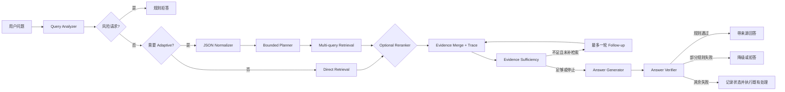

# Legal RAG Agent | 中国法律文本快照检索增强生成系统

一个面向指定中国法律文本快照的可复现 RAG 工程项目。它不是把大模型接到向量库后的演示，而是围绕法律场景中的三个核心问题展开：**如何稳定召回正确法条、如何证明一次优化真的有效、如何在证据不足时安全停止生成**。

仓库已经实现旧 Phase 路线中的规则型工程链路，包括数据画像、分块实验、混合检索、受控查询理解、证据覆盖启发式、引用编号检查、缓存契约和自动实验矩阵。默认链路保持保守：清晰问题直接检索，复杂问题才进入有边界的 adaptive lane；reranker 默认关闭，任何检索或生成增强都必须通过固定评测集、trace、质量与成本指标证明价值。M1 已把结构检查、行为检查和未知语义状态拆开；M2 进一步把 fresh/cache/replay、逐 case artifact、恢复、聚合和外部调用账本固化为显式实验生命周期。M3 的 PostgreSQL/pgvector 版本化语料、精确检索、原子快照切换、可复现导入和受控实验性 HNSW 已作为 [v0.4.0](https://github.com/1040942669/legal-rag-agent/releases/tag/v0.4.0) 发布并完成独立回执。M4 的持久会话、Bearer 身份隔离、幂等 run、SSE 续读和单进程 supervisor 已作为 [v0.5.0](https://github.com/1040942669/legal-rag-agent/releases/tag/v0.5.0) 发布并完成独立回执。M5 的 PostgreSQL LangGraph checkpoint、有界预算、外部调用 journal、显式 resume 和跨进程故障恢复已由 [PR #22](https://github.com/1040942669/legal-rag-agent/pull/22) 普通合并，并作为 [v0.6.0](https://github.com/1040942669/legal-rag-agent/releases/tag/v0.6.0) 发布；独立 [receipt PR #23](https://github.com/1040942669/legal-rag-agent/pull/23)、finalization PR #24、精确门禁及治理关闭均已核验，M5 状态为 `released`。M6 的 PostgreSQL durable job/outbox、Redis/Celery 批任务与可选脱敏观测已作为 [v0.7.0](https://github.com/1040942669/legal-rag-agent/releases/tag/v0.7.0) 发布；软件 PR 与 release-target master 的四路 CI 均成功，独立回执 PR #27 已合并且精确 master CI 四路通过。§11.6 的实际观测接线、真实耗时/预算/重试/缓存/证据/用量与幂等状态修正已由 [PR #28](https://github.com/1040942669/legal-rag-agent/pull/28) 正常合并，并作为 [v0.7.1](https://github.com/1040942669/legal-rag-agent/releases/tag/v0.7.1) 于 2026-10-02 正式发布。其精确 PR head 和实际软件合并提交的四路 CI 均成功。完整 M6 当前为 `released`：独立 [回执 PR #29](https://github.com/1040942669/legal-rag-agent/pull/29) 与实际回执合并提交的四路 master CI 已完成，Issue #25/Milestone 7 已随后关闭；历史 Tag 未移动，M7 未开始。

> 本项目仅用于检索与工程研究，不提供个案法律意见。仓库不随附完整法律语料，历史快照的内容截止日期为 2025-01-01；因此本文不声称覆盖全部当前有效法律。数据来源及复现边界见下文。

## 项目产出

当前未提交工作区已完成独立的 [通用证据与受控服务改善](reports/refactor/GENERAL_EVIDENCE_IMPROVEMENTS.md) 的W1至W8本地实施及所列适用运行验证，设计见 [ADR-006](docs/refactor/decisions/ADR-006-general-evidence-first-improvements.md)。它不是新M6发布，也不进入M7：明确法名/条号逐pair核验，数据库精确路由不以模糊结果冒充未命中，完整可见输出绑定语义判定，服务默认禁生成并冻结外发与费用策略。完整离线1752+157子测试、累计M2 25/25、隔离PG150、真实PG重启与仓库外wheel已通过；八臂消融中无购物扩展的generic-v3仅76/108到77/108，仍opt-in，排名默认legacy-v1。下面lexical-v2和paid Smoke保留为历史。工程通过不等于法律质量：实际法律审核/独立holdout/checker校准、真实Linuxbroker与生产容量未验证，最终文档静态结果见验收记录。

| 维度 | 已完成产出 |
| --- | --- |
| 数据与索引 | 203 部法律、19,050 个条文级 chunk 的历史实验快照；4 种 chunk 策略；废止法律标记与精确重复条文去重 |
| 检索能力 | 自研中文 BM25、dense、RRF、LlamaIndex 对照；可选 BGE cross-encoder reranker；法律名和条号 metadata boost；完整 ranking trace |
| 受控 Agent 能力 | 规则 Query Analyzer、严格 JSON normalizer、有限 multi-query planner、证据合并、最多一轮补检索 |
| 生成边界 | 高风险请求预拒答、证据充分性检查、结构化回答兼容层、引用/范围/行为检查、资料不足或澄清模板、最终交付前复核 |
| 评测体系 | 120 条分层评测集、30 条固定生成子集、bootstrap 95% CI、显式行为分母、answer/retrieval/Judge N/A、自动五维实验矩阵 |
| 工程质量 | M2 `v0.3.0` 为 548 个离线测试、157 个子测试与 25 项累计门禁；M3 `v0.4.0` 的候选和 release target 在 Linux/Python 3.12.13 上均通过 671 个离线测试、157 个子测试、61 项 PostgreSQL integration 与 33/33 累计门禁；M4 `v0.5.0` 的最终 release target 通过 801 个离线测试、157 个子测试、79 项 PostgreSQL integration 与 41/41 累计门禁；M5 `v0.6.0` 的本地精确候选为 921 个测试、157 个子测试，PR head 与 release target 均通过 offline、M4 service、M5 fault 三个 CI jobs，M5 专项 JUnit 为 81/0/0/0、累计门禁 51/51，并验证跨进程 hard kill、真实 PostgreSQL service restart、恢复 demo 与隔离 wheel；M6 `v0.7.0` 的软件 PR head 与 release-target master 均通过四路 CI，真实 PostgreSQL/Redis/Celery worker JUnit 为 41/0/0/0、累计门禁 58/58，0.7.0 wheel 隔离 smoke 通过，未调用 live model |

历史实验中，`Qwen3-Embedding-4B` dense 的 Hit@5 达到 **0.981 [0.954, 1.000]**，无外部 API 的自研 BM25 baseline 为 **0.704 [0.611, 0.787]**。这些数字来自 2026-06 的固定本地语料快照和当时模型版本，不是跨语料、跨时间的效果承诺。完整实验条件见 [结果摘要](reports/RESULTS_SUMMARY.md)。

## 为什么值得做

法律 RAG 的难点不只是“回答像不像”，而是每个环节都可能制造一个看似合理但无法核验的结果：

- 法律文本有天然条文边界，盲目按固定 token 切分会破坏引用粒度。
- 用户常用场景化、情绪化或多意图表达，关键词可能被噪声稀释。
- BM25、dense 和框架默认组件的适用边界不同，融合不一定比单路更强。
- 命中相关法律不等于命中正确条号，生成正确文字也不等于引用真实存在。
- 法律场景不能依赖无限 Agent loop，在证据不足或请求越界时必须可预测地停止。

因此，本项目把 **评测、失败归因和证据边界** 作为主线，而不是把组件数量当作完成度。

## 系统架构


```mermaid
flowchart LR
    A[用户问题] --> B[Query Analyzer]
    B --> C{风险请求?}
    C -- 是 --> R[规则拒答]
    C -- 否 --> D{需要 Adaptive?}
    D -- 否 --> E[Direct Retrieval]
    D -- 是 --> F[JSON Normalizer]
    F --> G[Bounded Planner]
    G --> H[Multi-query Retrieval]
    E --> Q{Optional Reranker}
    H --> Q
    Q --> I[Evidence Merge + Trace]
    I --> J[Evidence Sufficiency]
    J -- 不足且未补检索 --> K[最多一轮 Follow-up]
    K --> I
    J -- 足够或停止 --> L[Answer Generator]
    L --> M[Answer Verifier]
    M -- 规则通过 --> N[带来源回答]
    M -- 部分规则失败 --> O[降级或拒答]
    M -- 其余失败 --> P[记录状态并执行既有处理]
```

这是在线问答调用链的简化图。M1 `v0.2.0` 将生成结果适配为结构化回答，分开检查 schema、引用 ID、可见证据范围、回答模式、免责声明和语义状态。M2 不改变这条业务链的安全含义，而是在其外层增加可恢复实验执行器：按阶段记录输入身份、缓存来源、checkpoint、计时和调用账本，再从不可变 case artifact 聚合报告。M3 把 scope、snapshot、profile 与来源关系固化为数据库边界；M4 再把一次调用包装成可鉴权、可幂等、可追踪和可在断线后续读的持久 run。词面启发式最多给出 `uncertain` 或 `not_checked`，仍不证明引用语义支持或法律结论正确。

### 1. 数据驱动的分块

数据集本身是一行一条法律条文，因此 `article` 被选作可解释 baseline，而不是直接套用 256/512 token。项目同时保留 `neighbor`、`long_split` 和 `fixed_chars` 作为受控实验变量，并输出 chunk 长度、条号跨度、异常样例和索引规模诊断。

### 2. 可解释的多路检索

- 自研 BM25 使用中文单字、bigram、法律名和条号特征，弥补默认英文式 tokenizer 对中文法律文本的不适配。
- Dense 检索支持本地 sentence-transformers 和 OpenAI-compatible embedding API，并将 query instruction、metadata 拼接作为显式配置。
- RRF 只基于排名融合不同分值空间，同时保存 BM25/dense 子排名，便于解释每个结果从哪里来。
- 可选 cross-encoder 对 base retriever 的 top-N 候选做精排，保留原 rank/score，并单独记录候选数和重排耗时。
- 废止法律默认降权；用户明确查询旧法时不降权，保留历史法律研究能力。

### 3. 受控 Adaptive RAG

Adaptive lane 不是自由 Agent loop。只有规则分析器识别到模糊、多意图、矛盾、情绪化、过长、候选法律过多或低置信输入时才触发。LLM normalizer 必须返回严格 JSON，失败时回退到确定性规则；planner 限制 query 数量，补检索最多执行一轮。

### 4. 生成前后双重校验

生成前检查法律名、条号和问题覆盖是否充分。只有可信调用方显式注入 `VerificationContext` 时，证据才会在进入生成提示和返回 sources 前按 snapshot/scope 过滤，verifier 也会检查该范围；当前 CLI 没有认证身份、租户隔离或默认 active snapshot。生成后分别检查结构、引用 ID、claim 与可见引用对齐、可选范围、回答模式和免责声明。伪造引用或无效模式会进入有界的受限响应，最终交付响应再次验证；被拒绝草稿的正文与内容型诊断不会写入普通 Trace，只保留稳定状态和计数。

当前 verifier 仍是规则与启发式防线，不是语义支持或法律正确性证明。`source_ids_exist` 只说明编号属于本次结果目录；`citation_ids_valid` 还组合了当前可见引用/claim 对齐要求，快照与权限范围则由独立的 `evidence_scope_valid` 表示。没有启用经过校准的语义评审时，支持状态保持 `uncertain` 或 `not_checked`。免责声明不再等同拒答，普通法律文本中的“不得”“不能”也不会单独触发拒答。详细口径见[评测指标字典](docs/METRICS.md)。

### 5. 评测优先

评测报告同时记录 Hit@k、MRR、bootstrap 置信区间、平均/P50/P95 延迟、引用有效性、verifier、judge 和失败标签。Experiment matrix 可展开 chunk、retriever、embedding、adaptive、reranker 五个维度；LLM 和 reranker 的调用次数、token、耗时及可选成本估算统一聚合。Retrieval-only 与生成指标严格分离，外部 judge 的超时、格式错误和服务异常不会被伪装成模型质量失败。

## 关键实验结果

以下是 v3 固定评测集上的历史结果节选。检索指标只统计 108 条有 gold 的样例，12 条拒答样例单独处理。

| 配置 | Hit@5 | MRR | 结论 |
| --- | ---: | ---: | --- |
| 自研 BM25 | 0.704 | 0.608 | 无模型下载、无 API 的可复现 baseline |
| BGE dense | 0.676 | 0.538 | 纯 chunk 文本时没有超过 BM25 |
| BGE dense + metadata + query instruction | 0.769 | 0.577 | 文本工程带来 9.3 个百分点增益 |
| Qwen3-Embedding-4B dense | **0.981** | **0.884** | 当前快照上的质量优先配置 |
| BM25 + BGE RRF | 0.796 | 0.609 | 两路质量接近时融合有效 |
| BM25 + Qwen3 RRF | 0.944 | 0.783 | 弱检索器会拖累强 dense |
| LlamaIndex 默认 BM25 | 0.111 | 0.090 | 默认 tokenizer 不适合该中文语料 |
| LlamaIndex BGE dense | 0.870 | 0.709 | 暴露 metadata 文本拼接这一隐藏变量 |

Phase 4B 自动矩阵在同一 v3 集合上复跑了 BM25 direct/adaptive。质量与历史结论一致，但新增尾延迟揭示了更清楚的成本差异：

| 配置 | Hit@5 | MRR | 平均延迟 | P50 | P95 |
| --- | ---: | ---: | ---: | ---: | ---: |
| BM25 direct | **0.704** | **0.608** | 243.5 ms | 201.0 ms | 316.1 ms |
| BM25 + rules adaptive | 0.667 | 0.578 | 437.5 ms | 288.0 ms | 1189.3 ms |

这次复跑同时验证了 matrix runner；它不是新的跨机器性能基准。延迟只应在同一次运行、同一机器内横向比较。

生成实验固定使用 30 条子集和同一 BM25 检索结果，对 4 个 backend 形成 120 条 model-case 记录。历史报告中的 judge faithfulness 为 0.970，citation validity 为 0.925。由于 judge 使用 DeepSeek-V3，对同模型存在 self-preference 风险，规则 verifier 又只有启发式边界，这些数字只能作为当时配置下的信号，不能证明语义支持或法律正确性。

## 真正有价值的踩坑与修复

| 问题 | 根因 | 修复与价值 |
| --- | --- | --- |
| Adaptive 开启后整体效果下降 | 规则改写丢失语义词，强 retriever 已不需要额外改写 | 用同一 120 cases 做 A/B，BM25 Hit@5 从 0.704 降至 0.667；因此默认关闭，只保留可测的受控入口 |
| 同一 BGE 模型在 LlamaIndex 中明显更强 | 框架默认把法律名、条号等 metadata 拼入 embedding 文本 | 做 metadata 与 query instruction 消融，自研 dense 从 0.676 提升到 0.769，并把文本构造变成显式配置 |
| 框架默认 BM25 几乎失效 | 默认 tokenizer 没有针对中文法律名、条号和连续汉字设计 | 实现中文单字 + bigram + metadata boost，Hit@5 从对照的 0.111 提升到 0.704 |
| Retrieval-only 报告出现“拒答正确率” | 旧逻辑把拼接的检索文本送入回答 verifier，指标语义错误 | 无生成时回答类指标统一标为 `N/A`，避免用无意义数字包装效果 |
| 多 case 生成评测可能相互污染 | 聊天后端保留短期记忆，后一条 case 会看到前一条上下文 | 每个 case 开始前重置 memory，保证多模型横向比较公平 |
| Judge 服务异常被混入模型质量 | API/JSON 错误和低分没有分开统计，且模型返回的 `passed` 可与分数矛盾 | 严格解析单个 JSON 对象、校验分数范围、按阈值重算 pass；judge error 单独计数并排除质量均值 |
| 新旧法律和重复法条争夺排名 | 原始语料包含已废止法律及同法同条号完全重复文本 | 增加废止标记与可配置 penalty，只做保守精确去重，避免误删修订内容 |
| 旧 embedding cache 能加载但身份不完整 | 旧 metadata 没记录 query/document prefix、metadata embedding 开关和语料内容指纹，同目录可能静默复用错误向量 | 引入 cache schema v2、模型契约与 corpus SHA-256；dense 运行时 fail-closed，并提供 `cache-health` 迁移诊断 |
| 手工实验难复跑且只看平均延迟 | 多条 CLI 命令容易漏参数，单格失败会中断结果，平均值掩盖尾延迟 | 增加 experiment matrix harness，逐格记录状态并输出 CSV/JSON/Markdown、P50/P95、内存、调用/token/成本字段 |

这组结论里最重要的不是“组件越多越好”，而是保留负结果：RRF、Adaptive 和领域 embedding 都曾在合理假设下失败，项目据此调整默认策略，而不是隐藏实验。

## 快速开始

### 环境

- Python 3.10+
- [uv](https://docs.astral.sh/uv/)
- 可选：Ollama，用于本地生成
- 可选：SiliconFlow API Key，用于 Qwen3 embedding、API 模型和 LLM-as-judge

```powershell
git clone https://github.com/1040942669/legal-rag-agent.git
Set-Location legal-rag-agent
uv sync --locked
```

### 准备语料

基础语料来自 Hugging Face 的 [Kuugo/Chinese_Law](https://huggingface.co/datasets/Kuugo/Chinese_Law)，其数据卡标注为 Apache-2.0，内容截止到 2025-01-01。下载后目录应满足：

```text
Chinese-Laws/
├── README.md
└── Chinese-Laws/
    ├── 中华人民共和国民法典.txt
    └── ...
```

仓库不提交完整法律文本、embedding cache 或生成报告。历史结果使用 203 部法律的本地增强快照，精确复跑历史数字需要相同语料；使用公开数据的当前版本时，应把新结果视为一次新的实验。

### 10 分钟本地语料链路

以下命令不调用 LLM，也不需要 API Key，但需要先准备上节说明的本地法律语料：

```powershell
uv run python -m legal_rag.cli profile-data
uv run python -m legal_rag.cli build-index --chunk-strategy article
uv run python -m legal_rag.cli evaluate `
  --chunk-strategy article `
  --retriever bm25 `
  --cases eval_cases/legal_eval_cases_v3.jsonl `
  --prefix v3_article_bm25
```

启动只检索、不生成的交互模式：

```powershell
uv run python -m legal_rag.cli chat --chunk-strategy article --retriever bm25 --no-generate
```

### Dense 与生成实验

复制环境变量模板并填写需要的 Key：

```powershell
Copy-Item .env.example .env
```

```text
SILICONFLOW_API_KEY=your_key
```

构建 Qwen3 embedding 并运行 dense 评测：

```powershell
uv run python -m legal_rag.cli build-embeddings `
  --chunk-strategy article `
  --embedding qwen3_embedding_4b `
  --batch-size 8

uv run python -m legal_rag.cli evaluate `
  --chunk-strategy article `
  --retriever dense `
  --embedding qwen3_embedding_4b `
  --cases eval_cases/legal_eval_cases_v3.jsonl
```

固定检索条件，对比多个生成 backend 并启用 judge：

```powershell
uv run python -m legal_rag.cli evaluate `
  --chunk-strategy article `
  --retriever bm25 `
  --cases eval_cases/legal_eval_cases_v3_gen_subset.jsonl `
  --generate `
  --models qwen2.5:7b,siliconflow:deepseek-ai/DeepSeek-V3 `
  --judge `
  --prefix v3gen_models_bm25
```

### Cache、矩阵与 Reranker

构建 embedding 后先验证缓存和当前 chunk/config 是否完全匹配：

```powershell
uv run python -m legal_rag.cli cache-health `
  --chunk-strategy article `
  --embedding bge_large_zh
```

一条命令复跑 direct/adaptive 矩阵：

```powershell
uv run python -m legal_rag.cli experiment-matrix `
  --chunk-strategies article `
  --retrievers bm25 `
  --adaptive-modes direct,adaptive `
  --rerankers none `
  --cases eval_cases/legal_eval_cases_v3.jsonl
```

可选 BGE reranker 默认不加载；显式启用时才下载模型并将 top-20 重排为 top-5：

```powershell
uv run python -m legal_rag.cli evaluate `
  --chunk-strategy article `
  --retriever bm25 `
  --reranker bge_v2_m3 `
  --rerank-top-n 20 `
  --cases eval_cases/legal_eval_cases_v3.jsonl
```

首次运行 `bge_v2_m3` 需要下载/加载约 2.29 GB 模型。它目前是实验能力，不是默认链路；只有完整 A/B 同时提升质量且 P95 可接受时才会晋升为默认。

### M2 实验生命周期（v0.3.0）

[已合并 PR #9](https://github.com/1040942669/legal-rag-agent/pull/9) 提供 `plan / run / resume / aggregate / replay` 五个显式入口。当前可执行后端是 provider-free BM25；`offline` 使用 2 条完全虚构的合成 case，`retrieval` 必须显式给出本地语料路径。`smoke-generation` 与 `full-regression` 可以生成计划，但在没有预算闸门和显式 provider 配置时会失败关闭，不会读取 `.env` 或尝试模型请求。

这些命令要求在 Git 源码工作区运行，因为 manifest 会记录真实 HEAD、dirty 状态、未跟踪文件摘要和分阶段实现指纹。默认原始工件、精确阶段缓存和聚合报告均写入被 Git 忽略的 `artifacts/experiments/`。

```powershell
# 只校验并打印 manifest，不创建实验目录
uv run python -m legal_rag.cli experiment plan `
  --experiment-id offline-demo `
  --mode offline

# 新建并执行；已有同名实验会被拒绝，必须显式 resume
uv run python -m legal_rag.cli experiment run `
  --experiment-id offline-demo `
  --mode offline

uv run python -m legal_rag.cli experiment resume `
  --experiment-id offline-demo

# 只读取持久工件，发布内容寻址的 JSON、JSONL、CSV 和 Markdown
uv run python -m legal_rag.cli experiment aggregate `
  --experiment-id offline-demo

# 创建新的 experiment_id，只允许精确缓存命中，任何 miss 都失败关闭
uv run python -m legal_rag.cli experiment replay `
  --source-experiment-id offline-demo `
  --experiment-id offline-demo-replay
```

回放不会退化为 fresh，也不会复用源实验目录。新实验的 attempt 会保留 `replay` 来源、原始 source call provenance、实际外部调用 0 和独立计时；聚合器不会调用 retriever、assistant 或 provider，也不会把损坏 case 补成成功。

2026-09-22 的真实无模型执行记录以提交 `f5f6e40c1d1219188069b625f6fa693b78dce588` 为代码身份：source `m2-offline-f5f6e40` 与 replay `m2-offline-f5f6e40-replay` 均完成 2/2 个 case；replay 的实际外部调用为 0，两个 case 的 cache mode 均为 `replay`。聚合键为 `befeb112749971f15329921e84603b4fb48c220469a0136c204d5a30fe4c4c0d`，bundle hash 为 `c848654fecf3ad6333c482ada39befd5e976ceb198cdc0934cbb4f23d64c3432`。原始产物位于本地忽略目录，没有提交到仓库；这些结果只证明生命周期语义，不是法律质量实验。

### M3 版本化存储与精确检索（v0.4.0 与独立回执均已完成）

[PR #13](https://github.com/1040942669/legal-rag-agent/pull/13) 已普通合并并作为 [v0.4.0](https://github.com/1040942669/legal-rag-agent/releases/tag/v0.4.0) 发布。PostgreSQL/pgvector 路径把 `scope / snapshot / embedding profile / law / version / article / effective date` 固化为 typed boundary，并在排序和 `LIMIT` 前应用 hard filter。exact inner-product 仍是默认且权威的数据库向量检索；BM25、dense、RRF、adaptive、rerank、chat 和 artifact 恢复路径都会复核同一 provenance、正文 hash、向量 hash 和 hydrated payload hash。

结构化法条目录按精确法名、规范化条号以及可选版本/生效日期返回互斥的 `found / not_found / needs_disambiguation`，不做模糊标题、相邻条文或跨版本兜底。active snapshot 以 `revision + activation_id`、不可变 activation ledger、事务 advisory lock、确定顺序 row lock 和完整 CAS 原子激活、替换与回滚；失败事务保留旧 active，运行中的请求继续固定原快照。

M3-D 新增四个关键边界：

- `plan`（别名 `dry-run`）与 `validate` 只读取本地产物并生成可重算的机器 JSON，不连接数据库；`apply` 会先重新验证全部本地输入，再选择性显式迁移、事务导入、数据库回读和发布 receipt，并且不会自动激活快照。
- exact 仍是默认路径。HNSW 只有显式构造实验 retriever 时才启用，按 snapshot/profile/dimension/generation 隔离物理索引，并把 build receipt 绑定到不可变 generation；维度超过 pgvector HNSW 2000 上限时提前拒绝，但 exact 仍可使用。
- 过滤后的 ANN underfill 不是成功假象，而是 typed outcome。策略可选择保留显式 underfill，或在相同 typed boundary 下执行有超时上限的 exact fallback；超时、候选不足和填满 top-k 分别记录，任何 fallback 都不会移除过滤条件。
- Alembic `0004_m3_ann_build_guards`、downgrade/re-upgrade 回归和真实 PostgreSQL 服务容器重启验证，证明 schema、导入数据、active pointer、exact、catalog、HNSW build receipt 与检索结果在新进程中仍可复核。

可复现导入的最小命令形态如下。请求 manifest 只允许相对 `source-root` 的本地产物路径；输出文件采用 no-clobber 语义：

```powershell
# 无数据库：生成确定性计划；dry-run 是 plan 的等价别名
uv run python -m legal_rag.storage.import_cli plan `
  --manifest artifacts/m3-import/request.json `
  --source-root artifacts/m3-import/source `
  --output artifacts/m3-import/plan.json

# 无数据库：重新构建输入身份并与计划精确比较
uv run python -m legal_rag.storage.import_cli validate `
  --manifest artifacts/m3-import/request.json `
  --source-root artifacts/m3-import/source `
  --plan artifacts/m3-import/plan.json

# 显式数据库操作；--migrate 不是默认行为，apply 也不会激活快照
$env:LEGAL_RAG_DATABASE_URL = "postgresql+psycopg://USER@127.0.0.1:5432/DB"
uv run python -m legal_rag.storage.import_cli apply `
  --manifest artifacts/m3-import/request.json `
  --source-root artifacts/m3-import/source `
  --plan artifacts/m3-import/plan.json `
  --migrate `
  --receipt artifacts/m3-import/receipt.json
```

最终 PR head `fff2a4046d04e34664b374553070d9384eeec3c6` 的 [CI run 36076238447](https://github.com/1040942669/legal-rag-agent/actions/runs/36076238447) 与 release target `9395c221ea1fc9a9e869b3db04bd76910b77f5b0` 的 [master CI 36076759673](https://github.com/1040942669/legal-rag-agent/actions/runs/36076759673) 均为 success。两次 Linux/Python 3.12.13 离线结果均为 `671 passed, 157 subtests passed`、JUnit `828/0/0/0`；PostgreSQL 18 + pgvector 0.8.6 integration 均为 `61 passed`；M0-M3 累计门禁均为 `33/33`；真实服务重启、新进程复核与 wheel migration 资源检查均通过。本地 PostgreSQL 18.1 + pgvector 0.8.1 也通过 61 项集成测试。`0.4.0` 包审计为 wheel/sdist 66/109 个归档条目、禁止路径 0、migration 4/4，Python 3.12.13 隔离 no-index/no-deps 安装、distribution/module/entry point 均通过；真实模型、远程 embedding、reranker、Judge 和付费调用为 0。

annotated `v0.4.0` Tag 对象 `1aa41823030681e17b7da70c27b50463d7d997b1` 精确 peeled 到上述 release target；GitHub Release 已于 `2026-09-25T00:22:49Z` 发布，非 draft、非 prerelease、附件 0。M3 当前状态为 `released`。独立机器回执 [PR #14](https://github.com/1040942669/legal-rag-agent/pull/14) 的最终 head `4ec89300c0fbf020baddc18214d0dd7cbd4efedf` 已通过 [CI 36078353461](https://github.com/1040942669/legal-rag-agent/actions/runs/36078353461)，随后普通合并为 `99954c64d53705170024483f2b19d7fbade4ee6d`，该精确 master commit 的 [CI 36078748808](https://github.com/1040942669/legal-rag-agent/actions/runs/36078748808) 两个 job 也均成功。Issue #12 于 `2026-09-25T00:48:06Z` 关闭，Milestone 4 于 `2026-09-25T00:48:09Z` 关闭；后续 M4 工作不移动 `v0.4.0`。

### M4 持久 API、会话与事件流（v0.5.0 与独立回执均已完成）

M4 在 M3 数据边界之外增加一层可选 FastAPI 服务。PostgreSQL 是 session、message、run、result、idempotency key 和 event 的事实来源；HTTP handler 只负责协议与依赖注入，外部检索/生成期间不保持长数据库事务。默认入口使用 `LegalChatRunExecutor(generate=False)` 和冻结 PostgreSQL 语料上的 bound BM25，因此发布验证没有调用真实生成模型或付费服务，也不把 provider-free 结果描述为法律质量提升。

[PR #17](https://github.com/1040942669/legal-rag-agent/pull/17) 的 exact-head CI 成功后正常合并；首次 master [run 36472938508](https://github.com/1040942669/legal-rag-agent/actions/runs/36472938508) 随即以 `78 passed, 1 failed` 暴露一个 150ms 测试预算在慢 runner 上覆盖三个真实 PostgreSQL stage-event 事务的问题，发布因此被阻断。[PR #18](https://github.com/1040942669/legal-rag-agent/pull/18) 只把该测试实例的预算调整为 1s，保留 5s 故障注入、三个 callback、晚写 fence 和生产运行语义；其 exact-head CI 与最终 release target `670e005a081cffa36a75af2b202e50eb2b859c3d` 的 [master run 36475260433](https://github.com/1040942669/legal-rag-agent/actions/runs/36475260433) 均完整成功。annotated `v0.5.0` Tag object `36d6883cc1bc29f09f7be5625db458739bce4335` 精确 peeled 到该 target，GitHub Release 非 draft、非 prerelease、附件 0。独立回执 [PR #19](https://github.com/1040942669/legal-rag-agent/pull/19) final head 的 [run 36480188286](https://github.com/1040942669/legal-rag-agent/actions/runs/36480188286) 与 receipt merge commit 的 [master run 36481058959](https://github.com/1040942669/legal-rag-agent/actions/runs/36481058959) 也均完整成功；Issue #16 与 Milestone 5 随后按顺序关闭，M4 状态为 `released`。

安装服务依赖不会改变原 `legal-rag` CLI 的使用方式：

```powershell
uv sync --frozen --extra service
```

服务直接读取进程环境。下面仅展示配置形状；token 必须换成随机的 32-512 字符 opaque value，`scope_id` 和 64 位小写十六进制 `profile_id` 必须对应已导入并激活的快照。不要把 token 放进 URL、仓库或日志。

```powershell
$env:ALLOW_LIVE_MODEL_CALLS = "false"
$env:LEGAL_RAG_DATABASE_URL = "postgresql+psycopg://USER@127.0.0.1:5432/DB"
$env:LEGAL_RAG_AUTH_TOKENS_JSON = '{"replace-with-random-opaque-token-00000001":{"user_id":"local-user","scope_id":"local-scope","profile_id":"0000000000000000000000000000000000000000000000000000000000000000"}}'

# --migrate 是显式数据库变更；不传时只按当前 schema 启动。
uv run legal-rag-api --migrate --host 127.0.0.1 --port 8000
```

主要接口：

| 方法与路径 | 行为边界 |
| --- | --- |
| `GET /health/live` / `GET /health/ready` | 区分进程存活与数据库、migration、active snapshot、supervisor 就绪 |
| `POST /api/v1/sessions` | 以服务端 Bearer principal 创建持久会话 |
| `GET /api/v1/sessions/{id}/messages` | 只返回所属用户的有序会话记录 |
| `POST /api/v1/sessions/{id}/runs` | 需要 `Idempotency-Key`；原子写 run、用户消息、幂等绑定与首事件 |
| `GET /api/v1/runs/{id}` / `GET /api/v1/runs/{id}/evidence` | 返回所有者可见的状态、安全结果和证据 |
| `GET /api/v1/runs/{id}/events` | SSE 按持久 sequence 输出安全阶段事件；支持 `Last-Event-ID` 续读 |
| `POST /api/v1/runs/{id}/cancel` | 幂等取消；明确返回外部 provider 不保证已撤回 |
| `POST /api/v1/runs/{id}/resume` | 已发布的 M4 run 仍返回明确 unsupported；`v0.6.0` 只对兼容的 M5 `interrupted` run 启用 owner-scoped 显式恢复 |

最小调用链如下。示例只使用占位 token，不要把真实 credential 写进脚本、URL 或版本库：

```powershell
$baseUrl = "http://127.0.0.1:8000"
$token = "replace-with-random-opaque-token-00000001"
$auth = @{ Authorization = "Bearer $token" }

$session = Invoke-RestMethod -Method Post `
  -Uri "$baseUrl/api/v1/sessions" `
  -Headers $auth `
  -ContentType "application/json" `
  -Body (@{ title = "合同审查" } | ConvertTo-Json)

$runHeaders = @{
  Authorization = "Bearer $token"
  "Idempotency-Key" = "example-run-0001"
}
$run = Invoke-RestMethod -Method Post `
  -Uri "$baseUrl/api/v1/sessions/$($session.session_id)/runs" `
  -Headers $runHeaders `
  -ContentType "application/json" `
  -Body (@{
    question = "合成法律问题"
    retrieval = @{ top_k = 3 }
  } | ConvertTo-Json -Depth 3)

Invoke-RestMethod -Method Get `
  -Uri "$baseUrl/api/v1/runs/$($run.run_id)" `
  -Headers $auth

# SSE 断线后可带 Last-Event-ID 重新连接，只补读持久事件后缀。
curl.exe --no-buffer `
  -H "Authorization: Bearer $token" `
  -H "Last-Event-ID: 0" `
  "$baseUrl/api/v1/runs/$($run.run_id)/events"
```

两用户隔离由 `integration_tests/test_m4_http_api.py::test_m4_t01_real_http_owner_isolation_is_non_enumerating` 使用两个不同 Bearer principal、真实 loopback TCP 和真实 PostgreSQL 验证：另一用户访问 messages、run、evidence、events、cancel 或 resume 时，与资源不存在一样返回非枚举式 `404 resource_not_found`。任务恢复边界也保持显式：已完成记录跨应用进程存在，过期 `running` 只转为 `interrupted`；M4 不自动重试、不伪造 resume，所有者需先 cancel，节点级恢复属于 M5。

一次 run 在创建事务内冻结 `scope / snapshot / snapshot revision / activation / profile / retrieval config / graph version`。同一 user/session/key 加相同规范化 body 永远回到同一个 run；同 key 不同 body 返回 409。数据库 partial unique index 保证一个 session 只有一个 `queued / running / interrupted` run，不依赖进程内 Lock。supervisor 以 `FOR UPDATE SKIP LOCKED`、有限 lease、revision/event sequence CAS 和数据库 wall clock 领取任务；旧 worker、超时线程或取消后的晚到结果不能跨过 fence 写最终答案。

SSE 只发送 `run.started`、检索/生成/验证阶段摘要和终态，不逐 token 发送未验证草稿。`answer.final` 与安全 result、assistant message、run 终态在同一事务中提交。断开 SSE 不会取消或重建 run。服务进程退出后，完成历史继续存在；lease 过期的 `running` 只会变成 `interrupted`，在 M4 仍占 active 槽位，必须取消后才能新建。M4 不声称 checkpoint resume、provider exactly-once、生产 IdP、TLS、rate limit 或分布式 worker。

### M5 受控 Harness、预算与中断恢复（v0.6.0 已发布并完成独立回执）

M5 把 M4 的 durable run 接到唯一的 `m5-bounded-v1` LangGraph 控制图：`analyze_query -> route -> retrieve -> merge_evidence -> check_evidence -> [plan_followup -> retrieve] -> generate -> verify -> persist_result`。旧 adaptive/planner loop 不与图循环叠加；默认最多 2 个检索轮次、每轮 3 个 query、8 次工具、4 次模型、4 次 embedding、每个外部操作 1 次重试，并沿用接收时写下的 90 秒绝对 deadline。

恢复不是简单地重新执行节点。M5 同时维护两类持久状态：LangGraph `PostgresSaver` 保存框架 channel/checkpoint，应用侧 `run_checkpoints`、`run_budget_ledgers` 和 `run_external_attempts` 保存可信 checkpoint pointer、预算及外部调用状态。`InMemorySaver` 被显式拒绝。每个 lease epoch 使用隔离的 framework thread identity；旧 worker 即使留下孤儿 checkpoint，也不能越过 owner、epoch、revision、event sequence 和数据库 wall clock fence 推进业务状态。

外部调用在 dispatch 前预留预算。进程退出后，尚未 dispatch 的 reservation 可归类为 `abandoned_before_dispatch`，已经 dispatch 或已经返回但未进入可信 checkpoint 的结果归类为 `outcome_unknown`，额度不退回，默认不静默重试。系统因此不承诺 provider exactly-once 或零重复计费。检索 checkpoint 已提交时 resume 会复用检索；最终 result 已原子提交但图尾 checkpoint 未完成时，会对账既有唯一结果而不是生成第二个答案。

`needs_clarification` 是终态。用户补充信息会创建同 session 的新 run，并可用 `parent_run_id` 绑定父结果；child 有自己的 deadline 和 ledger，不重置父 run 预算。无 parent 请求继续使用 M4-compatible request hash，有 parent 请求则把 parent identity 纳入幂等 hash。

工具面固定为 `search_laws`、`get_article`、`get_neighbors` 和 `inspect_evidence_metadata`。authenticated scope、snapshot、profile、user、DSN 和 SQL 都来自服务端冻结状态，证据中的 prompt injection 不能增加工具、改变过滤范围或泄露 prompt/secret。checkpoint state 也是关闭 JSON schema，不持久化 raw draft、credential、连接或 client 对象。

发布数据库变更是 `0006_m5_harness_recovery`。`legal-rag-api --migrate` 会依次运行 Alembic 和 PostgreSQL saver setup；不带 `--migrate` 时只验证当前 schema/checkpointer readiness，不会静默改库或退回内存 saver。完整机制、M5-T01 至 M5-T10、真实失败与发布证据见 [M5 验收报告](reports/refactor/M5.md)、[M5 发布回执](docs/refactor/receipts/M5.json) 与 [ADR-003](docs/refactor/decisions/ADR-003-m5-durable-harness-recovery.md)。

最终软件 head `aa737e8d1f77214277c0544ce069d36c2b2161ff` 的 [PR CI run 36497021956](https://github.com/1040942669/legal-rag-agent/actions/runs/36497021956) 与 release target `832acaafaf5633e76daed7a62a73755187fca51e` 的 [master run 36498443123](https://github.com/1040942669/legal-rag-agent/actions/runs/36498443123) 都是 3/3 jobs success。两次均执行 offline、M4 PostgreSQL service 与 M5 fault-injection job；M5 JUnit 为 81 tests、0 failures、0 errors、0 skipped，累计 gate 51/51，恢复 demo、真实 PostgreSQL 18 + pgvector 0.8.6 service restart 和 M5 wheel probe 全部通过。annotated Tag object `c0ef0721ab49da0d7840b76e741a52e35b8941d2` 精确 peeled 到 release target；Release 非 draft、非 prerelease。

独立 [receipt PR #23](https://github.com/1040942669/legal-rag-agent/pull/23) final head `9dd6ec3867f05dd207ec15657861028f138167fc` 的 [CI run 36501403167](https://github.com/1040942669/legal-rag-agent/actions/runs/36501403167) 为 3/3 jobs success。该 PR 于 `2026-09-29T00:13:59Z` 以普通 merge commit `3436e9ad41c7455aa5f31117ab7ece3f4ea847c1` 合并，其 [master run 36502063863](https://github.com/1040942669/legal-rag-agent/actions/runs/36502063863) 亦为 3/3 jobs success。Issue #21 于 `2026-09-29T00:23:07Z` 关闭，跟踪 M5 的 GitHub Milestone 6 于 `2026-09-29T00:23:22Z` 关闭，M5 因此为 `released`。这是 M5 当时的治理快照；非递归 finalization 后续也已完成。

随后 M5 finalization [PR #24](https://github.com/1040942669/legal-rag-agent/pull/24) 已合并为 `76a038936ddfd900f98ad8709fedcc50c07063d3`，该精确提交的 [master CI run 36504995613](https://github.com/1040942669/legal-rag-agent/actions/runs/36504995613) 为 3/3 success。M6 从此已核验的 `origin/master` 开始，不新增 M5 回执，也不移动 `v0.6.0` Tag。

### M6 异步批任务与观测增强（v0.7.1 已发布、回执与治理已完成）

[软件 PR #26](https://github.com/1040942669/legal-rag-agent/pull/26) final head `b9400ab289618707a53ee6b14f6ac1cee4af2ee1` 的 [四路精确 head CI run 36553279892](https://github.com/1040942669/legal-rag-agent/actions/runs/36553279892) 全部成功，普通 squash merge 为 `28517b6f323253baf638ba60c887d10630dd0bf1`；该精确 release target 的 [master CI run 36554828645](https://github.com/1040942669/legal-rag-agent/actions/runs/36554828645) 也为 4/4 success。远端 annotated `v0.7.0` Tag 精确指向此 merge SHA，[GitHub Release](https://github.com/1040942669/legal-rag-agent/releases/tag/v0.7.0) 已发布、非 draft/非 prerelease。独立 [回执 PR #27](https://github.com/1040942669/legal-rag-agent/pull/27) 已普通合并为 `0dcafb87dd8537d66f6486febf73fd0d1258b0ed`，其 [master CI 36561210905](https://github.com/1040942669/legal-rag-agent/actions/runs/36561210905) 四路通过。复核发现的丰富观测字段接线缺口已在 [PR #28](https://github.com/1040942669/legal-rag-agent/pull/28) 修正，最终 head 和软件 merge target `582eb894...` 的四路 CI 各自通过，[v0.7.1 Release](https://github.com/1040942669/legal-rag-agent/releases/tag/v0.7.1) 于 2026-10-02 正式发布。独立 [回执 PR #29](https://github.com/1040942669/legal-rag-agent/pull/29) 的最终 head `51cbe21...` 通过 [四路 CI 37003455439](https://github.com/1040942669/legal-rag-agent/actions/runs/37003455439)，于 `2026-10-02T12:10:19Z` 普通 merge 为 `7ec13709...`；其精确 [master CI 37005116491](https://github.com/1040942669/legal-rag-agent/actions/runs/37005116491) 亦四路 success。Issue #25 于 `12:27:11Z` 关闭，Milestone 7 于 `12:27:23Z` 关闭且 open_issues 为 0；M6 状态为 `released`。本次仅作非递归文档收口，不再发版，M7 未开始。

M6 只把两种批工作交给 Celery：M2 provider-free 离线评测和 M3 预构建语料/索引导入。在线聊天继续使用 M5 runner。HTTP `POST /api/v1/evaluations` 接受服务端预注册的 `experiment_id`，`POST /api/v1/ingestions` 接受预注册的 `artifact_ref`；两者要求 Bearer 身份和 `Idempotency-Key`，返回 `202`、`job_id`、相对 `status_url`。`GET /api/v1/jobs/{job_id}` 报告 PostgreSQL 中的 `queued/running/succeeded/failed/cancelled`、`total/completed/failed/pending`、阶段及 outbox 状态；`POST /api/v1/jobs/{job_id}/cancel` 在任务边界尽力取消。跨 user/scope/profile 的查询与不存在任务同样返回 404。

HTTP 接受事务同时写入 `jobs` 与 `job_outbox`，因此 202 **不是**“已投递 Redis”或“已经运行”。独立 dispatcher 从 PostgreSQL outbox 向 Redis/Celery 发送仅含 `job_id` 和 schema version 的消息；Redis 中没有会话历史、结果、密钥或语料全文。worker 使用 PostgreSQL lease、item ledger 和既有不可变业务 artifact 对账重复投递；Redis 不可用时 job 仍可查询且 outbox 错误可见，恢复后重试。job 的 `created_at`、`started_at` 与 `queue_wait_ms` 显示排队耗时，尚未开始时该耗时为 null。既有 M2 评测逐 case 完成；M3 导入依次验证预构建 artifact、原子导入、可选 HNSW、读回验证，最后激活。`received → parsed → embedded → indexed → validated → activated` 是可审计阶段，不表示 worker 现场进行了新的 embedding。索引失败时不得移动 active snapshot。

导入的最后一步在同一 PostgreSQL 事务中锁定并核验 job 租约、epoch 与取消标记，提交 snapshot activation、最终 item 和 job 成功终态；失效 worker 不能在事后单独移动 active pointer。每个 job 自动创建的 outbox 记录默认最多 5 条（含初始记录），补投间隔指数退避；同一 pending 记录在确认成功前仍可重复尝试 broker 发送，这不是 publish 调用次数的硬上限。预算耗尽而仍无 worker 领取时，job 保留为 `queued` 并显示 `delivery_unconfirmed`，不伪报失败或完成。若此后 Redis 中的消息也全部丢失，当前版本没有普通用户重投 API，需经授权的运维人工对账/恢复，不能声称仍会无限自动恢复。

运行需要 PostgreSQL/pgvector、Redis 和可选 `jobs` 依赖组。在 Linux/WSL2 上运行 Celery prefork worker；原生 Windows worker 不是支持的默认组合。先由操作者准备 M2 离线 dataset 或 M3 已验证的预构建 import plan，创建只保存在受控主机上的 UTF-8 JSON registry；API 与 worker 使用相同的绝对路径 `LEGAL_RAG_JOB_REGISTRY_PATH`。registry 顶层包含 `schema_version: 1`、`artifact_root`、`repository_root`、`evaluations`、`ingestions`；评测条目绑定 `scope_id/profile_id/dataset_id/experiment_root/total`，导入条目绑定 `scope_id/profile_id/source_root/manifest_path/plan_path/snapshot_id/index_mode`。路径必须留在配置的 root 内，服务端会校验数据集计数和导入计划，不接受请求体提供本地路径。示例只给出一个合成离线评测注册，真实 `profile_id` 必须取部署配置的 SHA-256 identity：

```json
{
  "schema_version": 1,
  "artifact_root": "/srv/legal-rag/job-artifacts",
  "repository_root": "/srv/legal-rag/repo",
  "evaluations": {
    "synthetic-smoke": {
      "scope_id": "demo-scope",
      "profile_id": "0000000000000000000000000000000000000000000000000000000000000000",
      "dataset_id": "synthetic-offline-v1",
      "experiment_root": "experiments",
      "total": 2
    }
  },
  "ingestions": {}
}
```

已发布 M6 的 migration head 是 `0007_m6_jobs_outbox`；当前未提交改善候选追加 `0008_execution_money`，所以在当前 checkout 运行 `legal-rag-api --migrate` 会显式升级到0008，不应把历史0007回执当作新候选数据库事实。普通 API 启动不静默建表。配置 `LEGAL_RAG_DATABASE_URL`、`LEGAL_RAG_REDIS_URL` 与 registry 后，分别运行 `legal-rag-jobs worker` 和 `legal-rag-jobs dispatch --poll 1`。部署时先启动数据库、Redis、worker 和 dispatcher，再接收新 job；worker 停止后应保留 PostgreSQL 状态和 artifact，不能删卷伪造回滚。`legal-rag-jobs dispatch --once` 适合手动检查单轮投递。更多安全与恢复边界见 [ADR-004](docs/refactor/decisions/ADR-004-m6-batch-jobs-observability.md)，历史结果见 [M6 验收报告](reports/refactor/M6.md)，当前独立候选见 [改善记录](reports/refactor/GENERAL_EVIDENCE_IMPROVEMENTS.md)。

新观测 `Observation` 是本地可核对执行事实，不是隐藏推理内容。`LEGAL_RAG_OBSERVATION_JSONL_PATH` 可启用本地绝对路径 JSONL。Langfuse 远端导出默认关闭；只有显式设置 `LEGAL_RAG_LANGFUSE_ENABLED=1`、`LEGAL_RAG_LANGFUSE_EXPORT_ACK=1` 和 `LANGFUSE_BASE_URL/PUBLIC_KEY/SECRET_KEY` 才开启。远端字段白名单会伪名化关联 ID，不导出 query、答案/证据全文、凭证、token 或个人信息；导出队列满/失败不能改变主任务结果。启用前必须确认远端数据目的地和当地政策，密钥只放部署环境，不写入 registry 或 Git。

已发布的 `v0.7.1` 补齐了实际接线：同一观测配置覆盖 API 默认 M5 graph 和 batch worker。在线记录冻结的 session/run、实际节点与工具尝试、持久预算、重试、当前耗时、artifact cache lookup 和证据 ID；评测记录命名空间化的 experiment/job/case-attempt。预留预算不等于已发出的模型请求，模型计数仅证明受控客户端调用，历史 cache source 调用不计入当前消耗；未报告或不完整的 token 分量保持 null，费用不推算。详见 [补丁报告](reports/refactor/M6-observability-patch.md) 和 [v0.7.1 回执](docs/refactor/receipts/M6-v0.7.1.json)，独立回执的完成状态另行核验。

## 测试与复现边界

新增的 [首轮真实模型 smoke](docs/LIVE_MODEL_SMOKE.md) 是独立、显式 opt-in 的本地实验，不改变默认离线入口。固定 Qwen3.5-35B、article + BM25、至多 10 次尝试和 2 元费用政策预算，禁止隐藏重试、重定向、换输出目录重开额度；原始回答仅留本地 ignored artifacts。实际执行状态、失败与费用口径见 [首轮验收记录](reports/refactor/LIVE_SMOKE_QWEN35B.md)，不能把小样本结构检查解释为法律质量或 M7 完成。

首轮暴露了回答正文缺少同句引用的问题。用户另行授权修复与复测后，仅补足提示词中的引用布局要求，不放宽 verifier、不自动补引用；复测前 4 题草稿通过，包括原失败题。第 5 题因已有检索未命中导致回答模式不符，整轮停止，剩余 4 题未运行。新增 5 次、累计 7 次调用，累计估算 0.0070528 元，未核实账单；固定账本不允许补跑。真实结果与未解决的质量边界单独记录在 [引用格式修复复测](reports/refactor/LIVE_SMOKE_QWEN35B_REPAIR.md)，不覆盖首轮失败证据或改变既有发布状态。

历史局部修复增加了显式可选的 `local-lexical-v2`：连续汉字片段内生成二元词、查询特征去重、只为明确实物购买补少量完整词，不注入 gold 法名、条号、期限或答案。当时的历史 evidence 合同同时修正单法律与条号跨结果拼接、相关法律名冒充同名法律和无效分数，并为纯 BM25 v2 的退货题加词面必要性闸门；该闸门不是语义证明，也不是当前现代 evidence 默认。当前新 `general-reference-v2` 使用类型化引用关系、原文与来源范围，不按购物对象验充分；`generic-v3` 不含购物扩展，显式配置见 [通用候选示例](configs/generic-v3.yaml)。未推广排名默认，不放宽引用、权限或回答模式规则。

固定 `offline_lexical_ab_20261004_first` 的 108 条检索题命中数为 `76/108 -> 78/108`，网购退货题变为第 1 位；但有 4 题改善、2 题回退，配对差异区间跨 0，因此默认仍为 `legacy-v1`。12 条检索前拒答两臂均通过；16 条补充案例是合成检查而非法律 holdout。无真实模型调用，不把这次结果当作原 9 题 live Smoke 通过。完整回退、身份和验收边界见 [本地检索修复报告](reports/refactor/LOCAL_LEXICAL_RETRIEVAL.md)及[ADR-005](docs/refactor/decisions/ADR-005-local-lexical-retrieval.md)。

若要显式比较候选，使用 [词汇候选配置](configs/lexical-v2.yaml)，不传 `--generate`。例如在已有本地 article 索引上运行：

```powershell
.venv\Scripts\python.exe -B -m legal_rag.cli --config configs/lexical-v2.yaml evaluate `
  --chunk-strategy article --retriever bm25 --cases eval_cases/legal_eval_cases_v3.jsonl

# 严格复现 paired 实验需使用新的唯一 run-id；脚本禁用生成、Judge、embedding 和 followup。
.venv\Scripts\python.exe -B scripts/offline_retrieval_ab.py --run-id offline_lexical_ab_new_run
```

上面 CLI 的既有 followup 设置与专用脚本的固定 0 轮不是同一实验口径，不能混比。配置不授权任何付费请求或远端操作；旧账本、失败报告、M5/M6 Tag / Release 和 M7 状态保留。

```powershell
uv run --offline --frozen --no-sync python scripts/quality_gate.py --milestone M2 --mode offline
```

该 M2 门禁不需要完整语料或模型 Key，会累积运行 M0 的 7 项工程检查、`M1-T01` 至 `M1-T10` 和 `M2-T01` 至 `M2-T08`，共 25 个必检 ID：全量测试、明确禁止 socket 访问的合成 BM25 smoke、包版本导入、CLI help、Markdown 相对链接、STATE/manifest JSON、候选文件凭证风险检查，以及结构/行为/指标、精确回放、缓存失效、恢复、损坏、并发、调用账本和分母边界。离线子进程会禁用 dotenv 加载并在 provider 边界拒绝真实模型调用；mandatory pytest 出现零测试、skip、xfail 或无效 JUnit 也不会假绿。最终 PR head `170da868831e2730ea15d56ed88ad24b1159e67b` 的 [CI](https://github.com/1040942669/legal-rag-agent/actions/runs/35686885130) 与 release target `da7023a659672121fd772364e475870a0167e1be` 的 [master CI](https://github.com/1040942669/legal-rag-agent/actions/runs/35687258856) 均为 `548 passed, 157 subtests passed`、JUnit 705/0/0/0、25/25。这仍不是 OS 级 air-gap，也不代表真实法律质量已经验证。

M3 的 33 项累计门禁必须连接一次性 PostgreSQL/pgvector 测试库，并接收真实服务重启前生成的 receipt。可直接复跑普通集成测试；完整门禁还必须由操作者在 prepare 与 verify 之间真正重启数据库服务，而不是只重建 SQLAlchemy Engine：

```powershell
uv run --frozen --no-sync pytest -q integration_tests

uv run --frozen --no-sync python scripts/m3_restart_probe.py prepare `
  --receipt artifacts/m3-restart-receipt.json

# 在这里真实重启 PostgreSQL 服务，等待 pg_isready 成功，再由新进程复核
uv run --frozen --no-sync python scripts/m3_restart_probe.py verify `
  --receipt artifacts/m3-restart-receipt.json

uv run --offline --frozen --no-sync python scripts/quality_gate.py `
  --milestone M3 `
  --mode integration `
  --restart-receipt artifacts/m3-restart-receipt.json `
  --output artifacts/m3-quality-gate.json
```

门禁要求 `ALLOW_LIVE_MODEL_CALLS=false`、禁用 dotenv，并把数据库限制在显式测试环境。M3-T01 至 M3-T08 覆盖确定性导入、exact 等价、精确法条、全路径过滤、ANN underfill/fallback、维度与 profile 防护、原子激活/回滚、迁移和真实服务重启；它证明工程与存储合同，不证明法律内容、时效性或模型回答正确。

M4 门禁在同一真实 restart receipt 上累积 M0-M3，再运行 M4-T01 至 M4-T08，共 41 个唯一 mandatory ID。普通集成套件会为每次 pytest invocation 创建并销毁独立 loopback 测试数据库；其中还包含真实 Uvicorn TCP、SSE 主动断线续读、两个不同应用 PID 的进程重启、数据库不可用和执行超时归因。发布 wheel 在仓库外临时环境中验证 `legal-rag` 与 `legal-rag-api` 两个入口。

```powershell
$env:LEGAL_RAG_INTEGRATION_TEST = "1"
$env:LEGAL_RAG_DATABASE_URL = "postgresql+psycopg://TEST_USER@127.0.0.1:5432/legal_rag_m3_test"
$env:LEGAL_RAG_EXPECTED_PGVECTOR_VERSION = "0.8.1"
$env:LEGAL_RAG_DISABLE_DOTENV = "1"
$env:ALLOW_LIVE_MODEL_CALLS = "false"

uv run --offline --frozen --no-sync pytest -q integration_tests

# prepare 和 verify 之间必须真实重启 PostgreSQL service。
uv run --offline --frozen --no-sync python scripts/m3_restart_probe.py prepare `
  --receipt artifacts/m3-m4-restart-receipt.json
uv run --offline --frozen --no-sync python scripts/m3_restart_probe.py verify `
  --receipt artifacts/m3-m4-restart-receipt.json

uv run --offline --frozen --no-sync python scripts/quality_gate.py `
  --milestone M4 `
  --mode integration `
  --restart-receipt artifacts/m3-m4-restart-receipt.json `
  --output artifacts/m4-quality-gate.json

uv build --offline --wheel --out-dir artifacts/m4-wheel
uv run --offline --frozen --no-sync python scripts/m4_wheel_probe.py `
  --smoke artifacts/m4-wheel/legal_rag_assistant-0.5.0-py3-none-any.whl
```

最终 release target 的远端结果为离线 `801 passed`、`157 subtests passed`、累计 JUnit `958/0/0/0`，PostgreSQL 18 + pgvector 0.8.6 integration `79/79`，累计门禁 `41/41`。数据库服务重启、独立应用进程重启、wheel 资源/入口与隔离安装探测均通过。权威 wheel 为 `352218` bytes、`78` entries，SHA-256 `f59a054c04b4a16971fbc9b3f97516b9f29b50787f5bd5c6608ecbb88bbd31a7`。本地 PostgreSQL 18 + pgvector 0.8.1 也通过 79 项 integration；真实或付费模型调用为 0。

M5 必须用同一个精确 SHA 生成专项 JUnit、fault receipt、恢复 demo、数据库 restart receipt、wheel probe 和累计 gate。下面是本地 PowerShell 复验形状；数据库必须是可丢弃的 loopback 测试实例，prepare 与 verify 之间必须真实重启 PostgreSQL 服务：

```powershell
$env:LEGAL_RAG_INTEGRATION_TEST = "1"
$env:LEGAL_RAG_DATABASE_URL = "postgresql+psycopg://TEST_USER@127.0.0.1:5432/legal_rag_m5_test"
$env:LEGAL_RAG_DISABLE_DOTENV = "1"
$env:ALLOW_LIVE_MODEL_CALLS = "false"
$candidate = (git rev-parse HEAD).Trim()
$artifactRoot = Join-Path (Get-Location) "artifacts/m5-candidate"
New-Item -ItemType Directory -Force $artifactRoot | Out-Null
$junitPath = Join-Path $artifactRoot "m5-fault-junit.xml"
$env:LEGAL_RAG_M5_CANDIDATE_SHA = $candidate
$env:LEGAL_RAG_M5_FAULT_RECEIPT = Join-Path $artifactRoot "m5-fault-receipt.json"

uv run --offline --frozen --no-sync pytest -q -o xfail_strict=true `
  integration_tests/test_m5_fault_recovery.py `
  integration_tests/test_m5_budget_and_errors.py `
  integration_tests/test_m5_concurrent_resume.py `
  integration_tests/test_m5_checkpoint_compatibility.py `
  integration_tests/test_m5_followup_runs.py `
  integration_tests/test_m5_prompt_injection.py `
  integration_tests/test_m5_schema.py `
  tests/test_m5_configuration.py `
  tests/test_m5_graph_runtime.py `
  tests/test_m5_recovery_demo.py `
  tests/test_m5_retry_policy.py `
  tests/test_m5_state_contract.py `
  tests/test_m5_tool_security.py `
  --junitxml $junitPath

uv run --offline --frozen --no-sync python scripts/m5_recovery_demo.py `
  --candidate-sha $candidate `
  > (Join-Path $artifactRoot "m5-recovery-demo-receipt.json")

uv run --offline --frozen --no-sync python scripts/m3_restart_probe.py prepare `
  --receipt (Join-Path $artifactRoot "m3-restart-receipt.json")
# 真实重启 PostgreSQL service 并等待 pg_isready 后，再从新进程执行：
uv run --offline --frozen --no-sync python scripts/m3_restart_probe.py verify `
  --receipt (Join-Path $artifactRoot "m3-restart-receipt.json")

uv build --wheel --out-dir (Join-Path $artifactRoot "wheel")
$wheel = Get-ChildItem (Join-Path $artifactRoot "wheel") -Filter *.whl -File -ErrorAction Stop
if ($wheel.Count -ne 1) { throw "expected exactly one candidate wheel" }
uv run --offline --frozen --no-sync python scripts/release_wheel_probe.py $wheel[0].FullName `
  --profile M5 --expected-version 0.6.0 --smoke --timeout-seconds 180 `
  > (Join-Path $artifactRoot "m5-wheel-probe-receipt.json")

uv run --offline --frozen --no-sync python scripts/quality_gate.py `
  --milestone M5 `
  --mode fault-injection `
  --restart-receipt (Join-Path $artifactRoot "m3-restart-receipt.json") `
  --fault-receipt $env:LEGAL_RAG_M5_FAULT_RECEIPT `
  --output (Join-Path $artifactRoot "m5-quality-gate.json")
```

正式 CI 拒绝空测试、skip/xfail、receipt SHA 不等于 checked-out HEAD、非 PostgreSQL checkpointer、缺失进程 PID 证据、敏感字段、dirty wheel contract 和不足 51 个 mandatory ID。`v0.6.0` 的 final PR head、release target、独立 receipt final head 与 receipt merge target 已按此合同通过；后续 finalization PR #24 也已合并通过精确 master CI，不移动软件 Tag。

M6 新增独立 Linux CI job，使用真实 PostgreSQL 18/pgvector、Redis 7.4 与 Celery prefork 执行 T01/T02/T03/T04/T05/T07；T06 使用脱敏/失败隔离单元与 API 契约。软件 PR 精确 head 与 release-target master 的工作流均生成了匹配被测 SHA 的 M6 故障回执、JUnit、M3 实际数据库服务重启回执、M5 累计回执及 M6 isolated wheel probe，并运行 `scripts/quality_gate.py --milestone M6 --mode fault-injection --restart-receipt ... --fault-receipt ... --m6-receipt ...`。两轮均为 58/58 mandatory passed、无 mandatory skip/xfail；真实 worker JUnit 41/0/0/0。缺 Redis 或真实 worker 时门禁失败关闭。Windows 本机单元结果不能替代该 job，真实模型、外部 Langfuse 实发、生产容量和法律质量仍未验证。具体选择器、命令、环境和真实结果见 [M6 验收报告](reports/refactor/M6.md)。

需要明确区分三类可复现性：

1. 代码与离线逻辑：M0 发布时由 89 个测试提供基线；M1 `v0.2.0` 由 186 个测试、148 个子测试与 17 项累计门禁提供证据；M2 `v0.3.0` 由 548 个测试、157 个子测试和 25 项累计门禁覆盖；M3 `v0.4.0` 的候选与 release target 均由 671 个离线测试、157 个子测试、61 项数据库集成测试和 33 项累计门禁覆盖；M4 `v0.5.0` release target 由 801 个离线测试、157 个子测试、79 项数据库集成测试和 41 项累计门禁覆盖；M5 `v0.6.0` 本地精确候选为 921+157，final PR head 与 release target 的 M5 专项 JUnit 均为 81/0/0/0，累计 gate 均为 51/51；M6 `v0.7.0` final PR head 与 release target 的真实 worker JUnit 均为 41/0/0/0，累计 gate 均为 58/58。这些数字都不等于法律正确性保证。
2. 历史检索数字：依赖 2026-06 的 203 部法律快照及对应 embedding cache。
3. API 生成分数：还依赖外部模型版本、服务状态和 judge 偏差，不能视为永久固定值。

## 仓库结构

```text
legal_rag/                         核心实现
├── query.py                       规则查询分析与风险标记
├── query_understanding.py         JSON normalizer 与 fallback
├── planning.py                    有界 multi-query 计划
├── retrieval.py                   BM25、dense、RRF 与 trace
├── rerank.py                      Cross-encoder adapter 与 top-N 精排包装器
├── embeddings.py                  Encoder、cache schema 与 health check
├── experiments.py                 自动实验矩阵与统一汇总
├── experiment_runtime.py          实验身份、阶段缓存、case store 与通用 runner
├── experiment_adapter.py          真实评测/chat 阶段适配、恢复与纯评分
├── experiment_aggregation.py      只读 artifact 聚合与内容寻址发布
├── experiment_lifecycle.py        plan/run/resume/aggregate/replay CLI 编排
├── storage/                        M3 PostgreSQL/pgvector 存储边界
│   ├── import_cli.py               可复现 plan/dry-run/validate/apply 入口
│   ├── import_workflow.py          本地产物校验、导入计划与验证回执
│   ├── repository.py              事务导入与不可变语料 repository
│   ├── retrieval.py               filter-before-limit 的 exact pgvector 检索
│   ├── catalog.py                 精确法名/条号/版本目录与原子快照切换
│   ├── ann.py                     显式实验 HNSW、typed underfill 与 exact fallback
│   └── alembic/versions/           0001-0008 可打包数据库迁移（0008为当前未提交候选）
├── harness/                        M5 有界图、严格 state、预算、工具与 PostgreSQL checkpoint
├── services/                       M4-M5 RunService、执行器、检索装配、resume 与 supervisor
├── api/                            M4-M6 FastAPI、Bearer 鉴权、schema、配置与入口
├── jobs/                           M6 job/outbox、dispatcher、worker 与 M2/M3 handler
├── observability/                  M6 本地执行事实与可选脱敏 exporter
├── evidence.py                    证据充分性检查
├── verifier.py                    引用与回答校验
├── judge.py                       严格 LLM-as-judge 适配器
└── evaluation.py                  指标、置信区间与报告
configs/default.yaml               可审计的默认参数
eval_cases/                        固定评测集
tests/                             离线回归测试
integration_tests/                 真实 PostgreSQL/pgvector、HTTP/SSE、进程重启与 Redis/Celery 测试
scripts/m3_restart_probe.py        数据库服务重启前后跨进程验证
scripts/m4_wheel_probe.py          候选 wheel 内容、optional extra 与双入口隔离验证
scripts/m5_recovery_demo.py        M5 hard-kill 后跨进程 checkpoint 恢复演示
scripts/release_wheel_probe.py     M4-M6 版本、迁移、runtime、extra 与隔离入口审计
scripts/quality_gate.py            M0-M6 机器可读累计门禁
reports/RESULTS_SUMMARY.md         历史实验总表
docs/                              评测方法与开发计划
ARCHITECTURE_DECISION_LOG.md       关键架构决策和反例
```

生成的索引、embedding cache、CSV/JSON 报告和 trace 默认位于 `artifacts/`、`reports/`，均不进入 Git。

## 历史 Phase 实现快照与当前改造状态

截至 2026-09-18，旧 Phase 0-4B 路线实现了可复现 baseline、检索诊断与 trace、受控查询理解、最多一轮补检索、规则 verifier、v3 评测集、reranker adapter、embedding cache v2 和自动实验矩阵。旧 Phase 编号与当前 M0-M7 里程碑不一一对应；旧路线的 reranker/cache A/B 仍是未完成的实验项，不代表当前发布主线的下一步。

当前 M0-M7 主线以 [MASTER_PLAN](docs/refactor/MASTER_PLAN.md)、[STATE](docs/refactor/STATE.json) 和 [HANDOFF](docs/refactor/HANDOFF.md) 为权威来源。M0 已于 2026-09-19 作为 [v0.1.1](https://github.com/1040942669/legal-rag-agent/releases/tag/v0.1.1) 发布并远端核验；M1 已于 2026-09-20 作为 [v0.2.0](https://github.com/1040942669/legal-rag-agent/releases/tag/v0.2.0) 发布并远端核验；M2 软件 [PR #9](https://github.com/1040942669/legal-rag-agent/pull/9) 已正常合并，并于 2026-09-22 作为 [v0.3.0](https://github.com/1040942669/legal-rag-agent/releases/tag/v0.3.0) 发布、远端核验，独立文档回执 [PR #10](https://github.com/1040942669/legal-rag-agent/pull/10) 也已完成。M3 软件 [PR #13](https://github.com/1040942669/legal-rag-agent/pull/13) 已普通合并，并于 2026-09-25 作为 [v0.4.0](https://github.com/1040942669/legal-rag-agent/releases/tag/v0.4.0) 发布、远端核验；独立回执 [PR #14](https://github.com/1040942669/legal-rag-agent/pull/14) 已普通合并，精确 final-head CI 与回执 merge 后 master CI 均成功，Issue #12 与 Milestone 4 已关闭，因此 M3 状态为 `released`。M4 软件 PR #17、稳定性 PR #18 与独立回执 PR #19 已普通合并，并于 2026-09-29 作为 [v0.5.0](https://github.com/1040942669/legal-rag-agent/releases/tag/v0.5.0) 发布、远端核验；receipt merge 后 master CI 成功，Issue #16 与 Milestone 5 已关闭，因此 M4 状态为 `released`。M5 软件 [PR #22](https://github.com/1040942669/legal-rag-agent/pull/22) 已普通合并并作为 [v0.6.0](https://github.com/1040942669/legal-rag-agent/releases/tag/v0.6.0) 发布、远端核验；独立 [receipt PR #23](https://github.com/1040942669/legal-rag-agent/pull/23) final-head 与 merge-target master CI 均成功，Issue #21 与 Milestone 6 已按顺序关闭，因此 M5 状态为 `released`。M5 finalization PR #24 也已合并且精确 master CI 3/3 success。M6 [Issue #25](https://github.com/1040942669/legal-rag-agent/issues/25) 与 [Milestone 7](https://github.com/1040942669/legal-rag-agent/milestone/7) 已建立，软件 [PR #26](https://github.com/1040942669/legal-rag-agent/pull/26) 已合并并作为 [v0.7.0](https://github.com/1040942669/legal-rag-agent/releases/tag/v0.7.0) 发布；独立回执 PR #27 及精确 master CI 已完成；§11.6 运行时观测修补 [PR #28](https://github.com/1040942669/legal-rag-agent/pull/28) 及精确 head/master 四路 CI 已完成，[v0.7.1](https://github.com/1040942669/legal-rag-agent/releases/tag/v0.7.1) 于 2026-10-02 正式发布。其独立 [回执](docs/refactor/receipts/M6-v0.7.1.json) 已由 PR #29 正常合并且精确 head/master 四路 CI 均通过，Issue #25/Milestone 7 按顺序关闭，M6 为 `released`。M7 未开始。

## 文档导航

- [文档索引](docs/README.md)：公开文档的职责和阅读顺序。
- [历史实验结果](reports/RESULTS_SUMMARY.md)：完整数字、环境和解释边界。
- [评测方案](docs/EVALUATION_PLAN.md)：case 设计、指标定义和报告原则。
- [评测指标字典](docs/METRICS.md)：M1 schema v2、显式分母、N/A 与旧字段映射。
- [当前改造主计划](docs/refactor/MASTER_PLAN.md)：M0-M7 的范围、依赖和验收标准。
- [机器可读状态](docs/refactor/STATE.json) 与 [执行交接](docs/refactor/HANDOFF.md)：当前事实、下一步和阻塞项。
- [历史 Phase 0-5 执行记录](docs/LEGAL_RAG_EXECUTION_PLAN.md)：旧路线的状态、依赖和验收记录，仅供追溯。
- [Phase 4B 技术调研](docs/PHASE4B_RESEARCH_AND_DECISIONS.md)：最新机制、L9 可取原则、实现范围和暂缓项。
- [架构决策记录](ARCHITECTURE_DECISION_LOG.md)：为什么这样设计、哪些假设被实验推翻。

## 数据与责任说明

外部法律数据遵循其来源页面声明的许可证，本仓库不重新分发完整语料。法律法规会更新，任何实验结果都受语料截止日期影响。系统输出只适合作为信息检索线索，不能替代执业律师意见或官方法律数据库。
