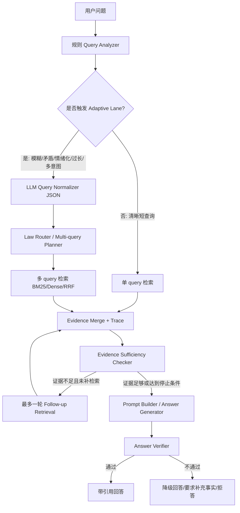

# 现行中国法律 RAG 架构升级执行计划

> 这是截至 2026-09-18 的历史 Phase 0-5 路线与实施记录，不再作为当前发布主线。
> 当前增量改造合同为 `docs/refactor/MASTER_PLAN.md`，执行事实以
> `docs/refactor/STATE.json` 和 `docs/refactor/HANDOFF.md` 为准。历史 Phase 完成状态
> 不等于新主线中的 M0-M7 已完成。

## 历史实施状态，截至 2026-09-18

截至 2026-09-18，本项目已经完成 Phase 0-3、Phase 4A 评测硬化，以及 Phase 4B 的实验平台工程实现:

- Phase 0: baseline/reproducibility 基础，包括 baseline 命令、manifest、v2 eval 默认路径、run metadata 和最小回归测试入口。
- Phase 1: retrieval reliability and failure attribution，包括 sliding neighbor chunk、chunk diagnostics、规则 Query Analyzer、BM25 参数配置化、RRF trace、failure labeler 和检索 trace JSONL。
- Phase 2: controlled query understanding and multi-query planning，包括 `NormalizedQuery` JSON contract、触发式 adaptive lane、Ollama normalizer adapter with fallback、候选法律/关键词 suggester、bounded retrieval planner、multi-query evidence merge、adaptive trace 和 adaptive eval cases。
- Phase 3: evidence sufficiency、bounded follow-up retrieval 和 answer verifier，包括生成前风险拒答、证据充分性检查、最多一轮补检索、低置信降级模板、引用/免责声明/verifier 校验、answer eval 指标扩展和 Phase 3 回归测试。
- Phase 4A: evaluation hardening and manual experiment matrix，包括 120 条 v3 固定评测集、30 条生成子集、bootstrap 95% CI、case 间 memory reset、LLM-as-judge、废止法律降权、保守去重、metadata embedding 消融、LlamaIndex 对照和结果总结。
- Phase 4B: reproducible experiment platform，包括 reranker protocol/BGE adapter、embedding cache v2 contract、cache health、五维 experiment matrix、P50/P95、build memory、调用/token/可选成本聚合和最新机制决策文档。

当前全量单元测试为 `70 passed`。Phase 4A 的历史实验结论保存在 `reports/RESULTS_SUMMARY.md`；报告反映 2026-06 的本地增强语料和当时模型版本，精确数值不是跨时间稳定承诺。Phase 4B 自动矩阵已在同一 v3 cases 上复现 BM25 direct/adaptive 的质量结论。

Phase 1 验证命令:

```powershell
python -B -m pytest
python -m legal_rag.cli build-index --chunk-strategy neighbor --neighbor-window 3 --neighbor-stride 1
python -m legal_rag.cli evaluate --chunk-strategy article --retriever bm25 --trace-path reports/eval_article_bm25_trace.jsonl
```

Phase 2 验证命令:

```powershell
python -B -m pytest
python -m legal_rag.cli evaluate --chunk-strategy article --retriever bm25 --cases eval_cases/legal_eval_cases_adaptive.jsonl --adaptive --trace-path reports/eval_article_bm25_adaptive_trace.jsonl --prefix eval_article_bm25_adaptive
```

Phase 3 验证命令:

```powershell
python -B -m pytest
python -m legal_rag.cli evaluate --chunk-strategy article --retriever bm25 --cases eval_cases/legal_eval_cases_adaptive.jsonl --adaptive --trace-path reports/eval_article_bm25_phase3_trace.jsonl --prefix eval_article_bm25_phase3
```

Phase 4A 验证命令:

```powershell
python -B -m pytest
python -m legal_rag.cli evaluate --chunk-strategy article --retriever bm25 --cases eval_cases/legal_eval_cases_v3.jsonl --prefix v3_article_bm25
```

Phase 4B 验证命令:

```powershell
uv run pytest -q
uv run python -m legal_rag.cli cache-health --chunk-strategy article --embedding bge_large_zh
uv run python -m legal_rag.cli experiment-matrix --chunk-strategies article --retrievers bm25 --adaptive-modes direct,adaptive --rerankers none --cases eval_cases/legal_eval_cases_v3.jsonl
```

旧路线当时建议的后续工作是用自动矩阵完成真实 reranker A/B、在 GPU 环境重建 v2 embedding cache，并进入 Phase 5 的 LawBench 与最终报告硬化。这些遗留项不构成当前 M0-M7 主线的 next action。Reranker 只有在质量提升且 P95 可接受时才可能改变默认策略。

## 1. 项目目标

把当前法律 RAG 项目升级为一个可复现、可评测、证据可核验的中国现行法律文本检索助手。短期目标不是做自由行动的法律 Agent，而是在稳定的检索与评测基线上，引入受控 Adaptive RAG：对模糊、矛盾、情绪化、过长或多意图的用户描述进行结构化理解，生成有限数量的检索计划，合并证据，在证据不足时最多补检索一轮，最后用引用与证据校验约束回答。

默认建设顺序：

1. 先冻结 `article chunk + BM25 + retrieval-only eval` 基线。
2. 再补齐失败归因、manifest、trace 与评测回归。
3. 然后加入受控 query understanding、law router、multi-query retrieval。
4. 最后增加 evidence sufficiency、bounded retrieval loop、answer verifier、reranker 和 benchmark 报告能力。

## 2. 制定旧 Phase 计划时的基线评估

### 已经做得好的部分

| 方面 | 当前基础 | 价值 |
| --- | --- | --- |
| 数据优先 chunk 策略 | 已有 `article`、`neighbor`、`long_split`、`fixed_chars` 多种策略，且已有数据画像产物。 | 适合作为实验变量，而不是凭直觉改 chunk。 |
| 检索实验雏形 | `legal_rag/retrieval.py` 已支持 BM25、dense、cached dense、RRF hybrid。 | 可以开展 BM25/dense/RRF 和 embedding 对照。 |
| 评测意识 | `legal_rag/evaluation.py`、`eval_cases/legal_eval_cases_v2.jsonl`、LawBench adapter 已存在。 | 具备从 smoke test 升级为回归门槛的基础。 |
| 生成边界 | `legal_rag/chat.py` 的 prompt 要求基于资料回答、引用 `[Sx]`、拒绝个案策略并附免责声明。 | 已经有最小安全边界，可继续加 verifier。 |
| CLI 工程入口 | `profile-data`、`build-index`、`build-embeddings`、`evaluate`、`lawbench-predict` 已串起来。 | 后续任务可以优先扩展 CLI，而不是重写项目结构。 |

### 目前缺失的关键能力

| 缺口 | 影响 | 优先处理方式 |
| --- | --- | --- |
| artifact manifest 不完整 | 数据、chunk、embedding cache、报告难以复现。 | Phase 0 加 manifest、run metadata、baseline 命令。 |
| chunk 诊断不足 | 无法解释失败来自条文解析、窗口边界还是 metadata。 | Phase 1 加 sliding neighbor 与 chunk diagnostics。 |
| 查询理解过弱 | 真实用户的长描述、情绪化表达、多意图请求会稀释检索 query。 | Phase 2 加触发式 LLM normalizer 和 deterministic fallback。 |
| 多 query 证据合并缺失 | 多法律领域问题容易只命中一部分证据。 | Phase 2 加 law router、bounded planner、merge trace。 |
| 证据充分性与引用校验缺失 | 资料不足时仍可能生成过度结论或虚假引用。 | Phase 3 加 sufficiency checker、bounded follow-up、answer verifier。 |
| Reranker 真实模型 A/B 尚未完成 | protocol、BGE adapter 和矩阵已完成，但 2.29 GB 模型尚未在完整 v3 集合验证收益与 P95。 | 在资源合适的机器运行 `none,bge_v2_m3` 同集矩阵；无收益则继续默认关闭。 |
| LawBench 解释不足 | 容易把所有 benchmark 分数误归因于检索。 | Phase 5 加 task map、score importer 和文档硬化。 |

### 应该暂缓的部分

| 暂缓项 | 原因 | 重新评估条件 |
| --- | --- | --- |
| 自由多智能体法律 Agent | 法律场景中错误行动和无依据扩展风险高，当前还缺 verifier 和稳定评测。 | Phase 0-3 指标稳定，且能证明 agent loop 带来可测收益。 |
| 长期记忆和用户画像 | 会引入隐私、偏见和个案建议风险。 | 有明确产品需求、数据治理和删除机制后再做。 |
| 微调/领域 SFT | 现阶段瓶颈更可能在检索、chunk、证据链和评测。 | 有失败归因显示生成模型系统性不会使用已检索证据。 |
| 线上服务编排和复杂 UI | 会分散对核心 RAG 质量的投入。 | 默认链路、报告和 demo 已稳定后再产品化。 |

## 3. 目标架构

### 3.1 目标 pipeline



### 3.2 模块边界

| 模块 | 职责 | 推荐文件 |
| --- | --- | --- |
| Query Analyzer | 规则抽取法律名、条号、风险词、输入复杂度和 adaptive 触发原因。 | `legal_rag/query.py` 或 `legal_rag/query_understanding.py` |
| LLM Normalizer | 只在触发条件满足时调用 LLM，输出严格 JSON。 | `legal_rag/query_understanding.py` |
| Law Router / Planner | 把 legal questions 拆成有限 retrieval plans，记录 law hints、keywords、top_k、rationale。 | `legal_rag/planning.py` |
| Retrieval Merge | 执行多 query 检索、按 `chunk_id` 去重、保留子排名与来源 query。 | `legal_rag/retrieval.py` |
| Evidence Checker | 判断证据覆盖是否足够，区分缺事实、缺法律依据、低分/低覆盖。 | `legal_rag/evidence.py` |
| Bounded Loop | 最多一轮 follow-up retrieval，记录停止原因。 | `legal_rag/adaptive.py` 或 `legal_rag/chat.py` |
| Answer Verifier | 校验 `[Sx]` 引用存在、有限词面启发式和拒答边界；不证明语义支持或法律正确性。 | `legal_rag/verifier.py` |
| Trace / Reports | 记录 analyzer、planner、retrieval、checker、verifier 的结构化 JSONL。 | `legal_rag/tracing.py`、`legal_rag/evaluation.py` |

## 4. 设计原则

1. **受控 Adaptive RAG，不做自由 agent loop。** LLM 只负责结构化查询理解和有限检索计划，不允许自主选择任意工具、无限追问或无限补检索。
2. **先可测，再优化。** 每个架构升级必须能通过 local eval、分组指标、失败归因或 trace 证明价值。
3. **证据可核验。** 检索结果、合并证据、回答引用和 verifier 结论都必须能追溯到 `chunk_id`、法律名、条号和来源 query。
4. **默认链路保守。** 清晰短查询继续走确定性 analyzer + 单 query 检索，只有复杂输入才启用 LLM normalizer。
5. **失败显式化。** 资料不足、缺少事实、缺少法律依据、引用无效、越界法律建议都应有明确状态，而不是让生成模型自由发挥。
6. **成本可解释。** 任何 LLM normalizer、reranker 或 follow-up retrieval 的引入，都要记录延迟、调用次数和质量收益。

## 5. 阶段计划与任务拆分

每个任务都控制在一个小 coding subagent 可以完成的范围内。任务可以并行阅读代码，但代码修改应按依赖顺序合入，避免多个任务同时改同一核心 dataclass 或 CLI 参数。

### Phase 0: Baseline and Reproducibility

目标：把当前项目从“能跑”升级为“可复现”。先不加复杂模型，不改变默认检索排序。

退出标准：一条命令能重建 `article + bm25 + retrieval-only` baseline，并产出包含 `run_id`、config、case set、chunk count 的报告。

| ID | 目标 | 范围/可能触达文件 | 预期产出 | 验收标准 | 非目标 | 建议测试/验证 |
| --- | --- | --- | --- | --- | --- | --- |
| P0-01 | 增加 baseline 一键命令 | `legal_rag/cli.py`，可选 `scripts/run_baseline.ps1` 或 `scripts/run_baseline.py`，`docs/LAWBENCH_EVALUATION.md` | 串起 `profile-data`、`build-index --chunk-strategy article`、`evaluate --retriever bm25 --no-generate` 的命令或 CLI 子命令 | 在空 artifacts 或干净输出目录下能生成 index、CSV、Markdown report；命令输出包含 report 路径 | 不调整检索算法，不引入 LLM 生成 | 运行 baseline smoke；确认 `artifacts/reports` 新增报告 |
| P0-02 | 定义 artifact manifest | `legal_rag/models.py`，新增 `legal_rag/manifest.py`，`legal_rag/indexing.py`，`legal_rag/embeddings.py` | dataset/chunk/index/embedding manifest JSON，记录输入路径、策略、config 摘要、时间、chunk 数 | `build-index` 和 `build-embeddings` 写出 manifest；字段稳定可读 | 不做 hash 全量校验，不改变 artifact 格式主体 | 单测 manifest 序列化；手动运行 `build-index` 检查 JSON |
| P0-03 | 让 eval v2 成为默认或显式版本 | `legal_rag/cli.py`，`docs/EVALUATION_PLAN.md` | `evaluate` 默认使用 `eval_cases/legal_eval_cases_v2.jsonl`，或新增 `--cases-version v1/v2` | 默认评测覆盖 v2 case；v1 仍可通过参数使用 | 不重写 case 内容，不新增指标 | `python -m legal_rag.cli evaluate --no-generate` 能读取 v2 |
| P0-04 | 报告补充 run metadata | `legal_rag/evaluation.py`，`legal_rag/cli.py`，可能 `legal_rag/models.py` | report 增加 `run_id`、config path、case path、top_k、chunk strategy、retriever、embedding key、chunk count | Markdown report 的“实验配置”足以复现实验 | 不新增复杂 dashboard | 单测 `render_eval_report`；运行一次 evaluate 检查报告 |
| P0-05 | 建立最小回归测试入口 | `tests/test_core.py`，可能新增 `tests/test_cli_smoke.py` | 覆盖 chunk load、retriever build、eval report 渲染的 smoke tests | `pytest` 不需要真实 LLM 和大型 embedding 模型即可通过 | 不做端到端 LawBench 测试 | `pytest tests/test_core.py tests/test_cli_smoke.py` |

### Phase 1: Retrieval Reliability and Failure Attribution

目标：先解释为什么检索失败，再优化检索。重点是 chunk 诊断、BM25 参数、RRF trace、failure label。

退出标准：每个失败样例至少能归因为 parse、chunk、query、recall、rank、metadata 或 refusal 边界问题之一。

| ID | 目标 | 范围/可能触达文件 | 预期产出 | 验收标准 | 非目标 | 建议测试/验证 |
| --- | --- | --- | --- | --- | --- | --- |
| P1-01 | 支持 sliding neighbor chunk | `legal_rag/chunking.py`，`legal_rag/config.py`，`legal_rag/indexing.py`，`tests/test_core.py` | `neighbor_window` 之外新增 `neighbor_stride`，支持 `window=3, stride=1` | 相邻条文不再因固定窗口边界被遗漏；默认仍保持兼容 | 不改变 `article` 默认策略 | 单测 window/stride 组合；build `neighbor` index |
| P1-02 | 输出 chunk 诊断报告 | `legal_rag/indexing.py`，新增 `legal_rag/diagnostics.py`，`reports/` 文档说明 | `diagnostics.json` 和可选 `diagnostics.md`，包含 chunk 数、长度分布、article span、异常样例 | `build-index` 后能看到每种策略的诊断摘要 | 不依赖 LLM，不做质量打分 | 单测诊断函数；手动检查 report |
| P1-03 | 增加规则 Query Analyzer | 新增 `legal_rag/query.py`，`legal_rag/retrieval.py`，`legal_rag/chat.py`，`legal_rag/evaluation.py` | `QueryAnalysis` dataclass，抽取法律名、条号、case type hint、risk flags、complexity flags | 清晰短 query 不需要 LLM 也能输出结构化分析 | 不做 LLM 改写，不拆多 query | 单测法律名、条号、风险词、过长输入识别 |
| P1-04 | BM25 boost 参数配置化 | `legal_rag/retrieval.py`，`legal_rag/config.py`，`configs/default.yaml`，`legal_rag/cli.py` | law/article boost 常数进入 config，报告记录参数 | 默认结果不回退；可以通过 config 做 ablation | 不换 BM25 实现 | 单测 metadata boost；跑一次 baseline 对比 |
| P1-05 | 增加 RRF trace | `legal_rag/models.py`，`legal_rag/retrieval.py`，`legal_rag/evaluation.py` | `SearchResult` metadata 或 trace 字段记录 `bm25_rank`、`dense_rank`、`fused_score`、权重 | RRF 结果能解释来自哪个子检索器和排序 | 不改变最终排序 | 单测 RRF trace 字段；evaluate report sources 可包含 trace 摘要 |
| P1-06 | 自动 failure labeler | 新增 `legal_rag/failure_analysis.py`，`legal_rag/evaluation.py` | 根据 expected law/article 与 retrieved ranks 标注 `miss`、`low_rank`、`wrong_law`、`wrong_article`、`metadata_gap` | 报告出现失败类型统计和前 N 个失败样例 | 不要求 LLM 判断失败原因 | 单测各类 label；用 v2 cases 生成失败统计 |
| P1-07 | 检索 trace JSONL | 新增 `legal_rag/tracing.py`，`legal_rag/evaluation.py`，`legal_rag/chat.py` | 每个 query 写出 analyzer、retrieval results、ranking trace 的 JSONL | eval/chat 可选输出 trace 文件；不影响默认回答 | 不记录长期用户画像 | 单测 trace schema；运行 evaluate 检查 JSONL |

### Phase 2: Controlled Query Understanding and Multi-query Planning

目标：只在复杂输入上启用 LLM query understanding，并把结果限制为可追踪的 JSON contract 和 bounded retrieval plans。

退出标准：模糊、多意图、候选法律过多、情绪化描述能产出稳定 query plans；清晰短 query 仍走确定性单 query。

| ID | 目标 | 范围/可能触达文件 | 预期产出 | 验收标准 | 非目标 | 建议测试/验证 |
| --- | --- | --- | --- | --- | --- | --- |
| P2-01 | 定义 normalizer JSON contract | 新增 `legal_rag/query_understanding.py`，`legal_rag/models.py`，`tests/test_query_understanding.py` | `NormalizedQuery` schema：`legal_questions`、`missing_facts`、`law_hints`、`article_hints`、`keywords`、`risk_flags`、`confidence` | fixture JSON 能解析、校验、降级；字段缺失有清晰错误 | 不调用真实 LLM，不生成最终答案 | schema 单测；非法 JSON fallback 单测 |
| P2-02 | 实现 adaptive 触发器 | `legal_rag/query.py`，`legal_rag/query_understanding.py`，`legal_rag/chat.py` | 仅在 vague、contradictory、emotional、too_long、multi_intent 或 low_confidence 时调用 normalizer | 清晰短查询不会触发 LLM；复杂 fixture 会触发 | 不把所有请求都改写 | 单测触发条件；mock normalizer 调用次数 |
| P2-03 | 接入 LLM normalizer adapter | `legal_rag/query_understanding.py`，`legal_rag/llm.py`，`configs/default.yaml` | 使用现有 Ollama client 或轻量 client 输出严格 JSON，带 timeout、重试 0-1 次、fallback | LLM 出错时回退到原 query 和规则 analyzer | 不引入新 agent 框架 | mock LLM 返回正常/异常/非 JSON；chat smoke |
| P2-04 | 候选法律与关键词 suggester | `legal_rag/query_understanding.py`，`legal_rag/planning.py` | 从 normalized query 生成 law hints、article hints、keywords、exclude terms | 检索计划包含可解释关键词组和候选法律 | 不保证候选法律一定正确 | fixture 单测；trace 中能看到 hints |
| P2-05 | Law router / multi-query planner | 新增 `legal_rag/planning.py`，`legal_rag/models.py` | `RetrievalPlan` schema，按 intent/law family 拆分，限制 `max_queries`、`top_k`、rationale | 多意图输入能拆成有限多个 query plans；超限会截断并记录原因 | 不做自由规划或工具调用 | 单测单意图、多意图、超限截断 |
| P2-06 | Multi-query retrieval merge | `legal_rag/retrieval.py`，可能新增 `legal_rag/adaptive.py` | 执行 plans，按 `chunk_id` 去重，合并分数/排名，保留 `source_query`、`plan_id`、子检索排名 | 报告或 trace 能说明每条证据来自哪个 query | 不新增 reranker，不改变单 query 默认 | 单测 dedupe/merge；mock retriever 多 query |
| P2-07 | Adaptive trace record | `legal_rag/tracing.py`，`legal_rag/chat.py`，`legal_rag/evaluation.py` | TraceRecord 增加 normalizer、planner、merge 字段 | adaptive eval/chat 的 trace 可完整复盘 | 不记录敏感用户画像或长期记忆 | JSON schema 单测；运行复杂 query smoke |
| P2-08 | Adaptive eval cases | `eval_cases/legal_eval_cases_adaptive.jsonl` 或扩展 v2，`docs/EVALUATION_PLAN.md` | 新增模糊、情绪化、多意图、候选法律过多、矛盾事实 cases | 能比较 direct retrieval 与 adaptive retrieval | 不要求 LawBench 全覆盖 | `evaluate --cases ...` 分组指标可运行 |

### Phase 3: Evidence Sufficiency, Iterative Retrieval, and Verifier

目标：在生成前判断证据是否足够，允许最多一轮受控补检索；生成后校验引用和结论支撑。

退出标准：引用不存在、证据不足、越界结论和个案策略请求都能被稳定检测并降级处理。

| ID | 目标 | 范围/可能触达文件 | 预期产出 | 验收标准 | 非目标 | 建议测试/验证 |
| --- | --- | --- | --- | --- | --- | --- |
| P3-01 | 增加拒答/风险 router | `legal_rag/query.py`，`legal_rag/chat.py`，`tests/test_chat.py` | 生成前识别个案策略、非法律问题、违法帮助、医疗/财务越界建议 | 高风险请求直接拒答并附边界说明 | 不调用 LLM 分类，不做复杂合规系统 | 单测风险词与拒答模板 |
| P3-02 | Evidence sufficiency checker | 新增 `legal_rag/evidence.py`，`legal_rag/models.py` | `EvidenceCheck` 输出 `sufficient`、`missing_facts`、`missing_law_support`、`low_coverage`、`followup_queries` | 多条文 case 能识别覆盖不足；无结果时给出明确缺口 | 不替代最终回答，不做事实裁判 | 单测 coverage/score/缺失类型 |
| P3-03 | Bounded follow-up retrieval loop | `legal_rag/adaptive.py`，`legal_rag/chat.py`，`legal_rag/evaluation.py` | 证据不足时最多一轮 follow-up retrieval，合并证据并记录停止原因 | 达到 `max_rounds=1` 停止；不会无限循环 | 不做自由 agent loop，不自动询问用户多轮 | mock retriever 验证补检索次数和停止原因 |
| P3-04 | Answer verifier | 新增 `legal_rag/verifier.py`，`legal_rag/chat.py` | 校验 `[Sx]` 是否存在、关键法律结论是否有证据片段、免责声明是否保留 | 虚假引用会被降级；无证据结论改写为资料不足 | 不做司法事实认定，不保证模型事实完全正确 | 单测引用解析、缺引用、越界结论 |
| P3-05 | Prompt builder 快照测试 | `legal_rag/chat.py`，`tests/test_chat.py` | `build_qa_prompt` 的引用格式、免责声明、资料格式快照 | prompt 关键结构改变会触发测试失败 | 不评判 LLM 输出质量 | pytest snapshot 或字符串断言 |
| P3-06 | Answer eval 指标扩展 | `legal_rag/evaluation.py`，`legal_rag/models.py`，`docs/EVALUATION_PLAN.md` | 增加 sufficiency pass、citation validity、verifier pass、refusal correctness 指标 | 生成评测不只看 keyword coverage | 不做大规模人工标注 | mock answer 评测单测；小样本 generate smoke |
| P3-07 | 低置信回答模板 | `legal_rag/chat.py`，`legal_rag/evidence.py`，`legal_rag/verifier.py` | 统一资料不足、缺事实、缺法律依据、引用失败的降级回答 | 用户能看懂缺什么，而不是收到泛泛拒答 | 不提供个案策略建议 | 单测模板；人工检查 3-5 个失败样例 |

### Phase 4: Reranker and Quality/Cost Experiments

目标：在已有可复现评测和 trace 基础上，比较 reranker、embedding、adaptive lane 的质量、延迟和成本，决定默认策略。

退出标准：产出 BM25、dense、RRF、RRF+rerank、direct/adaptive 的分组对比和默认策略说明。

当前状态：**平台工程已完成，真实 reranker 决策待实验**。Phase 4A 已补齐评测集、置信区间、judge 和手工矩阵；Phase 4B 已完成 P4-01 至 P4-05，并用自动 runner 复现 BM25 direct/adaptive 结论。P4-06 已更新默认策略和证据边界，但 `bge_v2_m3` 尚未完成真实 120-case A/B，所以 Phase 4 总退出标准仍保留这一项。

| ID | 目标 | 范围/可能触达文件 | 预期产出 | 验收标准 | 非目标 | 建议测试/验证 |
| --- | --- | --- | --- | --- | --- | --- |
| P4-01 | 定义 Reranker protocol | `legal_rag/rerank.py`，`legal_rag/cli.py` | `Reranker` 接口、wrapper 和 `--reranker none` bypass | 已完成；默认 none 不改变 baseline，base trace 被保留 | 不下载模型 | fake reranker 顺序/trace/stats 单测 |
| P4-02 | 接入 BGE reranker adapter | `legal_rag/rerank.py`，`configs/default.yaml` | lazy `BAAI/bge-reranker-v2-m3` CrossEncoder，支持 `top_n -> top_k` | adapter 已完成；真实完整 A/B 待资源环境 | 不把 reranker 设为默认 | mock contract 已完成；可选本地/GPU benchmark |
| P4-03 | Embedding cache health check | `legal_rag/embeddings.py`，`legal_rag/cli.py` | schema v2、模型契约、向量结构、chunk/corpus fingerprint 校验 | 已完成；旧 cache runtime fail-closed，CLI 给出重建原因 | 不自动伪造或重建 cache | healthy/drift/legacy 单测，真实旧 cache 诊断 |
| P4-04 | Experiment matrix runner | `legal_rag/cli.py`，`legal_rag/experiments.py` | chunk x retriever x embedding x adaptive x reranker，输出 CSV/JSON/Markdown | 已完成；120-case direct/adaptive 两格实跑成功 | 先不跑生成矩阵，不做并发调度优化 | matrix 去重/输出单测与真实 v3 run |
| P4-05 | Cost latency profiler | `legal_rag/llm.py`，`legal_rag/evaluation.py`，`legal_rag/experiments.py` | build、平均/P50/P95、LLM/rerank calls、token、可选估算成本 | 已完成；provider 无 usage 时显示 N/A | 不做线上监控和真实账单对接 | usage shape/delta、聚合和报告测试 |
| P4-06 | 默认策略决策报告 | `docs/`，`reports/`，`README.md` | 根据矩阵写出推荐默认链路和不启用项 | direct/BM25 结论已自动复现；reranker 晋升决策待真实 A/B | 不夸大法律能力 | 对照 matrix JSON 与结果摘要人工 review |

### Phase 5: LawBench, Reporting, and Documentation Hardening

目标：把本地 eval、LawBench、架构决策、README 和已知限制合并成可展示的工程闭环。

退出标准：新读者能 10 分钟跑通 smoke test；报告能解释为什么这样设计、哪里失败、下一步做什么。

| ID | 目标 | 范围/可能触达文件 | 预期产出 | 验收标准 | 非目标 | 建议测试/验证 |
| --- | --- | --- | --- | --- | --- | --- |
| P5-01 | LawBench score importer | `legal_rag/lawbench.py`，`legal_rag/cli.py`，`docs/LAWBENCH_EVALUATION.md` | 读取官方 evaluator 输出并合并为本项目 report | 本地 eval 和 LawBench 分开展示；路径说明清晰 | 不重写官方 LawBench 评测 | 用小样例 JSON 测 importer |
| P5-02 | LawBench task map | `legal_rag/lawbench.py` 或 `docs/LAWBENCH_EVALUATION.md` | 标注任务属于检索增强型、法律理解型、纯模型能力型 | 报告避免把所有 LawBench 分数归因于检索 | 不修改官方数据 | 文档 review；task id mapping 单测 |
| P5-03 | Architecture Decision Log 更新 | 新增或更新 `docs/ARCHITECTURE_DECISIONS.md` | 每个关键机制记录背景、决策、指标、失败模式、回滚条件 | 架构演进可被复盘和面试解释 | 不写流水账 | 人工 review；链接到报告 |
| P5-04 | README quick path | `README.md`，`docs/EVALUATION_PLAN.md` | quickstart、baseline、adaptive smoke、known limitations | 新读者 10 分钟能跑 retrieval smoke | 不夸大效果，不承诺法律意见 | 按 README 命令从头跑一次 |
| P5-05 | 报告模板硬化 | `legal_rag/evaluation.py`，`legal_rag/experiments.py`，`docs/` | 统一报告结构：配置、指标、失败归因、trace 链接、成本、结论 | 不同实验报告可横向比较 | 不做 Web dashboard | 单测 report renderer；人工检查可读性 |
| P5-06 | 最终验收清单 | `docs/LEGAL_RAG_EXECUTION_PLAN.md`，`docs/` | 汇总各阶段完成状态、未解决风险、下一步 backlog | 项目能明确说明“已完成/未完成/为什么” | 不继续新增功能 | 文档 review；对照 git diff 和测试结果 |

## 6. 明确排序与依赖

### 6.1 必须顺序执行的主链路

```text
P0-01 -> P0-02 -> P0-04 -> P1-06 -> P1-07
                              |
                              v
P1-03 -> P2-01 -> P2-02 -> P2-05 -> P2-06 -> P2-07
                                                   |
                                                   v
P3-02 -> P3-03 -> P3-04 -> P3-06
                                                   |
                                                   v
P4-04 -> P4-05 -> P4-06 -> P5-03 -> P5-04
```

### 6.2 依赖表

| 任务 | 前置依赖 | 说明 |
| --- | --- | --- |
| P0-01 | 无 | 第一批启动，用于冻结当前 baseline。 |
| P0-02 | P0-01 可并行 | manifest 可以先独立实现，但最好用 baseline 验收。 |
| P0-03 | 无 | 可独立执行，但会影响 baseline 默认 case。 |
| P0-04 | P0-01、P0-02 | 报告 metadata 需要引用 manifest/run_id。 |
| P0-05 | P0-01 到 P0-04 中任意已完成部分 | 随 Phase 0 增量补测试。 |
| P1-01 | P0-01 | 需要 baseline 作对照，防止 chunk 改动无法解释。 |
| P1-02 | P0-02、P1-01 | 诊断报告依赖 manifest 和 chunk metadata。 |
| P1-03 | 无，建议 P0-01 后 | query analyzer 可独立实现，后续 adaptive 依赖它。 |
| P1-04 | P0-04 | 参数配置化后必须能进入报告。 |
| P1-05 | P0-04 | trace 字段需要被 report/eval 消费。 |
| P1-06 | P0-03、P0-04、P1-05 | failure label 需要 v2 case 和 retrieved trace。 |
| P1-07 | P1-03、P1-05、P1-06 | 统一 trace 依赖 analyzer、retrieval trace 和失败归因。 |
| P2-01 | P1-03 | normalizer contract 应复用规则 analyzer 的复杂度/risk 判断。 |
| P2-02 | P2-01、P1-03 | 触发器需要 schema 和 analyzer。 |
| P2-03 | P2-01、P2-02 | LLM adapter 必须有 fallback 和触发边界。 |
| P2-04 | P2-01 | suggester 使用 normalized query 输出。 |
| P2-05 | P2-04 | planner 依赖候选法律和关键词。 |
| P2-06 | P2-05、P1-05 | merge 需要 retrieval plan 和子检索 trace。 |
| P2-07 | P1-07、P2-06 | adaptive trace 汇总前面所有节点。 |
| P2-08 | P2-02、P2-05、P2-06 | adaptive case 用于评估 direct vs adaptive。 |
| P3-01 | P1-03 | 拒答 router 复用 risk flags。 |
| P3-02 | P2-06 | sufficiency checker 需要合并后的证据和 plan。 |
| P3-03 | P3-02、P2-06 | bounded loop 根据 checker 输出 follow-up queries。 |
| P3-04 | P3-03 | verifier 应校验最终 evidence set 和回答。 |
| P3-05 | P3-04 可并行 | prompt 快照可以先做，但 verifier 接入后需更新。 |
| P3-06 | P3-02、P3-04 | 指标依赖 checker 和 verifier 输出。 |
| P3-07 | P3-02、P3-04 | 低置信模板依赖缺口类型和 verifier 结果。 |
| P4-01 | P1-05 | reranker 接入需要保留原排名 trace。 |
| P4-02 | P4-01 | adapter 依赖 protocol。 |
| P4-03 | P0-02 | cache health 依赖 manifest。 |
| P4-04 | P3-06，P4-01 | matrix 需要稳定指标和可选 reranker。 |
| P4-05 | P2-07，P4-04 | 成本统计依赖 trace 和 matrix runner。 |
| P4-06 | P4-04、P4-05 | 默认策略报告依赖质量和成本对比。 |
| P5-01 | P0-04 | LawBench 分数导入应使用统一报告 metadata。 |
| P5-02 | P5-01 可并行 | task map 是解释层，可先写文档再接 importer。 |
| P5-03 | 每个阶段结束时增量更新 | ADL 不应等最后一次性补。 |
| P5-04 | P4-06 | README 默认路径应反映最终推荐链路。 |
| P5-05 | P4-04、P5-01 | 报告模板统一本地 eval、matrix、LawBench。 |
| P5-06 | P5-03、P5-04、P5-05 | 最终验收清单只在文档硬化后做。 |

## 7. 风险与 fallback

| 风险 | 可能后果 | Fallback |
| --- | --- | --- |
| LLM normalizer 输出不稳定 | query plan 漂移，评测不可复现。 | 使用严格 JSON schema、fixture 测试、低 confidence 回退到原 query；默认只在复杂输入触发。 |
| Adaptive lane 提升不明显 | 增加成本和复杂度但指标不涨。 | 保持 direct retrieval 为默认；adaptive 只作为可选实验参数。 |
| 多 query 引入噪声 | 合并证据过多，生成阶段引用错误来源。 | 限制 `max_queries`、每个 plan 的 `top_k`、按 chunk 去重，并在 sufficiency checker 前截断。 |
| Follow-up retrieval 失控 | 变成自由 agent loop，延迟不可控。 | 固定 `max_rounds=1` 作为默认；所有停止原因写入 trace。 |
| Verifier 误杀正确回答 | 过度降级导致用户体验差。 | verifier 先做规则型 citation 校验和低风险 coverage 校验；LLM verifier 只作为后续实验。 |
| Reranker 依赖难安装或慢 | 本地环境不稳定，实验成本高。 | `NoOpReranker` 为默认；BGE adapter 失败时给清晰依赖错误，不阻塞 baseline。 |
| LawBench 分数被误读 | 项目展示时夸大 RAG 对纯推理任务的作用。 | task map 区分检索增强型、法律理解型、纯模型能力型，报告分开展示。 |
| 文档和代码漂移 | 执行计划失去指导意义。 | 每个阶段结束更新 ADL 和本文件验收状态，报告链接到具体 run_id。 |

## 8. 旧路线最初启动顺序，仅供追溯

第一批只启动 Phase 0 和少量 Phase 1 任务，目标是建立稳定地面基线和失败解释能力。

| 批次 | 任务 | 推荐原因 | 可并行性 |
| --- | --- | --- | --- |
| Batch 1A | P0-01 baseline 一键命令 | 所有后续优化都需要对照基线。 | 独立启动。 |
| Batch 1A | P0-03 eval v2 默认化 | 让 baseline 从 smoke case 升级到分层 case。 | 可与 P0-01 并行，但合入时注意 CLI 默认参数。 |
| Batch 1A | P0-02 artifact manifest | 为可复现和报告 metadata 打基础。 | 可与 P0-01 并行。 |
| Batch 1B | P0-04 报告 run metadata | 将 baseline、manifest 和 case 信息写进报告。 | 依赖 P0-01/P0-02。 |
| Batch 1B | P1-03 规则 Query Analyzer | Phase 2 adaptive lane 的前置模块，且本身能改善 trace。 | 可在 P0-04 后并行开发。 |
| Batch 1B | P1-06 Failure labeler | 让每个失败样例有归因，为 chunk/retrieval 优化提供方向。 | 依赖 P0-03/P0-04，建议晚于 P1-05 或先做轻量版本。 |
| Batch 1C | P1-05 RRF trace | RRF 与后续 multi-query merge 都需要子检索排名。 | 依赖 P0-04，可与 P1-06 协调字段。 |
| Batch 1C | P1-02 Chunk 诊断报告 | 解释 chunk 策略质量，支持是否优先做 sliding neighbor。 | 依赖 P0-02，可与 P1-01 先后合入。 |

不建议第一批启动 P2/P3 的 LLM normalizer、bounded loop 或 verifier。它们依赖稳定 schema、trace、失败归因和报告字段；太早做会让问题难以定位。

## 9. 阶段验收清单

| 阶段 | 最低验收 | 推荐命令/证据 |
| --- | --- | --- |
| Phase 0 | baseline 可复现，报告含 run metadata，v2 cases 可运行。 | `python -m legal_rag.cli evaluate --retriever bm25 --no-generate`，报告截图或路径。 |
| Phase 1 | 失败样例有 label，RRF 有 trace，chunk 有诊断。 | eval report 的失败归因统计和 trace JSONL。 |
| Phase 2 | 复杂输入触发 adaptive，清晰输入不触发；multi-query evidence 可追踪。 | adaptive cases direct vs adaptive 对比报告。 |
| Phase 3 | 已完成。证据不足、虚假引用、越界请求能被降级或拒答，trace/report 包含 sufficiency/verifier 字段。 | `python -B -m pytest`；`evaluate --adaptive --trace-path ...` 检查 evidence/verifier JSONL。 |
| Phase 4 | 平台工程完成，模型决策部分完成。固定评测、judge、reranker adapter、cache health、自动 matrix/cost 聚合均已落地；当时尚无仓库 CI，真实 BGE reranker A/B 也尚未完成。 | 历史记录为 `70 passed`；Phase 4B BM25 matrix CSV/JSON/Markdown；`reports/RESULTS_SUMMARY.md`；最终退出仍需 reranker 同集报告。 |
| Phase 5 | README、ADL、LawBench 报告能解释项目闭环。 | quickstart smoke、LawBench importer 小样例、最终验收清单。 |
