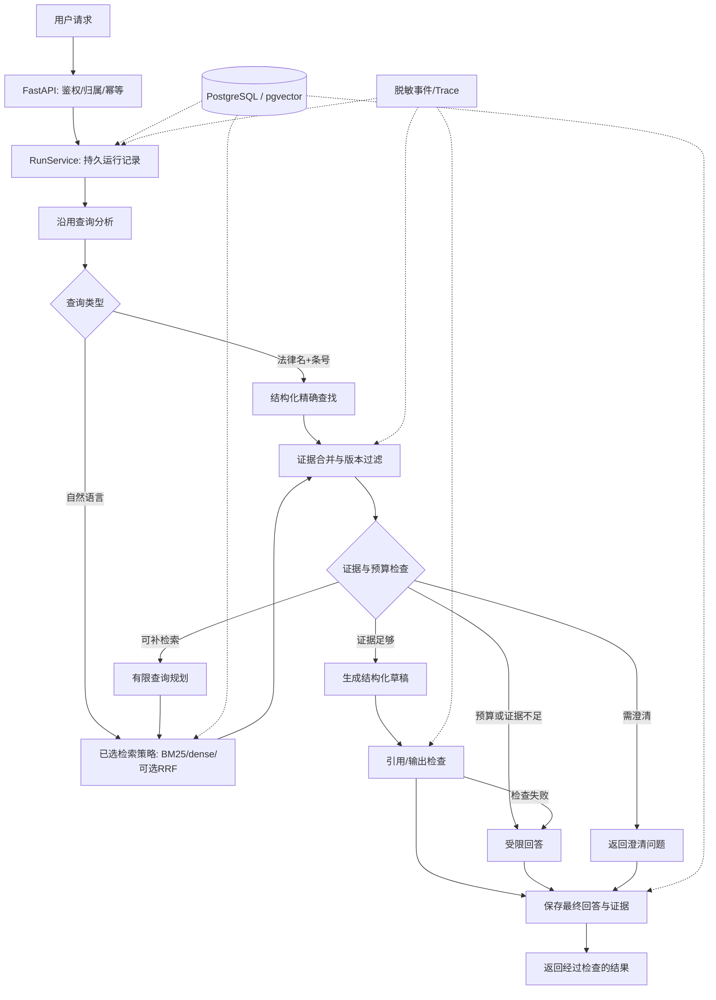
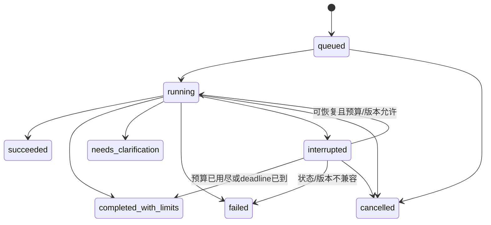

# Legal RAG 渐进式工程改造：开发与发布总方案

> 文档版本：1.0 · 编制日期：2026-09-19
>
> 目标仓库：`1040942669/legal-rag-agent` · 已核实默认分支：`master`
>
> 阅读基线：`4ed96ec921593ef81de61ce545513e3f1211b5db`
>
> 文档性质：交给代码 Agent 执行的需求、设计、验收和发布合同；不是已经完成的实现报告。
> “仅包含文档和记录模板”是本方案编制时的基线，不是持续状态。执行后的真实代码、PR、Tag、Release 和当前里程碑以 `STATE.json` 与 `HANDOFF.md` 为准。

---

## 0. 执行摘要与使用规则

### 0.1 最终要交付什么

在现有法律 RAG 上，渐进式构建一个**版本化法律知识检索与可核验问答服务**。重点证明三件事：资料怎样被找对，运行怎样受控，改造效果怎样被复现。

保留现有 Python、CLI、切分、BM25、dense、查询分析、评测与 Trace。先修指标与验证边界，再缩短实验反馈，然后引入 PostgreSQL/pgvector、FastAPI、LangGraph；Redis/Celery 和外部观测作为后置增强，不以组件数量作为验收标准。

每个里程碑必须留下四种证据：**可运行代码、真实测试记录、GitHub 可见版本、下一窗口可接续的状态**。不允许所有功能堆到最后才第一次 push。

### 0.2 执行权限与停止边界

这份文件被上传、解压或阅读，不等于立即授权修改仓库。用户在项目窗口发送配套的启动指令后，才按指令执行。启动指令默认授权当前仓库内的正常开发、测试、分支提交、push、PR、符合仓库规则的合并，以及通过验收的 Tag / Release。

不在授权范围内：改仓库可见性或成员权限、绕过保护规则、强推、删除远程历史、覆盖他人改动、公开私有数据、启用付费服务、无限制调用模型 API、发布生产环境。遇到这些需求，停止对应动作，说明原因；不为完成发布而擅自扩大权限。

默认一次执行一个里程碑。该里程碑发布并完成回执后汇报，不自动扩展到下一里程碑。用户明确要求连续执行多个阶段时，仍逐阶段验收和发布，不能合成一个大提交。

### 0.3 新窗口阅读顺序

1. 当前目录及父目录适用的 `AGENTS.md`，然后本包的 `AGENT_EXECUTION.md`。
2. `STATE.json` 与 `HANDOFF.md`，随后从远程核实其中的分支、PR、Tag、Release。
3. 本文第 1 节的基线校正、第 4 节的里程碑表，以及当前里程碑的完整说明。
4. 对应实现文件、测试、已有 `ARCHITECTURE_DECISION_LOG.md`、`docs/LEGAL_RAG_EXECUTION_PLAN.md`、`docs/EVALUATION_PLAN.md` 与现有报告。

聊天历史只是辅助材料；实际代码、测试和远程发布状态才是事实。本文中的拟新增路径和接口是设计目标，不代表当前已经存在。

### 0.4 必须遵守的硬约束

- 先检查真实仓库和当前 HEAD；本文固定 SHA 仅用于解释制定方案时的现状，不能把用户的新提交回滚到它。
- 已修复的缺陷不重复制造后再修；已有能力先复用，缺测试时补测试。
- 不删除现有 CLI、评测集、历史结果或负面实验结论；需要调整时保留兼容入口或迁移说明。
- 不把历史模型指标作为新版本实测；不把规则检查包装成法律正确性证明。
- 默认离线测试、mock 和固定 fixture；没有明确额度，不启动付费大规模实验。
- 任一阶段没有通过其强制验收，就不能标记 `released`，也不能为了赶进度跳过安全、隔离或幂等测试。
- 每个阶段都要更新文档和运行方式，但只写已实现功能，未来目标留在 Roadmap。

---

## 1. 已核实基线：对上一轮建议的必要校正

### 1.1 查看的仓库快照

2026-09-19 经连接的 GitHub 工具读取，`master` 指向上述 SHA，提交说明为 `feat: harden phase 4 evaluation and publish case study`。`pyproject.toml` 中包名为 `legal-rag-assistant`，版本为 `0.1.0`，使用 uv，声明 Python `>=3.10`。[R1][R4]

该次 Releases 查询返回空列表；这**不能推导出没有 Git tags**。Tag 列表仍需 M0 在真实工作区通过 `git fetch --tags` 与远程引用核实。本次没有在项目环境运行测试或模型调用。[R6]

### 1.2 不得照抄旧建议的地方

| 条目 | 此次静态核实 | 执行处理 |
|---|---|---|
| 单轮评测串历史 | `evaluate()` 已在每个 case 开始调用 `assistant.reset_memory()` | 保留实现，补/保留回归测试；不要再记为尚未修复的主缺陷 |
| retrieval-only 回答指标 | 已用 `answer_metrics_available` 将回答指标标记为不可用 | 复查主报告、Trace 和异常路径是否统一；不重复开发相同功能 |
| 评测规模 | README 记录 120 条 v3 样例、30 条生成子集 | 复用并核对文件；不退回重新凑 40+40 条 |
| 既有实验 | README 已记录融合和 adaptive 的负结果，adaptive 默认保守关闭 | 不强制把混合检索或 adaptive 改成默认最优路径 |
| 验证器 | 仍将“不构成法律意见”等宽泛词作为拒答线索；带引用的句子跳过部分启发式检查 | M1 优先修正指标与验证语义，不宣称正则能验证法律结论 |
| 现有工程 | 已有自研检索、manifest、trace、评测与历史文档 | 增量接入服务与存储，避免全盘重写 |

上述来自固定快照的 README、evaluation.py、verifier.py；README 所写测试数量和历史结果属于仓库自述，必须在本地重新运行后才可写为本次验证通过。[R2][R3][R5]

### 1.3 特别保留的成果

保留条文级切分和对照策略；保留现有中文 BM25；保留精确 dense 基线及 Embedding 缓存；保留 RRF，但允许它继续非默认；保留受控查询理解和现有补检索上限；保留历史评测和失败样例。

数据库改造阶段不同时更换 Embedding、切分、中文分词、融合参数和生成模型。否则无法判断变化来自存储迁移还是模型与文本工程。

### 1.4 数据边界

README 对语料来源标注了 2025-01-01 的内容截止日期，且历史实验使用了本地增强快照。仓库不随附完整语料。[R2]

因此，产品描述使用“指定语料快照上的法律文本检索”，不能未经更新核验就声称覆盖所有现行法律。法律文本公开可读，不等于任何来源、加工版本和完整数据集都可随意再分发。保留来源与许可记录；默认不把完整语料、模型权重、Embedding cache 或私人对话推到公开 GitHub。

---

## 2. 产品范围、技术取舍与成功标准

### 2.1 主要使用场景

**场景 A：明确条文查询。** 用户给出法律名和条号，优先结构化查找，返回该快照下的条文及来源，而不是一律语义搜索。

**场景 B：自然语言知识查询。** 用户描述问题，系统召回候选证据，说明证据来源、版本和不确定性；证据不足时补检索至预算上限，或提出明确澄清问题。

**场景 C：开发者排障。** 对同一 query 对照 BM25、dense、融合结果，看到每个阶段的输入摘要、证据 ID、耗时与停止原因。

**场景 D：中断与重复提交。** 进程中断后不丢失已持久化的状态；重复请求不创建两份业务任务；不将未知的外部模型执行结果谎称为从未发生。

**场景 E：批量实验。** 一个 case 完成就保存结果；中断后能续跑；改变下游 Prompt 不需要重建上游全部向量。

### 2.2 这轮不做

不做自动法律裁判、胜诉预测或替代专业人士；不做自由代码执行、浏览器 Agent、无限多 Agent 协作、强化学习训练、模型微调、多个向量库同时接入、Kafka/Kubernetes 全家桶、自动抓取所有法律网站。

不为了追求“高级”而引入语义答案缓存、长期向量记忆和 GraphRAG。除非后续失败样例证明具体需要，否则留在扩展清单。

### 2.3 技术决策

| 领域 | 本轮选择 | 边界 |
|---|---|---|
| 工程与依赖 | 继续 Python + uv + pytest | 沿用工作区兼容版本；新增依赖锁定，禁止无理由全量升级 |
| API | FastAPI + Pydantic 请求/响应 | 业务逻辑不写进路由；阻塞模型调用不占住事件循环 |
| 持久数据 | PostgreSQL + SQLAlchemy/Alembic | 原 CLI 默认仍可离线运行；数据库 profile 才要求数据库 |
| 向量检索 | pgvector + 原精确 dense 对照 | 先精确迁移，ANN 是独立的可关闭优化 |
| 编排 | LangGraph 外包裹已有核心函数 | 只保留一个循环控制者，不能与旧 adaptive loop 嵌套叠加预算 |
| 异步批任务 | M6 引入 Celery + Redis | 先解决真实批处理任务，不用队列包装每个小函数 |
| 可观测性 | 本地结构化事件优先，Langfuse 导出可选 | 导出失败不影响主回答；脱敏之后才允许离开本机 |
| 部署 | Docker Compose，API 默认仅本机暴露 | Windows 用户通过 Linux 容器/WSL2 运行 worker |

这是本项目取舍，不是宣称国内大厂统一使用同一技术组合。框架与 SDK 的实际 API 以安装的锁定版本文档为准。[S1][S2][S3]

### 2.4 完成度分级

**核心可交付：M0—M5。** 有可信评测、可重复实验、存储适配、API 隔离和受控恢复。

**中间件增强：M6。** 有持久批任务、幂等入库、队列与观测集成。确实不需要时可以延后，但不能在简历中写成已完成。

**展示收尾：M7。** 无论 M6 是否实施，都需要完成可运行演示、开发文档和真实案例报告；若跳过 M6，明确标注未包含的能力。

成功标准不规定“准确率必须提升若干点”。等价迁移、成本下降、故障被正确处理，以及有证据的负结果，都是有效成果；只有经实验支持，才把新路径切成默认。

---

## 3. 目标架构和代码改造位置

### 3.1 在线主链路



LangGraph 从 M5 起负责上述节点之间的控制，不重做每个节点的业务。M4 先运行既有同步/异步封装，不把中间阶段包装成已支持恢复。

### 3.2 现有文件映射

| 现有入口 | 改造目的 | 保留原则 |
|---|---|---|
| `legal_rag/verifier.py` | M1 检查结果拆分、免责声明与拒答分离 | 不把启发式检查命名为已验证语义支持 |
| `legal_rag/models.py` | 增量扩充结构化字段和兼容转换 | 旧评测与 CLI 输出保留适配 |
| `legal_rag/evaluation.py` | M1 指标口径；M2 分阶段执行与逐 case 持久化 | 保留已修复的 reset 和历史报告入口 |
| `legal_rag/chat.py` | 提取无共享会话状态的调用边界 | CLI 仍能用同一核心；Web 不共享一个聊天实例 |
| `legal_rag/retrieval.py` | M3 加存储适配，不重写全部召回策略 | 旧 Retriever 抽象优先复用 |
| `legal_rag/indexing.py` / `embeddings.py` | 索引 manifest、增量缓存和向量迁移 | 不因换数据库重新调用所有模型 |
| `legal_rag/adaptive.py` / `planning.py` / `evidence.py` | M5 拆节点、统一预算与停止逻辑 | 必须消除旧 loop 和 graph loop 叠加 |
| `legal_rag/tracing.py` | 标准化事件、脱敏和可选导出 | 本地 Trace 可独立工作 |
| `legal_rag/cli.py` / `config.py` | 增量增加入口与 profile | 禁止无迁移说明重命名全部旧命令 |

### 3.3 建议新增结构

```text
legal_rag/
  api/                  # M4: routes, schemas, auth, dependencies
  services/             # M4: run/session services
  storage/              # M3: database, repositories, pgvector adapter
  harness/              # M5: state, graph, budget, tools, recovery
  jobs/                 # M6: tasks, outbox dispatcher, job service
  observability/        # M6: exporter/redaction; 复用原 tracing
migrations/             # M3 起的 Alembic migrations
tests/
  fixtures/             # 合成数据，无外部网络/真实凭证
  integration/          # 真 PostgreSQL/可选Redis
  fault_injection/      # 进程中断、重投、超时、隔离
scripts/                # M0/M2 起的门禁与评测管理脚本
configs/profiles/       # offline, service, live_eval, middleware
.github/workflows/      # 测试门禁，不默认运行付费评测
docs/refactor/          # 本方案、状态、交接、验收、ADR
reports/refactor/       # 已脱敏的阶段总结，小体积，可进 Git
```

按里程碑创建需要的文件，不先生成一堆空类和抽象层。如果两段逻辑一个文件就能清楚表达，不为凑目录拆成十个模块。

---

## 4. 里程碑与版本路线

下表为**计划版本**，不是已经存在的 Tag。M0 必须核实远程版本和现有包版本；如冲突，整体顺延后记录理由，禁止覆盖已有 Tag。

| ID | 计划版本 | 交付重点 | 强制性 | 完成后的独立演示 |
|---|---|---|---|---|
| M0 | `v0.1.1` | 基线审计、离线测试、CI、版本规则 | 必需 | 新环境能知道如何启动/测试、基线是什么 |
| M1 | `v0.2.0` | 验证边界与评测语义 | 必需 | 免责声明不能冒充拒答；引用存在不冒充语义支持 |
| M2 | `v0.3.0` | 实验分层、复用、回放、断点续评 | 必需 | 改下游逻辑无需重复全流程，评测可续跑 |
| M3 | `v0.4.0` | PostgreSQL/pgvector 与语料版本 | 必需 | 同向量基线对照、过滤正确、数据库可重启 |
| M4 | `v0.5.0` | FastAPI、会话、幂等和进度事件 | 必需 | 两个用户隔离；重复请求不重复建任务 |
| M5 | `v0.6.0` | LangGraph Harness、预算与恢复 | 必需 | kill 后恢复，预算不会被重启清零 |
| M6 | `v0.7.0` | Redis/Celery、批任务、观测 | 增强 | worker 中断后续跑，无重复业务写入 |
| M7 | `v0.8.0` | 调试演示、报告与展示材料 | 必需 | 从固定输入到证据、Trace、失败案例的完整演示 |

依赖关系：`M0 → M1 → M2 → M3 → M4 → M5 → [M6] → M7`。

版本含义：`0.x` 表示仍在演进，不宣称生产级稳定；每个版本仍应可安装、可测试、可回到。修复已发布阶段的缺陷用 patch，如 `v0.5.1`，不移动 `v0.5.0`。是否标记 prerelease 取决于当期的完成度和已知限制，不用 prerelease 绕过测试。

每阶段允许多个小 commit。**至少在一个完整、可测试的子任务完成后 push 工作分支；Tag / Release 只在整个里程碑通过后创建。** 未完成的工作通过 Draft PR 展示，不标为发布版。

---

## 5. M0 · 基线审计与开发门禁 · v0.1.1

### 5.1 目标与禁止项

目标是建立可被信任的起点，而不是先改业务。禁止在 M0 引入数据库、Agent 框架、模型升级或新检索策略。清理依赖只限保证离线测试和包安装，不做无关格式化大改。

### 5.2 任务拆解

**M0-01 仓库审计。** 检查路径、origin、默认分支、HEAD、工作区改动、已有 tags/releases、CI 和 AGENTS。记录当前可见功能与文档差异。有未提交修改时列出所属文件，保留原样；不擅自 stash、reset、checkout 覆盖或删除。不能确定归属的重叠文件暂缓编辑。

**M0-02 基线清单。** 创建 `docs/refactor/BASELINE_AUDIT.md`，记录实际 commit、Python/uv/OS、依赖锁、已有数据目录、可用模型配置、测试收集数、测试结果、无法运行原因。模型 key 只记录“已配置/未配置”，不打印值。

**M0-03 离线运行。** 执行已有测试。若依赖或环境阻碍，分类为安装问题、测试失败、缺真实数据、外部服务不可用，而不是全归成“测试失败”。新增最小合成法律文本 fixture，避免 CI 为 import 自动下载模型或调用服务。合成文本必须标明并非真实法律条文。

**M0-04 门禁脚本。** 新增 `scripts/quality_gate.py`，按阶段运行适用检查并输出 JSON 汇总。第一版至少支持离线测试、包导入/CLI help、文档相对链接、manifest/STATE JSON 格式、变更文件中的凭证风险检查。未知 stage 必须非零退出；缺必需测试不能视为通过。秘密扫描只是防线之一，仍需审查 diff，不能声称它保证没有泄漏。

**M0-05 CI。** 建立 PR 和 `master` push 的离线检查。使用已核实的 Actions 版本/提交 SHA、锁定 uv 和 Python 版本。PR workflow 只给读取权限，不注入模型密钥、不用 `pull_request_target` 执行不可信 PR 代码。能否设置强制检查取决于当前仓库规则；不擅改权限或保护设置。

**M0-06 版本与文档。** 确定版本源，优先以 `pyproject.toml` 为单一版本源；检查 `__init__.py` 是否有另一份版本号并消除漂移。更新 lock 中确实受影响的元数据，不全量升级。旧方案标注为历史阶段文档，新方案作为增量工程主线，保留原内容。

### 5.3 强制验收

| 测试 ID | 检查 | 通过条件 |
|---|---|---|
| M0-T01 | 工作区与仓库身份 | origin 指向目标；用户改动被保留；无隐式改仓库操作 |
| M0-T02 | 原有离线测试 | 真实运行，记录 passed/failed/skipped；任何原失败已处理或明确列为阻塞 |
| M0-T03 | 合成 fixture smoke | 无 key、无真实语料、禁止网络条件下可运行 |
| M0-T04 | CLI 兼容 | `uv run python -m legal_rag.cli --help` 正常退出 |
| M0-T05 | 发布候选 CI | 精确候选提交上的必需检查成功；没有“尚未启动也算绿灯” |
| M0-T06 | 文档诚实性 | 现有功能、计划功能、历史结果、未实测内容明确分离 |

质量门禁可在本阶段先适配现有测试布局。Ruff/静态类型检查可逐步接入新模块，不能为消除历史告警制造无关巨型重构。

### 5.4 GitHub 更新与回滚

创建本阶段 Issue/Milestone（工具支持时）、`refactor/m0-baseline` 工作分支与 PR，更新 README 的开发/测试入口、CHANGELOG、阶段验收报告。通过发布流程后创建 `v0.1.1` 及对应 Release。

回滚仅涉及文档/测试配置；保留审计记录，不删除原始实验文件。M0 不必重新生成历史模型指标，Release 写明“离线工程基线”，不写“已复现全部历史实验”。

---

## 6. M1 · 验证边界与指标语义 · v0.2.0

### 6.1 目标

把“格式满足”“明确拒答”“证据支持”“业务质量”拆开，防止一个看似漂亮的总通过率掩盖不同问题。

### 6.2 拟采用的结构化输出

生成适配器逐步返回以下概念字段；旧模型只返回文本时，由兼容转换器处理并明确降低可验证程度。

```json
{
  "answer_text": "最终面向用户的文本",
  "answer_mode": "evidence_answer",
  "claims": [
    {"claim_id": "C1", "text": "需要被证据支撑的事实陈述", "source_ids": ["S1"]}
  ],
  "limitations": [],
  "clarification_question": null
}
```

`answer_mode` 允许 `evidence_answer / insufficient_evidence / needs_clarification / out_of_scope`。它不能由模型自报后直接当作真值：业务路由给出预期行为，渲染器/检查器验证输出与模式一致。无效 JSON、未知字段类型和不存在的 source_id 都进入可说明的降级路径。

### 6.3 三层检查及未知状态

**结构层。** 检查引用 ID 存在、版本/权限属于本次允许范围、引用摘录与保存的证据对应、必要来源字段不缺失。此层可以严格程序化。

**行为层。** 拒答/资料不足模式必须对应清晰模板或经过检查的行为，不能因为正文包含“不能”“无法”或免责声明就判为正确。普通法律陈述“不得……”“不能……”不构成拒答；免责声明单独用 `disclaimer_present` 表示。

**语义层。** 对 claim 与 source 的支持关系标为 `supported / unsupported / uncertain / not_checked`。只有启发式扫描时，默认 `not_checked` 或 `uncertain`，不能“没发现问题就当 supported”。可选模型评审需保存评审版本并抽样人工校准，评审失败与质量失败分开。

建议 `VerificationResult` 包含 `schema_valid`、`citation_ids_valid`、`evidence_scope_valid`、`disclaimer_present`、`response_mode_valid`、`semantic_support_status`、`failure_reasons`。原 `passed` 若保留，改为明确含义的“配置要求的结构/行为检查通过”，README 不得把它解释成语义或法律正确。

### 6.4 特别处理的边界

- 文本有 `[S999]` 但本次只有 S1—S5：结构检查失败。
- 文本有 `[S1]`，S1 存在，但其内容并不支持该结论：结构通过，语义仍待检查；不能因引用存在跳过。
- 有证据编号却来自另一快照或另一用户上传材料：权限/版本检查失败，即使语义相关也不允许使用。
- 没有证据时输出具体法律结论：不得通过默认结构化回答路径；返回资料不足或仅明确解释资料边界。
- 免责声明放在末尾：只能通过免责声明检查，不能改变 answer_mode 或拒答指标。
- 超出本产品范围：说明范围并给出允许的文本检索帮助，不将所有法律问题一概判成危险内容。

### 6.5 评测口径

保留已存在的逐 case reset，并增加顺序置换回归。单轮 case 独立；多轮测试显式携带 `session_group` 和顺序。

所有新报告显式记录分母：检索有 gold 样例数、应答样例数、应拒答样例数、应澄清样例数、服务失败数、judge 成功/失败/未执行数。拒答召回仅统计应拒答集合；过度拒答单独统计应答集合被拒绝的比例。不能把“无需拒答”的多数样例都算成正确拒答来抬高指标。

`citation_hit` 是检索结果命中目标的历史字段，不是回答支持率。新增无歧义名称并在兼容导出中说明旧字段映射。不可用指标新 schema 使用 `null + reason`；旧 `-1` 哨兵可在旧 CSV 输出维持兼容，不能进入均值。

历史报告不覆写；新报告记录指标 schema 版本。口径发生变化时，不直接比较旧“总通过率”并声称退化或提升。

### 6.6 强制测试

| ID | 构造样例 | 预期 |
|---|---|---|
| M1-T01 | 正常回答 + 免责声明 | 不被计为拒答 |
| M1-T02 | 句子包含“不得”或“不能”但在解释文本 | 不被词语匹配误判为拒答 |
| M1-T03 | 伪造来源编号 | citation_ids_valid=false，输出受限回答 |
| M1-T04 | 真编号 + 不相关证据 | 不得自动标记 semantic supported |
| M1-T05 | 仅资料不足模板，无证据 | 无伪造引用；模式正确；语义指标 N/A |
| M1-T06 | 单轮 case 按 A/B 和 B/A 跑，使用确定性 fake | 每个 case 结果一致，消息无串用 |
| M1-T07 | retrieval-only 模式 | 回答/拒答/judge 指标不可用，Trace 也不冒充生成结果 |
| M1-T08 | judge 超时/格式错误 | 归因 error，不进入质量均值 |
| M1-T09 | 应答与应拒答混合 | 指标分母与过度拒答计算正确 |
| M1-T10 | 跨快照/权限证据 ID | 明确拒绝，不能只检查编号是否存在 |

最后保存至少两组改前/改后合成样例。它们证明验证逻辑，不用来冒充真实法律回答质量提高。

### 6.7 发布与回滚

PR 说明哪些既有问题已在基线修复、此次新修正了什么。更新指标字典、CHANGELOG、README 验证能力说明和 `reports/refactor/M1.md`。发布 `v0.2.0`。

若业务兼容出现问题，可回切旧文本适配器，但不得默认重新启用“免责声明等于拒答”的错误指标。历史兼容输出与新安全默认必须分离。

---

## 7. M2 · 实验反馈周期与断点续评 · v0.3.0

### 7.1 目标

让开发反馈不再绑在每次完整调用多个模型。优先提高“每次改动的验证效率”，不承诺模型计算本身变快。

### 7.2 四条明确入口

| 模式 | 运行内容 | 默认调用模型 | 用途 |
|---|---|---|---|
| `offline` | 单元、合成 fixture、规则、故障模拟 | 否 | 每次提交 |
| `retrieval` | BM25 或已有向量/固定 query embedding 检索 | 生成模型否；新 query embedding 可能需要，必须显式标注 | 检索调参 |
| `smoke-generation` | 固定小生成子集 | 显式开启才调用 | 生成适配与输出检查 |
| `full-regression` | 冻结的阶段性完整评测 | 按配置、额度和数据许可 | 里程碑验证 |

不要笼统说“retrieval-only 永远没有模型调用”：dense 查询可能仍需要 Embedding，adaptive normalizer 也可能请求模型。为真正离线路径提供固定向量/fake，并在 manifest 中分开记录各类外部调用。

### 7.3 数据集处理

复用 v3 120 条及 30 条固定子集；核对真实数量、分类、gold 完整性和重复项。已反复用于开发的 v3 集合标记为 `legacy_regression`，不能改名为全新盲测集。

从已有开发资料选择少量 smoke case，不修改原文件。新增用于泛化评估的 holdout 必须独立登记来源、标注人/方法、冻结时间和近重复检查。不能一边根据 holdout 调参一边继续叫它未见测试集。无能力核实法律 gold 的条目标为待审核，不硬凑数量。

### 7.4 运行清单与阶段结果

每次实验固定保存 `experiment_id`、代码 commit、dirty 状态、配置摘要与 hash、语料快照 hash、case 文件 hash、schema 版本、Embedding 模型/维度/文本构造版本、生成模型与 Prompt 版本、随机种子、硬件/系统、并发、缓存模式、重试、计时范围。

使用 `artifacts/experiments/<id>/` 保存本地原始产物，默认不进 Git。每个 case 原子写入自己的 JSON 结果，再由聚合步骤生成 JSONL/CSV/Markdown。并发 worker 不直接无锁追加同一 JSONL，以免交叉写坏。

建议复用顺序：`query_analysis → retrieval → rerank → generation → verification → aggregation`。最小实现只需把检索、生成、聚合分开，不能为了完整 DAG 平台推迟交付。

### 7.5 缓存键与失效

| 缓存 | 必须纳入 key 的信息 |
|---|---|
| Embedding | 内容 hash、模型/修订、维度、归一化、query/document 文本构造版本 |
| 检索 | 规范化 query、语料/索引版本、Embedding 配置、检索器与参数、过滤条件、权限范围、top_k |
| 重排 | query、候选证据及内容 hash、重排模型/Prompt/配置 |
| 生成回放 | 完整上下文/历史 hash、Prompt/模型配置、证据与语料版本；标记 replay 而非 fresh |
| 评审 | 回答 hash、证据 hash、评审 Prompt/模型/规则版本 |

先做精确键匹配缓存，不做跨用户语义答案缓存。缓存损坏必须被发现；不能返回另一版本的数据。模型 API 的同名模型可能更新，无法取得修订号时记录不可完全复现的限制。

修改生成 Prompt，可以复用不受影响的检索结果；修改切分、Embedding 或索引过滤规则，必须使对应上游结果失效。缓存命中结果不得作为冷启动延迟。

### 7.6 续跑、并发与失败

新增评测管理入口，支持 `plan / run / resume / aggregate` 概念。具体命令名在实现时记录到 README，不先假设当前 CLI 已支持。

resume 只在 manifest 兼容时跳过已确认完成的 case；配置不同则拒绝复用或新建 experiment。失败 case 保留原记录和 attempt，不用覆盖删除失败来美化成功率。

默认并发 1；通过线程安全/会话隔离测试后才提高。模型请求设并发上限、timeout 和最大重试。429/短暂网络失败可有界退避；参数错误和鉴权失败不盲目重试。按 case 保存结果，每个 case 独立 assistant/状态；只有顺序执行时才允许安全地复用并 reset 一个对象。

### 7.7 分层计时与指标

拆分 queue_wait、query_embedding、retrieval、rerank、generation、verification、judge 和 end_to_end。旧代码已有 latency 不能自然假定含 judge；新指标字典定义起止时间。

性能报告同时给出缓存状态、样本数、并发和硬件。小样本 p95 只作描述，不叫稳定服务指标。远程请求失败同时计入服务成功率；另给成功请求质量，不通过悄悄排除失败夸大系统效果。

### 7.8 强制测试

| ID | 验收 |
|---|---|
| M2-T01 | 同一输入与 manifest 在 replay 模式得到相同工具输出，且外部请求计数为 0 |
| M2-T02 | 改 Prompt 不触发重建向量；改 Embedding/切分使相关缓存失效 |
| M2-T03 | 运行到一半终止，再 resume，已完成 case 不重新执行 |
| M2-T04 | 损坏一个 case 结果文件，聚合报告指出损坏，不能默认补成成功 |
| M2-T05 | 并发 fake case 不串会话、不重复统计、不写坏结果 |
| M2-T06 | fresh / cache / replay 耗时与外部调用分开报告 |
| M2-T07 | 配置/语料不一致的 resume 被拒绝，或明确创建新实验 |
| M2-T08 | 大小样本和无 gold 样例的分母、N/A、失败数均正确 |

发布 `v0.3.0`，附一条不调用模型的回放命令和一次真实执行记录。回滚可关闭缓存或使用旧评测入口，但不得删除新实验产物，也不能把 replay 与 fresh 报告混合。

---

## 8. M3 · 数据持久化、语料版本与 pgvector · v0.4.0

### 8.1 改造顺序

先实现数据库连接与迁移，再将同一批已缓存向量导入 pgvector，验证精确检索等价；最后独立研究 ANN 和过滤。先验证正确性，再讨论性能，不把“用了数据库”当作召回率提高的原因。

### 8.2 最小数据模型

| 实体 | 主要字段 | 约束/说明 |
|---|---|---|
| `corpus_snapshots` | snapshot_id, source_manifest_hash, built_at, status | 只有 validated/active 的快照可服务；历史快照不可就地改内容 |
| `law_versions` | law_id, version_id, title, valid_from, valid_to, verification_status | 时间未知可空，必须有 unknown 状态；不是从文件名猜生效日期 |
| `chunks` | chunk_id, law_id, version_id, article_id, text, content_hash, source_ref | chunk_id 指向确定内容；相邻条文 chunk 保留多个 article 引用 |
| `snapshot_chunks` | snapshot_id, chunk_id | 复用内容与快照成员关系分离；联合唯一 |
| `embedding_profiles` | profile_id, model, revision, dimensions, normalization, recipe_hash | 模型、维度、文本构造有一项变更就不是同一 profile |
| `chunk_embeddings` | chunk_id, profile_id, embedding, embedding_hash | 联合唯一；维度与 profile 一致 |
| `index_builds` | build_id, snapshot_id, profile_id, index_params, status | 未完成构建不能切成默认索引 |

模型可合并实现，前提是保留上述身份和不变量。不要为简化表结构把“同法同条号”当作跨修订版本的唯一主键。

时间区间内部统一为半开区间 `[valid_from, valid_to)`，必要时转换来源表示。这个约定只用于检索版本过滤，并不能自动决定某个案件应适用哪一版法律。

### 8.3 检索契约

保留当前 `Retriever`，通过适配器提供以下概念：

```python
# 接口示意，不是本次已交付的实现。
def search(query: str, *, top_k: int, filters: RetrievalFilters) -> list[SearchResult]:
    ...

def get_article(*, law_id: str, article_id: str,
                snapshot_id: str, version_id: str | None) -> list[SearchResult]:
    ...
```

过滤条件来自已鉴权的服务上下文，包括可访问语料范围、snapshot/version 和允许的时间条件。模型不能修改 user_id/权限过滤器。用户明确法律和条号时走 exact lookup；多个版本无法消歧则展示版本信息或请求澄清，不能随机选一条。

不同路径统一证据 ID、rank、raw score、score_kind、source_ref、version 字段。pgvector 距离与原检索器相似度的方向必须显式转换，不能按错误方向排序。并列分数采用稳定二级键，但索引性能与确定性排序的取舍应记录。

### 8.4 维度、索引与过滤风险

先测出当前实际向量维度，不假设为 768/1024。按此次查阅的 pgvector 文档，`vector` 的 HNSW 索引上限与 `halfvec` 不同；例如分别列为 2,000 和 4,000 维。存储能力不等于索引能力，实施时再次核对锁定版本。[S2]

高维向量超出所选 ANN 索引支持范围时，先保留精确搜索；采用半精度、支持的降维或其他表达，必须作为独立实验并记录影响。禁止静默截断向量或偷偷更换 Embedding 来“让索引建起来”。

近似检索叠加过滤可能返回不足 top_k。处理顺序建议：正确元数据索引与限定快照 → 测试可用的迭代扫描/候选扩展 → 在允许预算内精确回退。不得通过移除权限或版本过滤来凑满 K。[S2]

ANN 索引召回率定义为与**相同过滤、相同距离函数的精确近邻集合**比较；业务 Hit@k 用人工 gold，二者必须分开。并列距离采用并列容忍口径，避免浮点边界产生虚假退化。

### 8.5 数据迁移与版本激活

使用 Alembic 或等价版本化迁移；从空库建表和从上一版本升级都要测试。导入采用可重复 upsert、唯一约束和批次结果记录；完整语料缺失时用合成 fixture 验证流程，真实数据迁移标为未执行。

新快照导入期间旧快照继续可用；全部校验完成后，短事务原子切换 active snapshot 指针。新请求固定使用读取到的快照，已经在运行的请求继续使用原快照，避免前半段检索旧法、后半段引用新文本。

切换后保留旧快照供回滚；不默认删除旧表或删除所有数据卷。数据库只绑定本机/内部 Compose 网络，凭证来自环境变量，发布包不含真实连接串。

### 8.6 强制测试

| ID | 验收 |
|---|---|
| M3-T01 | 固定向量导入前后数量、内容 hash、维度一致；重复导入不增行 |
| M3-T02 | 精确 dense 与 pgvector exact 在相同条件下结果等价，数值误差/并列解释清楚 |
| M3-T03 | 明确法名+条号返回正确版本；不存在时不编造替代条文 |
| M3-T04 | 过滤在所有召回/融合/回退路径生效，跨范围结果数为 0 |
| M3-T05 | ANN 少结果时返回可解释状态或受控回退，不取消过滤 |
| M3-T06 | 超维或 profile 不匹配提前报可操作错误，不静默修数据 |
| M3-T07 | 新快照导入失败不影响旧快照；激活和回滚都原子完成 |
| M3-T08 | 空库迁移、上一版升级、进程重启后检索均通过 |

发布 `v0.4.0` 时可保持 pgvector exact 为默认数据库模式，ANN 标实验功能。README 继续提供无需数据库的旧 CLI 路径。回滚优先切回已验证快照或旧 retriever；schema 回滚另做兼容判断，不能以 `git revert` 代替数据库恢复。

---

## 9. M4 · FastAPI、会话隔离、幂等与事件流 · v0.5.0

### 9.1 服务边界

API 只做协议与依赖注入；RunService 管任务状态和业务事务；retriever/generator 仍复用已有代码。HTTP 请求与模型/数据库客户端都显式处理超时和关闭。需要调用同步、阻塞 SDK 时使用合适的线程/执行器边界，不仅给函数加 async 就宣称非阻塞。

M4 只保证任务与会话被持久记录，不提前宣称已有跨进程精确恢复。可采用单进程 supervisor 从数据库领取 queued run；运行进程退出后将陈旧 running 标为 interrupted，不虚构“仍在后台执行”。M5 再实现 checkpoint 恢复。

### 9.2 最小鉴权

第一版支持本地开发用随机 Bearer token，每个 token 由服务端映射到确定 user_id。凭证不写死在代码，不接受客户端任意 `X-User-ID` 作为可信身份。

每次访问 session、run、events、evidence 都验证归属；不可访问对象统一按不泄露存在性的方式响应。默认本机部署，不把这套开发鉴权宣传为完整企业身份系统。不得在 URL query 中带 token，以免泄漏到日志。

### 9.3 新增业务实体

| 实体 | 关键字段/约束 |
|---|---|
| `sessions` | session_id, user_id, created_at, title, status；所有查询带归属校验 |
| `messages` | message_id, session_id, role, content, run_id, ordinal；每个 run 的最终 assistant 消息唯一 |
| `runs` | run_id, session_id, user_id, status, request_hash, snapshot_id, graph_version, timestamps, error_code |
| `idempotency_keys` | user_id, session_id, key, request_hash, run_id, expires_at；联合唯一 |
| `run_events` | run_id, sequence, event_type, safe_payload, created_at；联合唯一，序号单调 |

M4 就预留 `revision / lease_owner / lease_expires_at`，但不强制开发分布式任务平台。短事务保护状态，外部模型调用不占着数据库事务等待。

### 9.4 API 契约

| 方法与路径 | 用途 | 主要行为 |
|---|---|---|
| `GET /health/live` | 进程存活 | 不返回凭证/内部配置 |
| `GET /health/ready` | 必要依赖就绪 | 数据库不可用时非成功，不把可选 Langfuse 当硬依赖 |
| `POST /api/v1/sessions` | 建会话 | 返回 session_id |
| `GET /api/v1/sessions/{id}/messages` | 会话历史 | 鉴权、分页、有序 |
| `POST /api/v1/sessions/{id}/runs` | 开始请求 | 接受 Idempotency-Key；返回 202 + run_id + status/events 位置 |
| `GET /api/v1/runs/{id}` | 任务状态/结果 | 只返回此用户可见内容 |
| `GET /api/v1/runs/{id}/events` | SSE 进度 | 支持断线后按事件序号续读 |
| `POST /api/v1/runs/{id}/cancel` | 请求取消 | 幂等；不能保证撤回已送到模型提供商的请求 |
| `POST /api/v1/runs/{id}/resume` | M5 才启用的恢复 | M4 返回明确尚不支持，不做伪恢复 |

创建 run 的 body 最小包含 `question`、可选允许的 snapshot_id 和检索选项。身份、工具权限、预算上限由服务端决定；客户端不能通过 body 覆盖系统限制。

### 9.5 幂等与同会话并发

同一 user/session/key + 相同规范化请求体：返回同一 run_id，包括任务已成功的情况。同一 key + 不同请求体：409。过期策略可配置，客户端不得复用已过期 key 来期望永久去重。

同一会话第一版只允许一个 active run。使用数据库约束/原子状态变更，而不是只靠进程内 Lock。active 包括 queued、running，以及尚未被处理的 interrupted；用户需恢复或取消中断任务后再开新的任务。

确定性约束示意：

```sql
-- 示意，实际表名/枚举须与迁移一致。
CREATE UNIQUE INDEX uq_one_active_run_per_session
ON runs (session_id)
WHERE status IN ('queued', 'running', 'interrupted');
```

创建幂等记录、用户消息和 run 尽可能同一事务完成；唯一冲突时查询已存在的结果或返回 409。不要先检查“没有任务”，再无约束地插入，以免竞争条件产生两条。

### 9.6 会话与上下文

PostgreSQL 保存完整对话记录；发给模型的是受预算限制的历史片段，不是每轮不断附加全部历史。初期使用最近若干轮和 token/字符预算，无需立即引入长期记忆。

每个 run 只读取自己 session 的已完成历史，不读取其他 session，也不把同会话未完成的草稿当成最终答复。checkpoint 将在 M5 使用 run_id 作为执行 thread 的映射，聊天历史仍由 session 存储管理，避免混淆“对话会话”与“单次可恢复执行”。

### 9.7 SSE 与验证前草稿

**默认只流式发送阶段事件，不把尚未验证的法律草稿逐 token 发给用户。** 若先把错误答案流出去再说“验证失败”，安全边界已经失效。

事件例：`run.started`、`retrieval.completed`、`generation.started`、`verification.completed`、`answer.final`、`run.failed`。`answer.final` 只在检查和结果持久化之后发送。事件 payload 是事实摘要，不是隐藏推理逐字稿。

SSE 断开不等于取消任务；客户端可重新鉴权并按 Last-Event-ID/游标补读。浏览器原生 EventSource 的鉴权方式需与实际实现兼容，第一版可用支持 Authorization 的 fetch 流式客户端，不能因接不上传鉴权就移除权限检查。

### 9.8 强制测试

| ID | 验收 |
|---|---|
| M4-T01 | 用户 A 无法读取/取消/恢复用户 B 的 session/run/events/evidence |
| M4-T02 | 并发提交同一幂等 key 得到一个 run、一条用户消息、一个最终回答 |
| M4-T03 | 同 key 不同 body 返回 409；同会话不同 key 并发也不能越过 active 约束 |
| M4-T04 | 进程重启保留历史和结果，陈旧 running 被标记 interrupted |
| M4-T05 | SSE 断线重连补读有序事件，不重复创建 run |
| M4-T06 | verifier 拒绝草稿时，客户端从未收到该草稿作为最终回答 |
| M4-T07 | 数据库故障、模型超时、输入过长返回明确可归因状态 |
| M4-T08 | 原 CLI 工作方式保留，不要求 CLI 用户必须启动 API |

发布 `v0.5.0`，附 API 使用示例、两用户隔离测试和任务恢复能力边界。回滚可关闭 API profile 使用 CLI；会话数据保留，不执行 `docker compose down -v` 清库。

---

## 10. M5 · 受控 Harness、预算与中断恢复 · v0.6.0

### 10.1 本阶段新增的价值

已有 adaptive 能力不重写成更多 Agent。将已有节点接入 LangGraph，新增持久执行状态、明确预算、可恢复节点边界与可证明的失败处理。一个 graph 里不得再调用包含独立无限/多轮 loop 的旧助手，否则上层两轮限制可能变成乘法放大。

LangGraph 的 checkpointer 保存执行 thread 的图状态，store 用于跨 thread 数据；内存 checkpointer 不提供重启持久化。本项目使用持久化后端，并保留关系数据库中的会话与业务运行记录。[S1]

### 10.2 节点与控制权

建议节点：`analyze_query → route → retrieve → merge_evidence → check_evidence → [plan_followup] → generate → verify → persist_result`。

新增 `build_bounded_graph` 包裹已有函数；旧 `adaptive.py` 拆出单轮检索、证据检查和规划函数。旧 CLI 如仍使用旧入口，由适配层调用同一控制实现或明确保持 legacy 模式，两者不能嵌套。

模型可以在允许范围内提出补检索 query；代码决定能否继续、能否调用工具、剩余额度和终止条件。模型输出“还要再搜索”不产生预算豁免。

### 10.3 最小状态契约

```text
run_id / session_id / user_id
schema_version / graph_version / retrieval_config_hash
question / bounded_history_refs
snapshot_id / embedding_profile_id
analysis / proposed_queries / completed_query_hashes
retrieval_rounds_used / model_attempts_used / tool_attempts_used
execution_deadline_at / budget_ledger_ref
retrieved_evidence_refs / immutable_evidence_hashes
answer_draft_ref / verification_result_ref
last_completed_node / checkpoint_id
stop_reason / last_error_code
```

checkpoint 保存 JSON 可序列化状态和稳定引用，不保存数据库连接、SDK client、API key、协程对象或任意待执行代码。证据引用指向不可变快照；可恢复性要求该快照在运行保留期内仍可用。

框架 checkpoint 与应用 `runs` 状态不是天然同一事务。恢复前需要对账；例如回答已经写入而最后图状态未完成，依据 `UNIQUE(run_id)` 结果记录确认完成，不能再插一条回答。

### 10.4 初始预算建议

以下只是起始配置，不是实际模型性能或行业标准。M0/M2 已确定的预算和用户额度优先。

| 配置 | 初始建议 | 语义 |
|---|---:|---|
| max_retrieval_rounds | 2 | 首次 + 最多一次补检索 |
| max_queries_per_round | 3 | 每轮允许的 query 上限；去重后的实际 query 另计 |
| max_tool_attempts | 8 | 每次实际外部工具尝试计数，重试也计入 |
| max_model_attempts | 4 | 在线 normalizer/planner/generator 等请求尝试总数；失败也消耗额度 |
| max_retry_per_operation | 1 | 单操作允许的重试次数，仍受全局上限约束 |
| execution_deadline_seconds | 90 | 从实际开始执行计算的绝对截止；恢复不重置 |
| evidence_top_k | 5 | 与固定基线一致后再调，不代表仅允许召回 5 条候选 |

query Embedding 的请求有独立 `embedding_attempts` 上限，同时纳入 external_requests 观测；不把 Embedding 请求遗漏在模型成本记录之外。judge 属于离线评估预算，不默认加到在线回答链路。

额度预留必须在实际请求发出前持久记录；恢复时以调用台账为准，不能只信旧 checkpoint 中更小的计数。重启、节点重试、工具异常都不能把剩余额度恢复成初值。

对尚未 dispatch 的节点，调用前检查绝对 deadline；正在进行的请求有单次 timeout。超时后的远端计算可能仍继续，取消本地 await 不等于提供商已经停止计费。

### 10.5 状态机与澄清处理



`succeeded / completed_with_limits / needs_clarification / failed / cancelled` 为终态。用户回答澄清问题时，在同一 session 创建**新的 run**，可引用 parent_run_id；不让一个旧 run 挂数天等待输入，也不悄悄延长旧 run 的执行预算。

`interrupted` 不是失败，也不是正在自动运行。M5 默认用户显式调用 resume 或运行恢复命令后才继续；自动恢复策略留为可配置增强。这样一旦费用/状态不确定，不会无限自启动。

### 10.6 工具白名单

首批只读工具：`search_laws`、`get_article`、`get_neighbors`、`inspect_evidence_metadata`。所有参数经过 schema 校验；snapshot/权限由服务端注入，模型不能指定任意数据库查询、shell、文件路径或访问密钥。

每个工具返回结构化结果：`ok / data / error_code / retryable / source_refs / duration_ms`。tool output 和检索文本都是不可信数据，不能当新的系统指令；在证据中嵌入“忽略规则/泄露 key”时，程序侧权限和工具白名单仍要生效。

### 10.7 恢复与幂等的具体保证

承诺：已提交的业务结果不重复写；已经保存的节点结果能够重用；恢复不会越过预算；无法确认的状态被标记而不是编造成功。

不承诺：任意外部模型调用 exactly once。请求已被提供商接收、但本地尚未保存响应时宕机，可能出现费用和结果不确定。记录 `outcome_unknown`，先查可用的提供商请求状态/幂等能力；没有该能力时按预算和恢复策略重新尝试，并披露可能重复费用。

使用 lease + revision/fencing 保护同一个 run 的恢复 ownership：旧 worker 失去 lease 后不得提交覆盖新 worker 的结果。长操作期间 lease 定期更新；终态写入使用条件更新并有唯一结果约束。数据库事务不能跨整段模型推理保持打开。

checkpoint/schema/graph_version 不兼容时拒绝恢复并给迁移建议；不能用新图直接解释旧状态，再声称“已完整续跑”。

### 10.8 必做故障注入

| ID | 故障位置 | 期望 |
|---|---|---|
| M5-T01 | 检索结果和 checkpoint 保存后、生成前 kill | 重启 resume 重用已保存检索，不重复检索整个流程 |
| M5-T02 | 模型请求发出后、结果保存前 kill | 标记未知外部结果，额度不退回，不承诺零重复费用 |
| M5-T03 | 最终回答落库后、最终节点结束前 kill | 对账为已有结果，不生成第二条回答 |
| M5-T04 | 模型不断要求补检索 | 到轮数/工具/模型预算停止，返回 stop_reason |
| M5-T05 | 429、超时、400、401 | 临时错误有限重试；参数/权限错误不盲重试 |
| M5-T06 | 两个进程同时 resume 同一 run | 至多一个取得有效执行权；失效 owner 不可写入 |
| M5-T07 | 旧 checkpoint/new graph 不兼容 | 明确失败/迁移状态，不静默丢历史 |
| M5-T08 | 证据包含 prompt injection | 无越权工具调用、无密钥泄露、过滤范围不变 |
| M5-T09 | deadline 已到后 resume | 不重置 deadline；直接结束为受限状态 |
| M5-T10 | 只配置 InMemorySaver | 持久恢复验收必须失败，不接受同进程演示替代重启 |

用独立子进程/容器模拟真正的中断和重启，不只在单个进程里抛异常。主测试使用 fake model，避免故障测试反复消费真实 API。

发布 `v0.6.0`，附故障矩阵和一次命令化恢复演示。回滚时新建 run 可走上一稳定执行器；已有 run 必须按 graph_version 选择兼容 runner、明确结束或迁移，不强行继续。

---

## 11. M6 · 异步任务与观测增强 · v0.7.0

### 11.1 本阶段定位

M6 围绕两个真实任务接入中间件：批量评测、语料/索引导入。不要先把每次聊天的每个节点都送进 Celery。在线 Harness 已在 M5 完成，可继续用自己的受控 runner。

Celery 是任务处理框架，Redis 在本方案中作为 broker 与可丢弃缓存；PostgreSQL 仍是业务任务进度的事实来源。Celery 文档明确说明任务可能重投，应自行实现幂等；`acks_late` 不能自动提供 exactly once，worker 被终止的处理还涉及其他设置。[S3]

### 11.2 接口和任务状态

新增 `POST /api/v1/evaluations`、`POST /api/v1/ingestions` 和 `GET /api/v1/jobs/{id}`。提交返回 202 + job_id；任务状态至少包括 queued/running/succeeded/failed/cancelled，进度包含 total/completed/failed/pending。

导入步骤：`received → parsed → embedded → indexed → validated → activated`。激活前不能让半成品参与线上检索；取消在步骤边界尽力生效，已发生的外部调用不被假装撤销。

### 11.3 最小可靠投递

在一个 PostgreSQL 事务中写 job 与 outbox 消息，再由 dispatcher 投递 Celery；消息只带 job_id、schema_version 和必要安全引用，不把 key 或完整私人文本放进 broker。

dispatcher 发出消息后、来得及标记 delivered 前也可能宕机，因此可能重复投递。worker 必须凭数据库唯一键和 task/item 状态做幂等，不依赖 broker “只送一次”。第一版的 outbox 可以简单且单进程，不需要单独部署复杂事件总线。

评测项目唯一键可使用 `(experiment_id, case_id, stage, config_hash)`；导入使用 `(snapshot_id, chunk_id, embedding_profile_id)`。已完成项目直接返回已有结果；失败项目保留 attempt 与错误后可有界重试。

### 11.4 worker 运行策略

显式设置任务序列化为 JSON、连接/读取超时、单任务重试上限、并发和预取；长短任务队列可以在有证据表明阻塞时再拆分。按小批次提交进度，而不是一次几小时任务只在最后保存。

为 kill 测试选择与 Celery 锁定版本一致的 ack/redelivery 配置，测试实际进程失联场景；不能只设置 acks_late 就认为所有 kill 都会重投。Windows 宿主通过 Linux 容器/WSL2 执行 worker；不把不受支持的原生组合设为默认说明。[S3][S4]

### 11.5 Redis 使用边界

可用作检索缓存、短期限流和消息 broker；会话历史、最终回答、实验结果不能只放 TTL Redis 中。Redis 清空或重启之后，持久数据仍在 PostgreSQL；缓存 miss 只影响速度，不能改权限或真实性。

缓存 key 包括权限范围、语料/配置版本。仅缓存可重新计算的内容；缓存出错时返回受控降级或走原检索，不返回来路不明的旧法律依据。

### 11.6 可观测性

沿用本地 Trace，统一关联 `trace_id / session_id / run_id / experiment_id / job_id`。记录节点、工具、预算消耗、重试、缓存状态、证据 ID、耗时、错误类别、模型用量。事件层展示可核实的执行事实，不记录隐藏推理逐字稿。

Langfuse exporter 为可选 feature；默认不导出 query、答案全文、证据全文、token、Authorization 或个人信息。字段级脱敏先在本地执行；导出失败不能阻塞主链路。远程观测必须在用户明确知道数据流向且配置完成后启用。

### 11.7 强制测试

| ID | 验收 |
|---|---|
| M6-T01 | DB job 已提交但消息尚未投递时停止进程，恢复后仍能投递 |
| M6-T02 | 同一消息重复投递，业务结果、最终回答或 chunk 不重复插入 |
| M6-T03 | worker 处理中被 kill，重启续跑未完成项目，已完成项目不重算 |
| M6-T04 | Redis 断开时返回可解释任务状态，已有会话/实验记录不丢 |
| M6-T05 | 入库在索引构建失败，active 快照不改变 |
| M6-T06 | exporter 失败不拖死请求；导出 payload 不含凭证和默认禁止字段 |
| M6-T07 | 一个慢任务不让所有新任务无可见进度；并发和排队耗时可观测 |

发布 `v0.7.0`，附任务流程、组件职责、至少一份重复投递测试记录。回滚可停接新任务并切回 CLI 批处理；先排空或显式标记既有任务，不删除 broker/数据库持久卷来假装回滚完成。

---

## 12. M7 · 检索调试、作品展示与文档收尾 · v0.8.0

### 12.1 最小界面

不重做大型前端。可采用轻量页面，提供问题输入、快照选择、只检索开关、来源列表和阶段事件。服务端鉴权仍生效，用户内容按文本渲染，禁止把模型 HTML 直接作为可信 HTML 注入页面。

调试页至少分四个区域：查询与过滤条件；各检索路径的候选及融合排名；最终证据与引用对应；执行/预算/耗时与停止原因。若某路径未执行，显示未执行而非填一个看似真实的排名。

这比统一显示动画更有价值：一次错误能被定位到切分、过滤、召回、重排、生成还是验证。

### 12.2 三类固定演示

**正常路径。** 一个明确条号查询和一个自然语言问题，显示固定快照、证据与最终回答。

**质量边界。** 一个缺少证据或版本冲突的问题，显示停止/澄清，不通过反复修改问题挑出唯一好看的成功样例。

**工程故障。** 一个重复提交、一个中断恢复；M6 实施时再展示 worker 重投和任务进度。

每个演示保存输入、配置、可重复命令和实际输出。录屏或截图不包含 key、私人问题和未授权语料。没有实际采集的截图不得伪造为系统运行结果。

### 12.3 必交付文档

更新根 README：项目定位、已实现架构、快速开始、版本路线、关键结果与限制。

新增/完善运行手册、API 示例、数据库迁移与回滚、评测指标字典、故障演练手册、技术取舍 ADR 和简历素材。历史 README 指标归入历史快照说明，不覆盖为新实测。

`reports/refactor/FINAL_CASE_STUDY.md` 必须有：问题 → 基线 → 改动 → 固定条件 → 结果 → 负结果 → 代价 → 尚未解决的问题。没有准确率改善也可报告服务化、恢复与验证边界的成果，不能捏造百分比。

### 12.4 验收与发布

- 从干净环境按 README 能执行离线 smoke；数据库 profile 有已验证启动路径。
- 核心 M0—M5 的强制检查全部通过；M6 若跳过，文档/技术栈/简历都不声称已实施。
- 界面每个字段来自实际后端数据，未验证状态清晰；错误输出不被 UI 隐藏。
- 最终报告所有新指标可追到 experiment manifest；样本数、失败数、缓存和模型条件完整。
- 依赖与参考项目按许可证要求说明，没有把开源框架原生能力说成原创算法。

发布 `v0.8.0`。后续新增法律版本差异分析、更新影响评估、人工审批后切换索引，作为新里程碑，不混入 M7 的收尾范围。

---

## 13. GitHub 开发、push 与里程碑发布流程

### 13.1 五个不同的状态，不可混写

| 状态 | 含义 | 不能声称什么 |
|---|---|---|
| committed | 只在本地创建提交 | 不能说 GitHub 已更新 |
| pushed | 分支在远程可见 | 不能说 master 已合并或已发布 |
| merged | PR 已按规则合入 master | 不能说已有版本 Tag / Release |
| tagged | Tag 指向明确提交且已推远程 | 不自动等于 Release 已发布 |
| released | Release 已发布且 Tag/目标/测试可核对 | 不代表已部署生产或证明所有法律回答正确 |

GitHub 支持带说明的 Release 和 draft；Release 与普通 push 是不同的动作。[S5]

### 13.2 分支与提交策略

默认分支沿用实际 `master`，不擅自改名。开发分支 `refactor/m0-baseline`、`refactor/m1-verification` 等，每个里程碑从上一阶段已合并基线创建。

小提交按完整意图命名，例如 `fix(verifier): separate disclaimer from refusal checks`、`test(eval): preserve single-case isolation`、`docs(m1): record acceptance evidence`。不要 `update everything`，不伪造过去的提交日期，不把相同一份实现拆成无意义几十个提交。

commit 前检查 diff、未跟踪文件、秘密与大文件。使用明确路径 `git add -- <本次文件>`；不默认 `git add .`。不得 force push、改已发布 Tag、重写已共享历史或把本机用户名/路径/凭证作为示例推到 GitHub。

### 13.3 每阶段的发布顺序

**A. 开始。** 核实上一阶段发布状态，更新当前阶段状态为 in_progress，记录基线和范围。创建/关联 Issue 和 Milestone；已有对象按标题/标签查重，不反复创建同名事项。工具不支持这些元数据操作时，仍完成分支/PR/Release，并报告未创建的对象。

**B. 增量开发。** 完成一个可测试子任务就测试、commit、push 工作分支；未完成时维持 Draft PR。每次 push 更新 PR 摘要中的完成/待办/已知问题，代码测试过和只写了测试文件要分开写。

**C. 冻结候选。** 当前里程碑全部任务完成后，生成验收报告，更新 README、CHANGELOG、版本源、lock 及 HANDOFF。把全部候选文件提交，记录候选 SHA；本地门禁和远程 CI 针对最终候选，不引用一个修改前的绿灯。

**D. 合并。** 检查 PR base/head、必需 CI 和 review。只有启动指令授权合并且仓库规则允许才合并；不能用 admin 绕过。需要其他人的 review 时停在 awaiting_review，不假装已发布。合并后重新取得实际 merge/squash SHA，并确认 master 上对应提交的必需检查成功。

**E. 固定版本。** Tag 明确指向已通过检查的 merge/squash 提交，不默认为“当前最新 master”，因为并发提交可能已改变它。包版本与 Tag 一致，核实 Tag 不存在冲突，再创建 annotated Tag 并 push。精确引用远程校验 Tag 指向，不只检查名字存在。

**F. 发布 Release。** 基于现有远程 Tag 创建 draft，附阶段说明和已脱敏小报告，检查无私密内容后发布。使用 `--verify-tag` 避免 CLI 在 Tag 缺失时悄悄创建错误目标。[S6]

**G. 发布回执。** 读取远程确认 Release 非 draft，记录 Tag 目标 SHA、PR、CI、Release URL 和真实时间，更新 STATE/HANDOFF、关闭完成的 Issue/Milestone。最后汇报结果，不承诺离开当前执行后继续自动工作。

### 13.4 发布记录的“自引用”问题

不要为了把本次 release SHA 写进同一个 release commit，反复 amend 和移动 Tag。版本提交不可能预先包含它自己的最终 SHA。

采用两段记录：发布前验收报告记录候选信息与 planned tag，状态为 ready_for_release；发布后通过一个**仅更新文档的回执提交**，保存远程验证结果。回执文件为 `docs/refactor/receipts/Mx.json`，同时更新 STATE/HANDOFF。

回执提交仍遵守仓库策略：用户或仓库既有规则明确允许维护者直接推文档时可正常 push；否则单独文档 PR，经检查后合并。不移动业务发布 Tag，也不为回执再造一个软件版本。最终 master 可能比最近 Tag 多一个文档提交，这是正常情况。

若业务 Release 已发布但回执 push 失败，真实状态为 `released_receipt_pending`，不能回写成“发布失败”，更不能重复创建 Release。下次先核验远程并补回执。

### 13.5 命令示例：不是本轮已执行的命令

以下面向 Git Bash/WSL Bash。真实执行前把变量和路径解析为当前阶段，检查 dirty workspace；不要不看上下文整段粘贴。

```bash
# 只读检查与获取远程信息
git status --short
git remote -v
git fetch origin --prune --tags
git log -5 --oneline
git tag --list
gh auth status
gh release list --repo 1040942669/legal-rag-agent

# 仅在本地改动已妥善处理、且目标分支确认后创建阶段分支
git switch master
git pull --ff-only origin master
git switch -c refactor/m0-baseline

# 修改与测试完成后：只 stage 已审查的真实文件
# git add -- path/to/file1 path/to/file2
git diff --cached --check
git diff --cached --stat
# git commit -m "chore(m0): establish reproducible development baseline"
# git push -u origin refactor/m0-baseline
```

PR/发布操作应在对应步骤执行，不是固定脚本从头无条件跑到底：

```bash
# PR_BODY 为已生成并审查的文件；PR_NUMBER 为真实 PR 编号。
# gh pr create --base master --head "$BRANCH" --title "$TITLE" --body-file "$PR_BODY"
# gh pr checks "$PR_NUMBER"
# gh pr merge "$PR_NUMBER" --squash --match-head-commit "$EXPECTED_PR_HEAD"

# TARGET_SHA 必须是经过 master CI 验证的实际合并提交。
# git merge-base --is-ancestor "$TARGET_SHA" origin/master
# git tag -a "$VERSION" "$TARGET_SHA" -m "$RELEASE_TITLE"
# git push origin "refs/tags/$VERSION"
# gh release create "$VERSION" --verify-tag --draft \
#   --title "$RELEASE_TITLE" --notes-file "$RELEASE_NOTES"
# 审查附件/正文后，通过受支持的 CLI/API 发布 draft。
# gh release edit "$VERSION" --draft=false
# gh release view "$VERSION" --json url,isDraft,tagName,publishedAt
```

`--match-head-commit` 用于避免预期 head 改变后误合并；实际工具参数以当前 GitHub CLI 文档为准。[S7] 没有 CLI 时使用当前环境已连接的 GitHub API 工具完成相同行为；不得因为没有 gh 就宣称 GitHub 整体不可用。

### 13.6 必须停止发布的条件

凭证/权限不可用；存在未处理的冲突；必需测试失败；CI 未运行或未完成；需 review 但未获批准；未知来源的大文件将被上传；Tag 已存在但指向不同提交；无法核对发布候选 SHA；数据库迁移无可验证的恢复路径。

此时保留已完成代码与本地记录；允许在明确安全时 push 工作分支供检查，但不得标为正式发布版。记录精确失败命令、错误类别、已执行/未执行步骤，不输出 token。不要为了让门禁变绿修改断言去迎合错误实现。

### 13.7 每个 Release 的固定内容

- 本版解决的问题与用户可见行为。
- 实际实现的技术机制，以及未实现/实验性的能力。
- 对应 PR、Tag、commit、CI 和验收报告。
- 复现命令、语料/模型/缓存条件；未运行项明确列出。
- Breaking changes、数据库迁移、配置变更与回滚方法。
- 下一里程碑范围；不写无证据的性能百分比。

“本地代码完成但 GitHub 发布未完成”与“整个里程碑完成”必须在汇报中分开。

---

## 14. 通用验收矩阵与门禁分层

### 14.1 三层门禁

**快速门禁，每个提交可运行。** 无网络单元测试、API mock、schema/文档校验、预算与错误分支、兼容 smoke。新逻辑必须有能失败的断言，不接受只 import 一下就称测试覆盖。

**集成门禁，按里程碑启用。** M3 起真实 PostgreSQL/pgvector；M4 起 HTTP API 和身份隔离；M5 起跨进程恢复；M6 起真实 broker/worker。单元 fake 不能代替这些组件真实交互的验收。

**质量与性能实验，显式运行。** 真实语料、模型和人工/模型评审，需要对应数据与额度。未运行时 Release 限制为工程机制验证，不声称真实问答质量达到某阈值。

### 14.2 强制不变量

| 不变量 | 证据 |
|---|---|
| 跨用户/跨权限泄漏数为 0 | 负向 API、缓存与检索测试 |
| 同幂等键不重复产生业务结果 | 并发数据库集成测试 |
| 重复任务不重复入库 | 唯一约束 + worker 重投测试 |
| 执行预算不可绕过 | adversarial fake planner、retry、resume 测试 |
| 语料快照不在一次 run 中漂移 | 激活快照期间并发运行测试 |
| 检索/生成/评审指标分母明确 | 小数据手工可验证测试 |
| 重启不把未知外部调用说成从未发生 | 故障位置可控的进程测试 |
| 未验证草稿不作为正式答案发出 | SSE 集成测试 |

这些“0”是设计验收条件，不代表本轮已经测到零问题，也不是保证所有未知攻击都不存在。

### 14.3 门禁入口约定

M0 实现之后，统一入口建议为：

```bash
uv run python scripts/quality_gate.py --milestone M0 --mode offline
uv run python scripts/quality_gate.py --milestone M3 --mode integration
uv run python scripts/quality_gate.py --milestone M5 --mode fault-injection
```

以上是**待实现的入口合同**，当前仓库未被本交付新增这些脚本。首次实现时必须校验 `--help`、正常/失败退出码、缺服务行为以及输出结果 JSON。README 不得提前标成可用。

`--milestone Mx` 的门禁必须累积此前已实施的必需回归，而不是只验证本阶段新模块。

任何跳过项都有 `reason`；标为 mandatory 的检查被 skip 时门禁非通过。可选 live 模型实验缺额度时可不运行，但质量提升声明同样不可发布。

### 14.4 结果记录格式

每条测试记录 `test_id, command, environment, executed_at, exit_code, status, output_summary, artifact_path`；每份实验记录 manifest 与摘要。不要把“计划运行命令”当作“执行证据”。

Git 中只保存小体积、脱敏的总结、fixture 和复现脚本；原始模型回答、完整语料和敏感 Trace 留本地受控目录。对需要公开的片段先核实来源许可和脱敏。

---

## 15. 配置、密钥、成本与依赖管理

### 15.1 配置层次

保留当前 `configs/default.yaml` 兼容入口，新增 profile 覆盖。默认 profile 以离线 BM25/fake 为可运行基础，不自动下载大模型。

| profile | 必需依赖 | 允许外部模型调用 |
|---|---|---|
| offline | Python 与离线 fixture | 否 |
| service | PostgreSQL/pgvector；生成可使用 fake | 默认否，显式配置才启用 |
| live_eval | 用户已配置的模型与额度 | 仅已授权预算范围 |
| middleware | PostgreSQL + Redis + worker | 同样独立控制，不因 worker 启动自动跑模型 |

每个配置字段只在对应阶段实现之后加入真实生效配置；未识别字段应报错或警告，避免一份 YAML 写了限制而程序完全没读。

### 15.2 环境变量建议

`DATABASE_URL`、`MODEL_API_KEY`、`MODEL_BASE_URL`、`REDIS_URL`、`LANGFUSE_*`、`ALLOW_LIVE_MODEL_CALLS` 等是建议名称；优先兼容现有 `SILICONFLOW_API_KEY` 配置，不为了命名统一让用户失去原设置。

`.env.example` 只留占位符；实际 `.env` 永不提交。日志、PR、Release、错误页、Trace、checkpoint 都不得包含凭证。用户已有 key 不能被复制到新的第三方服务。

### 15.3 成本控制

默认调用权限关闭。用户明确开启后，先在小样本上运行，固定提供商、模型、最大外部调用数和 token 预算。不能由 Agent 为取得更好数字偷偷换昂贵模型或扩大样本。

提供商未返回 token usage 时记 unknown，不能记为 0。价格未核实不填货币成本；可先报告调用次数和 token。报告所有真实尝试，包括错误与重试。

### 15.4 依赖版本

沿用 uv，选择当前兼容的稳定依赖并提交锁文件。新增 FastAPI、SQLAlchemy、pgvector client、LangGraph、Celery 时在 ADR 写清用途。轻量 offline 环境不应被迫加载完整本地模型或观测平台。

Python 最低版本如因依赖需要从 3.10 提升，必须单列兼容性决定并更新 CI/README，不静默发生。Docker 镜像选经过验证的固定版本/摘要，不用浮动 latest 作为可复现证明。

---

## 16. 回滚、工作交接和范围变更

### 16.1 三种回滚分别处理

**代码回滚。** 首选 revert 新提交或关闭新 feature flag，保留历史；不能 force push 已共享历史。

**数据回滚。** 保留旧快照和兼容 schema；破坏性 migration 必须独立审批、备份并做恢复演练，不能凭 Alembic downgrade 名字就认为可安全恢复。

**任务回滚。** 停接新任务，明确处理正在运行的 job/run；保留错误与 attempt 信息，按锁定 graph/config 版本继续或终止，不删除任务证明。

### 16.2 每次中断前的 HANDOFF

必须记录：当前 milestone、实际 branch/HEAD、哪些文件改了、测试执行结果、未提交/未 push 状态、已知失败、待做的唯一下一步、是否已建立 Tag/Release 和对应 URL。没有执行的部分标 not_run。

一份好的交接应能回答：“下一窗口从哪条命令开始，成功该看到什么，失败该检查哪里？”不写“继续优化系统”这种无法执行的下一步。

### 16.3 新窗口恢复

先核对本地工作区和远程，不能直接信任旧 HANDOFF 的 released 字段。若上次 push 成功但 Release 失败，从发布步骤续，不重写完成的业务代码。若 Tag 已存在且正确，不重复 tag；若 Release 已发布，补回执而不是重新发版。

若发现用户在两次会话间修改了代码，先做差异审计，将新提交与当前任务合并理解。保留用户新增成果，不能为遵守旧方案将它们覆盖。

### 16.4 范围变更控制

新需求进入 `BACKLOG.md` 或独立 Issue。确实影响当前阶段正确性时，写 ADR：触发问题、两个以上可选方案、选择、代价、影响版本和验收变化。

“顺便上微服务”“再接一个框架”“一并重新设计所有目录”默认不是当前阶段任务。实测表明某优化无收益时可关闭并保留报告，不能为证明方案正确去篡改测试集。

---

## 17. 完成阶段后给用户的固定汇报

建议采用下面格式，数字、链接、命令都来自真实执行：

```text
里程碑：M3 / v0.4.0
状态：released（或 test_failed / publish_blocked / awaiting_review）
本阶段完成：……
测试：实际 passed / failed / skipped；真实数据实验是否运行
GitHub：分支 / PR / Tag / Release / 验证的目标 commit
回滚方法：……
已知限制：……
交接文件：docs/refactor/HANDOFF.md
下一阶段：M4，仅说明范围，不自动启动
```

如果只完成了一部分：逐项写已完成与阻塞；工作分支如已 push 给出真实位置；不写“全部完成”，不许用 future tense 承诺之后自行继续。

---

## 18. 后续延伸：不在本轮悄悄追加

首选扩展是“法律语料更新与影响分析”：人工导入两个已核实版本，条文 diff，确定受影响的 Embedding 与评测，运行回归，生成人工审核报告，审核后切换快照，支持回滚。

可选研究：重排器收益、带过滤的 ANN 召回对照、Qdrant/Milvus 第二适配器、语料质量仪表盘。每次只选一个由失败样例支撑的假设，固定其余变量。

不要同时把它扩展为法律研究、多 Agent、通用爬虫、代码沙箱和文档生成平台。主项目完成且有真实证据之后，再决定哪条扩展值得做。

---

## 19. 来源、查阅边界与实施前复核

### 19.1 固定仓库来源

以下源码链接固定到制定本方案时的 commit。实施仍以实际工作区为准。

- [R1] 仓库基线提交：`https://github.com/1040942669/legal-rag-agent/commit/4ed96ec921593ef81de61ce545513e3f1211b5db`
- [R2] README：`https://github.com/1040942669/legal-rag-agent/blob/4ed96ec921593ef81de61ce545513e3f1211b5db/README.md`
- [R3] evaluation.py：`https://github.com/1040942669/legal-rag-agent/blob/4ed96ec921593ef81de61ce545513e3f1211b5db/legal_rag/evaluation.py`
- [R4] pyproject.toml：`https://github.com/1040942669/legal-rag-agent/blob/4ed96ec921593ef81de61ce545513e3f1211b5db/pyproject.toml`
- [R5] verifier.py：`https://github.com/1040942669/legal-rag-agent/blob/4ed96ec921593ef81de61ce545513e3f1211b5db/legal_rag/verifier.py`
- [R6] Releases API，2026-09-19 查询：`https://api.github.com/repos/1040942669/legal-rag-agent/releases?per_page=20`

本次通过 GitHub 读取了上述内容和目录树，没有在原项目环境运行测试。读取本地源码归档的尝试因网络不可用未完成；这不影响经 GitHub 工具完成的静态检查，但不构成完整代码审计或性能实测。

### 19.2 官方机制参考

- [S1] LangGraph Persistence / checkpointers：`https://docs.langchain.com/oss/python/langgraph/persistence`
- [S2] pgvector 官方 README：`https://github.com/pgvector/pgvector`
- [S3] Celery Tasks / idempotency / acknowledgement：`https://docs.celeryq.dev/en/stable/userguide/tasks.html`
- [S4] Celery FAQ，平台支持：`https://docs.celeryq.dev/en/stable/faq.html`
- [S5] GitHub 管理 Release：`https://docs.github.com/en/repositories/releasing-projects-on-github/managing-releases-in-a-repository`
- [S6] GitHub CLI `gh release create`：`https://cli.github.com/manual/gh_release_create`
- [S7] GitHub CLI `gh pr merge`：`https://cli.github.com/manual/gh_pr_merge`

官方页面查阅日为 2026-09-19。依赖具体 API、维度限制、命令选项会随版本变化；M0 及接入阶段核对锁定版本，不把本文当作永不变化的 SDK 文档。

### 19.3 上轮候选项目的使用方式

以下是上轮已提出的机制参考，不是本轮要求全部安装的依赖：`bytedance/deer-flow`（Harness 分层与预算）、`infiniflow/ragflow`（检索调试）、`Tencent/WeKnora`（知识库任务与展示）、`agentscope-ai/agentscope`（服务化对照）、`langfuse/langfuse`（可选观测）。

实施需要借鉴具体代码时，先通过 GitHub 读取对应 commit、LICENSE 和真实路径，再记录参考。本文没有对这些项目当前全部版本做再次源码审计，不提供未经核实的内部文件名或最新版本号。只借鉴需要的机制，不能盲目整套复制。

---

## 20. 最终执行原则

**先建立可信基线，再验证一个具体改动；一个阶段完成就形成独立版本。代码、测试、文档和 GitHub 发布记录必须讲同一件事。**

从 M0 开始，不把本文一次性全部实现，不以“生成了很多文件”代替完成一个可验证的能力。
